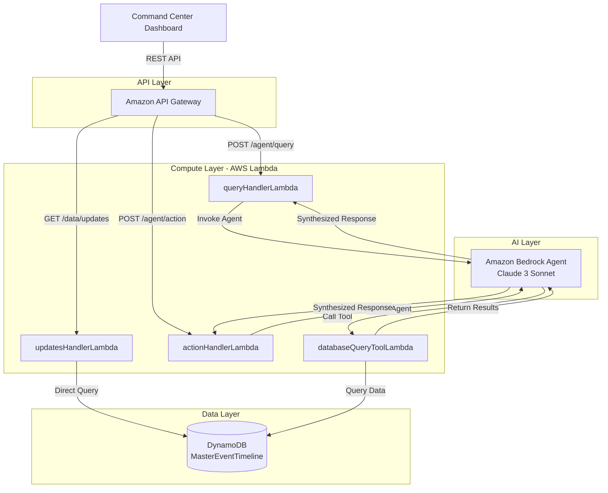

# Design Document

## Overview

The Command Center Backend is a serverless API built on AWS that serves as the data and intelligence layer for the disaster response Command Center Dashboard. The system provides three core capabilities:

1. **Real-time event updates** - Fast retrieval of simulation timeline events with time and domain filtering
2. **AI-powered natural language queries** - Intelligent query processing using Amazon Bedrock Agents
3. **Pre-defined action execution** - Quick access to common queries through action shortcuts

The architecture leverages AWS serverless services to provide automatic scaling, high availability, and cost efficiency. The system stores a complete 7-day pre-processed simulation timeline and uses Amazon Bedrock Agents with custom Action Groups to enable the AI to query the database and synthesize intelligent responses.

## Architecture

### High-Level Architecture



### Request Flow Patterns

**Pattern 1: Direct Data Access (Updates Endpoint)**
1. Client calls `GET /data/updates?since=2023-02-06T04:00:00Z&domain=MEDICAL`
2. API Gateway routes to `updatesHandlerLambda`
3. Lambda directly queries DynamoDB using GSI for efficient filtering
4. Lambda formats and returns lean JSON response
5. **No AI agent involved** - this is a simple, fast data retrieval

**Pattern 2: AI-Powered Query (Query/Action Endpoints)**
1. Client calls `POST /agent/query` with natural language text
2. API Gateway routes to `queryHandlerLambda` or `actionHandlerLambda`
3. Lambda invokes the configured Bedrock Agent
4. Agent reasoning cycle:
   - **Understand**: Parse user intent from natural language
   - **Plan**: Determine what data is needed
   - **Act**: Invoke `databaseQueryTool` Action Group
5. `databaseQueryToolLambda` receives structured parameters from agent
6. Tool Lambda queries DynamoDB and returns raw data to agent
7. Agent synthesizes data into natural language response
8. Agent constructs complete JSON payload (chatResponse + mapUpdates + events)
9. Handler Lambda returns agent's response to client

## Components and Interfaces

### 1. Amazon API Gateway

**Purpose**: Single entry point for all client requests, handles authentication, CORS, and routing.

**Configuration**:
- **REST API** with three routes:
  - `GET /data/updates` → `updatesHandlerLambda`
  - `POST /agent/query` → `queryHandlerLambda`
  - `POST /agent/action` → `actionHandlerLambda`
- **Authentication**: API Key authentication
- **CORS**: Configured to allow requests from dashboard origin
- **Throttling**: Rate limiting to prevent abuse
- **Logging**: CloudWatch integration for request/response logging

### 2. Lambda Functions

#### updatesHandlerLambda

**Purpose**: Direct database access for real-time event updates (no AI involved).

**Input**:
```typescript
interface UpdatesRequest {
  since: string;      // ISO 8601 timestamp
  domain?: string;    // Optional: MEDICAL | FIRE | STRUCTURAL | LOGISTICS | COMMUNICATION
}
```

**Logic**:
1. Parse and validate query parameters
2. Query DynamoDB using `domain-timestamp-index` GSI if domain is provided
3. Filter by timestamp using sort key condition
4. Transform database records into map layers and critical alerts
5. Return response with mapAction="APPEND" for incremental updates

**Output**:
```typescript
interface UpdatesResponse {
  latestTimestamp: string;
  mapUpdates?: {
    mapAction: "APPEND";
    mapLayers: Array<MapLayer>;
  };
  criticalAlerts?: Array<Alert>;
}
```

#### queryHandlerLambda

**Purpose**: Handle natural language queries by invoking Bedrock Agent.

**Input**:
```typescript
interface QueryRequest {
  text: string;           // Natural language query
  sessionId?: string;     // Optional: for conversation continuity
  currentMapState?: {     // Optional: current map context
    center: [number, number];
    zoom: number;
  };
}
```

**Logic**:
1. Validate request payload
2. Invoke Bedrock Agent using AWS SDK
3. Pass user text and optional context to agent
4. Wait for agent to complete reasoning cycle (query data, synthesize response)
5. Transform agent output into full response structure with:
   - chatResponse (natural language answer)
   - mapAction (REPLACE or APPEND)
   - mapLayers (GeoJSON features with styling)
   - viewState (map bounds/zoom)
   - uiContext (suggested actions)
6. Return complete response

**Output**: Full response structure matching data contract (see Request/Response Contracts section)

#### actionHandlerLambda

**Purpose**: Execute pre-defined actions by invoking Bedrock Agent with action context.

**Input**:
```typescript
interface ActionRequest {
  actionId: string;       // e.g., "GENERATE_AREA_BRIEFING", "CALC_ROUTE"
  payload?: object;       // Optional: action-specific parameters
}
```

**Logic**:
1. Map actionId to specific query intent (e.g., "GENERATE_AREA_BRIEFING" → "Generate a summary of all needs in Nurdağı city limits")
2. Construct appropriate prompt for Bedrock Agent including payload context
3. Invoke agent with action context
4. Transform agent output into full response structure (same as queryHandlerLambda)
5. Return complete response

**Output**: Same structure as queryHandlerLambda

#### databaseQueryToolLambda

**Purpose**: Action Group tool for Bedrock Agent to query the database.

**Input** (from Bedrock Agent):
```typescript
interface ToolInput {
  domain?: string;
  severity?: string;
  startTime?: string;
  endTime?: string;
  location?: {
    lat: number;
    lon: number;
    radiusKm?: number;
  };
  limit?: number;
}
```

**Logic**:
1. Parse structured parameters from agent
2. Build DynamoDB query based on filters
3. Execute query with appropriate indexes
4. Return raw data to agent (no formatting)

**Output** (to Bedrock Agent):
```typescript
interface ToolOutput {
  events: Array<RawEvent>;
  count: number;
}
```

### 3. Amazon Bedrock Agent

**Purpose**: Core AI reasoning engine that interprets queries and orchestrates data retrieval.

**Model**: Claude 3 Sonnet (balance of performance and cost)

**Instruction Prompt**:
```
You are an AI assistant for a disaster response Command Center. Your role is to help operators understand the current situation by answering questions about incidents, resources, and response activities during the 2023 Turkey earthquake response simulation.

You have access to a database of events from a 7-day earthquake response simulation. Use the databaseQueryTool to retrieve relevant data when needed.

When answering questions:
1. Be concise and factual
2. Include specific numbers and locations when available
3. Highlight critical or urgent situations
4. Autonomously control the map visualization - decide optimal zoom levels, generate density polygons, and center the map to best answer the query
5. If the data doesn't exist or you're unsure, say so clearly

Your response will be transformed into a structured format with:
- chatResponse: Your natural language answer
- mapAction: "REPLACE" (clear existing layers) or "APPEND" (add to existing)
- mapLayers: Array of GeoJSON layers with styling (Points, Polygons, LineStrings)
- viewState: Map bounds or center/zoom to focus on relevant area
- uiContext: Suggested follow-up actions for the operator

When creating map layers:
- Use appropriate icons for Point layers (BUILDING_COLLAPSE, FOOD_SUPPLY, DONATION_POINT, etc.)
- Use color coding for severity (CRITICAL=#DC2626, HIGH=#F59E0B, MEDIUM=#3B82F6, LOW=#10B981)
- For demand zones or analysis areas, use Polygon layers with semi-transparent fills
- Always include meaningful properties in GeoJSON features for tooltips
```

**Action Group: databaseQueryTool**

**API Schema**:
```json
{
  "openapi": "3.0.0",
  "info": {
    "title": "Database Query Tool",
    "version": "1.0.0"
  },
  "paths": {
    "/query": {
      "post": {
        "description": "Query the simulation database for events",
        "parameters": [
          {
            "name": "domain",
            "in": "query",
            "schema": { "type": "string", "enum": ["MEDICAL", "FIRE", "STRUCTURAL", "LOGISTICS", "COMMUNICATION"] }
          },
          {
            "name": "severity",
            "in": "query",
            "schema": { "type": "string", "enum": ["CRITICAL", "HIGH", "MEDIUM", "LOW"] }
          },
          {
            "name": "startTime",
            "in": "query",
            "schema": { "type": "string", "format": "date-time" }
          },
          {
            "name": "endTime",
            "in": "query",
            "schema": { "type": "string", "format": "date-time" }
          }
        ]
      }
    }
  }
}
```

**Lambda Association**: Points to `databaseQueryToolLambda`

### 4. Amazon DynamoDB

**Purpose**: Primary data store for the 7-day simulation timeline.

**Table: MasterEventTimeline**

**Schema**:
- **Partition Key (PK)**: `Day` (String) - e.g., `DAY_0`, `DAY_1`, ..., `DAY_6`
  - Groups events by day for efficient querying
  - Distributes load across partitions
- **Sort Key (SK)**: `Timestamp` (String) - ISO 8601 format
  - Enables efficient time-range queries
  - Maintains chronological ordering

**Attributes**:
```typescript
interface EventItem {
  Day: string;                    // PK: DAY_0 to DAY_6
  Timestamp: string;              // SK: ISO 8601
  eventId: string;                // UUID
  domain: string;                 // MEDICAL | FIRE | STRUCTURAL | LOGISTICS | COMMUNICATION
  severity: string;               // CRITICAL | HIGH | MEDIUM | LOW
  geojson: string;                // Stringified GeoJSON
  summary: string;                // Brief description
  details?: string;               // Optional: full details
  resourcesNeeded?: string[];     // Optional: list of resources
  contactInfo?: string;           // Optional: contact information
}
```

**Global Secondary Index: domain-timestamp-index**
- **Partition Key**: `domain` (String)
- **Sort Key**: `Timestamp` (String)
- **Purpose**: Enable efficient filtering by domain in the updates endpoint
- **Projection**: ALL (include all attributes)

**Query Patterns**:

1. **Get events for a specific day**:
   ```
   PK = "DAY_3"
   ```

2. **Get events after a timestamp**:
   ```
   PK = "DAY_3" AND SK > "2023-02-09T10:00:00Z"
   ```

3. **Get events by domain**:
   ```
   GSI: domain = "MEDICAL" AND Timestamp > "2023-02-09T10:00:00Z"
   ```

## Data Models

### Request/Response Contracts

**GET /data/updates**

Request (Query Parameters):
```typescript
{
  since: string;      // Required: ISO 8601 timestamp
  domain?: string;    // Optional: domain filter
}
```

Response:
```typescript
{
  latestTimestamp: string;                    // ISO 8601 timestamp
  mapUpdates?: {
    mapAction: "APPEND" | "REPLACE";          // How to apply updates
    mapLayers: Array<{
      layerId: string;
      layerName: string;
      geometryType: "Point" | "Polygon" | "LineString";
      style: {
        icon?: string;                        // For Point layers
        color?: string;                       // Hex color
        size?: number;                        // For Point layers
        fillColor?: string;                   // For Polygon layers
        fillOpacity?: number;                 // For Polygon layers
      };
      data: GeoJSON.FeatureCollection;        // GeoJSON features
    }>;
  };
  criticalAlerts?: Array<{
    alertId: string;
    timestamp: string;
    severity: "CRITICAL" | "HIGH" | "MEDIUM" | "LOW";
    title: string;
    summary: string;
    location: { lat: number; lon: number };
  }>;
}
```

**POST /agent/query**

Request:
```typescript
{
  text: string;                               // Natural language query
  sessionId?: string;                         // Optional: for conversation continuity
  currentMapState?: {
    center: [number, number];
    zoom: number;
  };
}
```

Response:
```typescript
{
  simulationTime: string;                     // e.g., "Day 1, 11:00"
  timestamp: string;                          // ISO 8601 timestamp
  chatResponse: string;                       // Natural language answer
  mapAction: "REPLACE" | "APPEND";            // How to apply map updates
  viewState?: {
    bounds?: {
      southwest: { lat: number; lon: number };
      northeast: { lat: number; lon: number };
    };
    center?: { lat: number; lon: number };
    zoom?: number;
  };
  mapLayers: Array<{
    layerId: string;
    layerName: string;
    geometryType: "Point" | "Polygon" | "LineString";
    style: {
      icon?: string;                          // For Point layers (e.g., "BUILDING_COLLAPSE")
      color?: string;                         // Hex color
      size?: number;                          // For Point layers
      fillColor?: string;                     // For Polygon layers
      fillOpacity?: number;                   // For Polygon layers
    };
    data: GeoJSON.FeatureCollection;          // GeoJSON features with properties
  }>;
  tabularData?: any;                          // Optional: structured data for tables
  uiContext?: {
    suggestedActions?: Array<{
      label: string;
      actionId: string;
      payload?: object;
    }>;
  };
  clientStateHint?: {
    activeDomainFilter?: string;
  };
}
```

**POST /agent/action**

Request:
```typescript
{
  actionId: string;                           // e.g., "GENERATE_AREA_BRIEFING"
  payload?: object;                           // Action-specific parameters
}
```

Response: Same structure as /agent/query

## Error Handling

### Error Response Format

All errors follow a consistent structure:

```typescript
{
  error: {
    code: string;        // Machine-readable error code
    message: string;     // Human-readable message
    details?: object;    // Optional: additional context
  }
}
```

### Error Codes

- `INVALID_REQUEST`: Malformed request or missing required fields
- `AUTHENTICATION_FAILED`: Invalid or missing API key
- `RATE_LIMIT_EXCEEDED`: Too many requests
- `DATABASE_ERROR`: DynamoDB query failed
- `AGENT_ERROR`: Bedrock Agent invocation failed
- `INTERNAL_ERROR`: Unexpected server error

### Lambda Error Handling

Each Lambda function implements:
1. **Input validation** with clear error messages
2. **Try-catch blocks** around external service calls
3. **Structured logging** to CloudWatch
4. **Graceful degradation** where possible
5. **Timeout handling** (Lambda timeout < API Gateway timeout)

### Bedrock Agent Error Handling

- **Agent timeout**: If agent takes too long, return partial response with explanation
- **Tool failure**: If databaseQueryTool fails, agent should explain data unavailability
- **Invalid tool parameters**: Agent should retry with corrected parameters

### DynamoDB Error Handling

- **Throttling**: Implement exponential backoff with jitter
- **Item not found**: Return empty array, not error
- **Query timeout**: Log and return partial results if available

## Testing Strategy

### Unit Testing

**Lambda Functions**:
- Mock AWS SDK calls (DynamoDB, Bedrock)
- Test input validation logic
- Test error handling paths
- Test response formatting
- Use Jest or similar framework

**Example Test Cases**:
```typescript
describe('updatesHandlerLambda', () => {
  it('should validate required since parameter', async () => {
    const event = { queryStringParameters: {} };
    const response = await handler(event);
    expect(response.statusCode).toBe(400);
  });
  
  it('should query DynamoDB with correct parameters', async () => {
    // Mock DynamoDB client
    // Assert query parameters
  });
});
```

### Integration Testing

**API Gateway + Lambda**:
- Deploy to test environment
- Test each endpoint with various inputs
- Verify CORS headers
- Test authentication
- Measure response times

**Bedrock Agent + Tool Lambda**:
- Test agent invocation from handler Lambda
- Verify tool is called with correct parameters
- Test agent response parsing
- Test conversation continuity with sessionId

### End-to-End Testing

**Full Request Flow**:
1. Deploy complete stack to test environment
2. Populate DynamoDB with test data
3. Execute test queries from client
4. Verify responses match expected format
5. Test error scenarios (invalid auth, malformed requests)

**Performance Testing**:
- Load test updates endpoint (target: <500ms p95)
- Load test agent endpoints (target: <3s p95)
- Test concurrent requests
- Monitor DynamoDB read capacity

### Manual Testing

**Bedrock Agent Console**:
- Test agent in Bedrock playground
- Verify tool invocation works correctly
- Test various query types
- Refine instruction prompt based on results

## Deployment

### Infrastructure as Code

Use AWS CDK (TypeScript) to define all infrastructure:

```typescript
// Simplified CDK structure
const api = new apigateway.RestApi(this, 'CommandCenterAPI');
const updatesLambda = new lambda.Function(this, 'UpdatesHandler', {...});
const queryLambda = new lambda.Function(this, 'QueryHandler', {...});
const actionLambda = new lambda.Function(this, 'ActionHandler', {...});
const toolLambda = new lambda.Function(this, 'ToolHandler', {...});
const table = new dynamodb.Table(this, 'MasterEventTimeline', {...});
const agent = new bedrock.Agent(this, 'CommandCenterAgent', {...});
```

### Deployment Steps

1. **Bootstrap CDK** (one-time): `cdk bootstrap`
2. **Deploy stack**: `cdk deploy`
3. **Populate database**: Run data population script
4. **Test endpoints**: Run integration tests
5. **Configure dashboard**: Update dashboard with API endpoint and key

### Environment Variables

Each Lambda function receives:
- `TABLE_NAME`: DynamoDB table name
- `AGENT_ID`: Bedrock Agent ID (for query/action handlers)
- `AGENT_ALIAS_ID`: Bedrock Agent alias ID
- `LOG_LEVEL`: Logging verbosity

## Security Considerations

1. **API Authentication**: API keys stored in AWS Secrets Manager
2. **IAM Roles**: Least privilege principle for all Lambda functions
3. **VPC**: Optional VPC deployment for enhanced security
4. **Encryption**: DynamoDB encryption at rest enabled
5. **Secrets**: No hardcoded credentials in code
6. **Input Validation**: Strict validation on all inputs
7. **Rate Limiting**: API Gateway throttling configured

## Performance Optimization

1. **DynamoDB**: Use GSI for domain filtering, batch operations where possible
2. **Lambda**: Appropriate memory allocation, connection reuse
3. **Bedrock**: Use streaming responses for long queries (future enhancement)
4. **Caching**: Consider API Gateway caching for updates endpoint
5. **Monitoring**: CloudWatch dashboards for latency, errors, throttling
