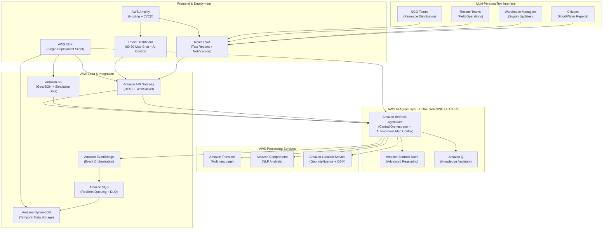
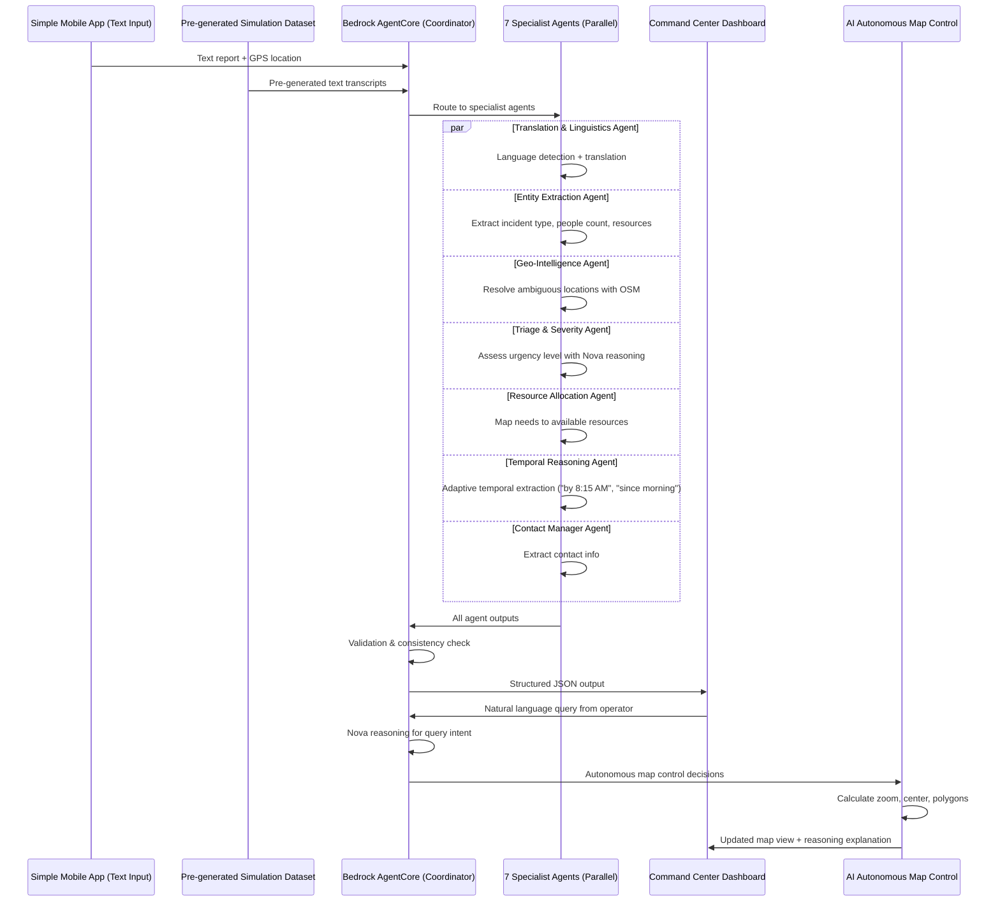

# Design Document

## Overview

The Disaster Response MVP system is designed as a comprehensive AWS-native AI **rescue assistant** that serves as a single source of interaction for command center operators. The system does NOT make decisions but rather consumes, processes, and presents timestamped data from diverse sources (citizens, warehouse managers, rescue teams, NGOs) to help human operators make informed decisions. 

**CORE WINNING FEATURE:** The AI agent autonomously controls map visualization - when operators ask questions in natural language, the Bedrock AgentCore independently decides optimal zoom levels, generates density polygons, centers the map, and provides reasoning explanations. This demonstrates true AI agent autonomy beyond simple data processing.

The system aggregates complex rescue data through a 7-agent parallel processing pipeline, provides natural language querying capabilities, and generates dynamic visualizations, simulating the 2023 Turkey earthquake response for Nurdağı city with strict temporal data controls.

**Key Technical Highlights:**
- **NO Audio/STT Processing:** Uses pre-generated text transcripts to focus on AI agent capabilities and reduce costs
- **Autonomous Map Control:** AI agent makes independent visualization decisions
- **7 Specialist Agents:** Parallel processing with cross-validation
- **Sophisticated Dataset:** 200-300 reports with edge cases, ambiguous locations, temporal variations
- **Temporal Simulation:** 14-minute browser timeline = 7-day earthquake response
- **Single Deployment:** AWS CDK script for complete system activation

## Architecture

The system follows AWS AI Agent architecture patterns with Amazon Bedrock AgentCore as the central orchestrator, leveraging multiple AWS AI services for comprehensive disaster response management.



## Components and Interfaces

### 1. Simple Multi-Persona Mobile Application (NO Audio/STT)

**Technology Stack:** React PWA with AWS Amplify (NO Amazon Transcribe - using pre-generated text transcripts)

**Simple 2-Screen Interface:**
- **Screen 1: Text Report** - Text input area, auto-capture GPS location, submit report
- **Screen 2: Notifications** - View notifications filtered by proximity and criticality

**Supported Personas (All use same simple interface):**
- **Citizens:** Community members reporting resource availability/needs
- **Warehouse Managers:** Supply chain and inventory updates
- **Rescue Teams:** Field operation status and resource requests
- **NGO Teams:** Resource distribution and coordination updates

**Text Report Examples (Pre-generated for simulation):**
- *"We have gathered food for 100 people from our locality, someone please pick it up at the community center on Atatürk Street"*
- *"Medicine consignment received at warehouse B-12, insulin and antibiotics available for distribution"*
- *"Rescue team Alpha taking medical supplies from warehouse B-12 for 30 people in camp zone C"*
- *"Bizim mahallede 100 kişilik yiyecek topladık, lütfen alın"* (Turkish)

**Interface Specifications:**
```typescript
interface TextReport {
  id: string;
  transcript: string; // Pre-generated text, NO audio
  originalLanguage: string;
  translatedText?: string;
  location: {
    coordinates: [number, number];
    description: string;
    gpsAccuracy: number;
  };
  timestamp: string;
  persona: {
    type: 'citizen' | 'warehouse_manager' | 'rescue_team' | 'ngo';
    id?: string;
    organization?: string;
    language: string;
  };
  extractedData: {
    resourceType: 'food' | 'water' | 'medicine' | 'shelter' | 'personnel';
    action: 'available' | 'needed' | 'distributed' | 'transported';
    quantity: number;
    beneficiaries: number;
    urgency: 'low' | 'medium' | 'high' | 'critical';
    location_mentioned: string;
    temporalReferences: string[]; // "by 8:15 AM", "since morning", etc.
  };
  processingMetadata: {
    confidence: number;
    agentOutputs: Record<string, any>;
    requiresHumanReview: boolean;
  };
}

interface Notification {
  id: string;
  type: 'global' | 'proximity_based';
  message: string;
  criticality: 'low' | 'medium' | 'high' | 'critical';
  location?: [number, number];
  distance?: number; // meters from user
  contactInfo?: string;
  timestamp: string;
}
```

### 2. Multi-Agent Text Processing Pipeline (NO Audio/STT)

**Architecture:** This is where the detailed multi-agent pipeline from `multi-agent-architecture-conversation-processing.md` is implemented using Amazon Bedrock AgentCore, processing pre-generated text transcripts instead of audio

**Core Agent Components:**
- **Bedrock AgentCore:** Central orchestrator with reasoning capabilities using Claude 3 Sonnet
- **Amazon Bedrock Nova:** Advanced reasoning for complex scenarios, temporal extraction, and multi-step planning
- **Amazon Q:** Knowledge assistant for resource matching and disaster response protocols
- **Pre-trained AWS AI Services:** Leveraging existing capabilities without custom model training

**Specialized Action Groups (Data Processing & Presentation Only):**
- **Text Processing Action Group:** Amazon Translate for multi-language text (NO Transcribe)
- **Map Control Action Group (CORE WINNING FEATURE):** Autonomous zoom, pan, and polygon overlay management based on text queries
- **Data Aggregation Action Group:** DynamoDB queries + temporal data filtering
- **Damage Context Action Group:** Pre-classified building damage data correlation with OSM
- **View Management Action Group:** Map snapshot creation, storage, and restoration
- **Information Synthesis Action Group:** Amazon Comprehend + Bedrock for data presentation
- **Notification Distribution Action Group:** Proximity + criticality filtering for notifications

**Multi-Agent Processing Integration:**

The multi-agent pipeline from `multi-agent-architecture-conversation-processing.md` is implemented as follows:



**Multi-Agent Components Implementation (7 Specialist Agents):**
1. **Translation & Linguistics Agent** → Amazon Translate + Comprehend (Turkish, English, Arabic)
2. **Entity Extraction Agent** → Amazon Comprehend + Bedrock reasoning (incident type, resources, quantities)
3. **Geo-Intelligence Agent** → Amazon Location Service + OSM integration (resolve "near old market" → coordinates)
4. **Triage & Severity Agent** → Bedrock Nova reasoning + damage context (assess urgency with building damage data)
5. **Resource Allocation Agent** → DynamoDB queries + Bedrock optimization (match supply with demand)
6. **Temporal Reasoning Agent** → Adaptive extraction (normalize "by 8:15 AM", "since morning", "around dawn")
7. **Contact Manager Agent** → Regex extraction + validation (phone numbers, names)
8. **Validation & Consistency Agent** → Bedrock AgentCore cross-validation (detect conflicts, flag low confidence)

### 3. Intelligent Dashboard with Dynamic Map Control

**Technology Stack:** React with shadcn/ui components, Leaflet for mapping with OSM data, WebSocket for real-time updates

**Layout Specifications:**
- **Left Panel (80%):** Interactive map with AI-controlled zoom and polygon overlays
- **Right Panel (20%):** Text-only chat interface with Bedrock AgentCore (NO voice input)
- **Top Center:** Time slider with 12-hour increment dots (Day 0-7)

**AI-Controlled Map Dynamics:**
The Bedrock AgentCore dynamically controls map visualization based on text queries:

**Map Control Capabilities:**
- **Dynamic Zoom Control:** Agent adjusts zoom level based on query scope
- **Polygon Overlay Management:** Agent adds/removes/modifies polygon layers
- **View State Management:** Agent centers map on relevant areas
- **Layer Visibility Control:** Agent shows/hides specific data layers

**Example Text Interactions (Command Center Only):**
- *"Show me zones where people are calling for food"* → Agent zooms to city level, adds food request density polygons
- *"Focus on cluster 0 building damage"* → Agent zooms to cluster 0, highlights destroyed buildings
- *"Display water distribution in the northern area"* → Agent pans north, adds water distribution overlays
- *"Show me all medicine requests near OSM building 1138689421"* → Agent zooms to specific building, adds medicine request markers

**Map View Snapshot System:**
```typescript
interface MapViewSnapshot {
  id: string;
  name: string; // user-defined or auto-generated
  timestamp: string;
  query: string; // original query that created this view
  mapState: {
    center: [number, number];
    zoom: number;
    bounds: [[number, number], [number, number]];
  };
  activePolygons: {
    layerId: string;
    type: string;
    visibility: boolean;
    style: LayerStyle;
  }[];
  temporalContext: {
    simulationDay: number;
    simulationHour: number;
    timeSliderPosition: number;
  };
  metadata: {
    createdBy: string; // operator ID
    description?: string;
    tags: string[];
    isBookmarked: boolean;
  };
}
```

**Snapshot Management Features:**
- **Auto-save interesting views:** Agent automatically saves significant map configurations
- **Manual bookmarking:** Operators can save current view with custom names
- **Quick restore:** "Show me the view from this morning's medicine shortage analysis"
- **View sharing:** "Load the water distribution view that Sarah created yesterday"

**Map Visualization Layers:**
```typescript
interface DynamicMapLayers {
  staticLayers: {
    buildingDamage: {
      // Pre-classified building damage from satellite imagery
      clusters: GeoJSONFeatureCollection; // cluster_0.geojson
      buildings: GeoJSONFeatureCollection; // cluster_0_buildings.geojson
      osmBaseMap: OSMTileLayer;
    };
    administrativeBoundaries: {
      nurdagiCity: PolygonLayer;
      districts: PolygonLayer[];
    };
  };
  dynamicLayers: {
    resourceRequests: {
      type: 'food' | 'water' | 'medicine' | 'shelter';
      polygons: GeneratedPolygon[];
      intensity: number;
      callCount: number;
    }[];
    supplyAvailability: {
      type: 'warehouse' | 'distribution_point' | 'mobile_unit';
      coverage: PolygonLayer[];
      capacity: number;
    }[];
    operationalZones: {
      type: 'rescue_active' | 'search_complete' | 'evacuation';
      boundaries: PolygonLayer[];
      status: string;
      teamCount: number;
    }[];
  };
  queryGeneratedLayers: {
    query: string;
    polygons: PolygonLayer[];
    metadata: {
      generatedBy: 'bedrock_agent';
      confidence: number;
      dataPoints: number;
      timestamp: string;
    };
  }[];
}

// Pre-classified Building Damage Data Structure
interface BuildingDamageCluster {
  cluster_id: number;
  buildings_destroyed: number;
  area_km2: number;
  density_buildings_per_km2: number;
  centroid_lat: number;
  centroid_lon: number;
  bbox: {
    minx: number;
    miny: number;
    maxx: number;
    maxy: number;
  };
  estimated_population_affected: number;
  severity: 'Moderate' | 'Severe' | 'Critical';
  geometry: GeoJSONPolygon;
}

interface DestroyedBuilding {
  osm_id: number;
  damage_date: string; // "2023-02-06"
  destroyed_building: "yes";
  damage_event: "#TürkiyeEQ060223";
  damage_type: "earthquake";
  cluster: number;
  geometry: GeoJSONPolygon;
}

interface GeneratedPolygon {
  coordinates: number[][];
  properties: {
    intensity: number;
    callCount: number;
    resourceType: string;
    urgencyLevel: 'low' | 'medium' | 'high' | 'critical';
    generatedFromQuery: string;
  };
  style: {
    fillColor: string;
    strokeColor: string;
    opacity: number;
    strokeWeight: number;
  };
}
```

### 4. AWS-Native Event-Driven Processing Pipeline

**Event Orchestration Strategy:**
- **Amazon EventBridge:** Central event routing with custom event patterns
- **Amazon SQS:** Resilient queuing with DLQ for failed processing
- **AWS Lambda:** Serverless processing with automatic scaling
- **Amazon Bedrock AgentCore:** Intelligent event classification and routing

**Multi-Persona Event Processing:**
```typescript
interface EventProcessingConfiguration {
  eventPatterns: {
    'voice-report-received': {
      source: 'disaster-response.voice-interface';
      detailType: 'Voice Report Submitted';
      routing: 'bedrock-agent-core';
      priority: 'high';
    };
    'resource-availability-updated': {
      source: 'disaster-response.warehouse';
      detailType: 'Inventory Update';
      routing: 'resource-matching-agent';
      priority: 'medium';
    };
    'rescue-operation-status': {
      source: 'disaster-response.field-teams';
      detailType: 'Operation Update';
      routing: 'coordination-agent';
      priority: 'high';
    };
  };
  
  processingQueues: {
    critical: {
      type: 'FIFO';
      visibilityTimeout: 30;
      maxReceiveCount: 3;
    };
    standard: {
      type: 'Standard';
      visibilityTimeout: 60;
      maxReceiveCount: 5;
    };
    batch: {
      type: 'Standard';
      visibilityTimeout: 300;
      maxReceiveCount: 10;
    };
  };

  bedrockAgentConfiguration: {
    model: 'anthropic.claude-3-sonnet-20240229-v1:0';
    actionGroups: [
      'voice-processing',
      'geo-intelligence', 
      'resource-matching',
      'damage-assessment',
      'polygon-generation'
    ];
    knowledgeBases: [
      'disaster-response-protocols',
      'resource-inventory',
      'osm-geographic-data',
      'pre-classified-damage-data'
    ];
    staticDataSources: {
      buildingDamageData: 's3://disaster-response-data/geojson/cluster_0_buildings.geojson';
      clusterData: 's3://disaster-response-data/geojson/cluster_0.geojson';
      osmData: 'openstreetmap-tiles';
    };
  };
}
```

## Data Models

### AWS AI Agent Data Structures

```typescript
// Text Report Model (Primary data structure with strict timestamping - NO audio)
interface TextReport {
  id: string;
  transcript: string; // Pre-generated text, NO audio
  originalLanguage: string;
  translatedText?: string;
  location: {
    gpsCoordinates: [number, number];
    addressDescription: string;
    resolvedAddress?: string;
    accuracy: number;
  };
  
  // CRITICAL: Temporal data controls for simulation
  temporalData: {
    reportTimestamp: string; // ISO 8601 - when report was made
    ingestionTimestamp: string; // when system received it
    processingTimestamp: string; // when AI processed it
    simulationDay: number; // 0-7 for earthquake simulation
    simulationHour: number; // 0-23 for time slider
    isHistorical: boolean; // prevents future data access
  };
  
  persona: PersonaInfo;
  bedrockProcessing: BedrockProcessingResult;
  resourceData: ResourceInformation;
  
  // Data presentation metadata (not decision-making)
  presentationMetadata: {
    confidence: number;
    dataQuality: 'high' | 'medium' | 'low';
    requiresHumanReview: boolean;
    correlatedReports: string[]; // related report IDs
  };
}

// Persona Classification
interface PersonaInfo {
  type: 'citizen' | 'warehouse_manager' | 'rescue_team' | 'ngo_volunteer' | 'government_official';
  confidence: number;
  organization?: string;
  role?: string;
  contactInfo?: string;
  language: string;
  previousReports: number;
}

// Bedrock Agent Processing Results (Data Processing & Presentation Only)
interface BedrockProcessingResult {
  agentCoreResponse: {
    dataExtracted: Record<string, any>; // extracted information
    confidence: number;
    processingNotes: string; // explanation of data processing
  };
  novaAnalysis?: {
    dataComplexity: number;
    contextualInformation: string[]; // contextual data points
    relatedDataSources: string[]; // not recommendations, just related data
  };
  qKnowledgeMatch?: {
    relevantProtocols: string[]; // for context, not decision-making
    historicalPatterns: string[]; // similar past events
    availableResources: string[]; // current resource status
  };
  actionGroupResults: {
    voiceProcessing: VoiceProcessingResult;
    geoIntelligence: GeoIntelligenceResult;
    dataAggregation: DataAggregationResult;
    damageContext: DamageContextResult;
    informationSynthesis?: InformationSynthesisResult;
  };
  
  // Temporal processing controls
  temporalProcessing: {
    processedAt: string;
    simulationTimeConstraint: string; // only access data up to this point
    futureDataBlocked: boolean; // ensures no future data access
  };
}

// Damage Assessment using pre-classified data
interface DamageAssessmentResult {
  nearbyDamage: {
    clusterId: number;
    buildingsDestroyed: number;
    severity: 'Moderate' | 'Severe' | 'Critical';
    estimatedPopulationAffected: number;
    distanceFromReport: number; // meters
  }[];
  riskAssessment: {
    structuralRisk: 'low' | 'medium' | 'high';
    accessibilityImpact: 'minimal' | 'moderate' | 'severe';
    resourcePriority: number; // 1-10 scale
  };
  osmContext: {
    nearbyInfrastructure: string[];
    accessRoutes: string[];
    alternativeRoutes: string[];
  };
}

// Resource Information (Data Only, No Decision Logic)
interface ResourceInformation {
  type: 'food' | 'water' | 'medicine' | 'shelter' | 'personnel' | 'equipment' | 'transportation';
  subtype: string;
  status: 'reported_available' | 'reported_needed' | 'reported_distributed' | 'reported_transported' | 'reported_consumed';
  quantity: {
    amount: number;
    unit: string;
    reportedBeneficiaries: number; // as reported, not calculated
  };
  location: {
    reportedLocation: [number, number];
    reportedDestination?: [number, number];
    reportedCoverage?: number[][]; // as described by reporter
  };
  
  // Strict temporal tracking
  timeline: {
    reportedAvailable?: string;
    reportedExpiry?: string;
    reportedPickupTime?: string;
    lastUpdated: string;
    simulationTimestamp: string; // for temporal filtering
  };
  
  // Data source tracking (not decision-making)
  dataSource: {
    reporterId: string;
    reporterType: string;
    reportConfidence: number;
    verificationStatus: 'unverified' | 'cross_referenced' | 'confirmed';
  };
}

// AI-Controlled Map Response
interface MapControlResult {
  query: string;
  mapActions: {
    zoomChange: {
      newZoom: number;
      reason: string;
    };
    centerChange: {
      newCenter: [number, number];
      reason: string;
    };
    polygonUpdates: {
      add: GeneratedPolygon[];
      remove: string[]; // layer IDs to remove
      modify: { layerId: string; newStyle: LayerStyle }[];
    };
    layerVisibility: {
      layerId: string;
      visible: boolean;
    }[];
  };
  snapshotRecommendation: {
    shouldSave: boolean;
    suggestedName: string;
    reason: string;
  };
  textResponse: string; // explanation of what was found/displayed
}

// Enhanced Polygon Generation with Map Control
interface GeneratedPolygon {
  layerId: string;
  coordinates: number[][];
  properties: {
    dataPoints: number;
    intensity: number;
    resourceType: string;
    timeframe: string;
    queryOrigin: string; // original query that created this
  };
  style: {
    fillColor: string;
    strokeColor: string;
    opacity: number;
    strokeWeight: number;
  };
  interactionHandlers: {
    onClick: string; // action to take when clicked
    onHover: string; // hover information to display
  };
}
```

### Database Schema Design with Temporal Controls

**DynamoDB Tables:**
- **TextReports Table:** 
  - Partition key: `report_id`, Sort key: `simulation_timestamp`
  - GSI: `simulation_day-simulation_hour-index` for time slider
  - TTL: None (preserve all simulation data)
- **ResourceReports Table:** 
  - Partition key: `resource_type`, Sort key: `simulation_timestamp`
  - GSI: `location-timestamp-index` for geographic queries
- **Teams Table:** 
  - Partition key: `team_id`, Sort key: `last_update_timestamp`
  - GSI: `status-timestamp-index` for temporal status tracking
- **MapViewSnapshots Table:**
  - Partition key: `snapshot_id`, Sort key: `created_timestamp`
  - GSI: `operator_id-timestamp-index` for user's saved views
  - GSI: `query_hash-index` for similar query detection
- **SimulationControl Table:**
  - Partition key: `simulation_id`, Sort key: `current_time`
  - Controls temporal data access boundaries

**S3 Static Data:**
- **Building Damage Data:** `s3://disaster-response-data/geojson/cluster_0_buildings.geojson`
- **Cluster Data:** `s3://disaster-response-data/geojson/cluster_0.geojson`
- **Simulation Dataset:** `s3://disaster-response-data/simulation/reports-day-{0-7}.json` (200-300 pre-generated text reports)
- **OSM Tile Cache:** `s3://disaster-response-data/osm-tiles/`

**Temporal Data Integration Pattern:**
```typescript
interface TemporalDataIntegration {
  simulationControls: {
    startDate: '2023-02-06T00:00:00Z'; // Earthquake Day 0
    currentSimulationTime: string; // controlled by time slider
    maxSimulationDay: 7;
    timeSliderIncrement: 12; // hours
    preventFutureDataAccess: true;
  };
  
  staticDataIntegration: {
    buildingDamageLoader: {
      source: 'cluster_0_buildings.geojson';
      loadOnStartup: true;
      cacheInMemory: true;
      indexBy: ['cluster', 'osm_id', 'coordinates'];
      timestampOverride: '2023-02-06T00:00:00Z'; // damage occurred at earthquake time
    };
    clusterDataLoader: {
      source: 'cluster_0.geojson';
      loadOnStartup: true;
      cacheInMemory: true;
      indexBy: ['cluster_id', 'severity', 'bbox'];
      timestampOverride: '2023-02-06T00:00:00Z';
    };
  };
  
  dynamicDataFiltering: {
    queryTimeConstraint: 'simulation_timestamp <= current_simulation_time';
    preventFutureQueries: true;
    temporalIndexing: ['simulation_day', 'simulation_hour'];
  };
}
```

## Error Handling

### Resilience Patterns

1. **Circuit Breaker Pattern:** Prevent cascade failures in multi-agent pipeline
2. **Retry with Exponential Backoff:** Handle transient failures
3. **Dead Letter Queues:** Isolate problematic messages
4. **Graceful Degradation:** Fallback to simplified processing when agents fail

### Error Categories and Responses

```typescript
interface ErrorHandling {
  categories: {
    'agent_timeout': {
      action: 'retry_with_fallback';
      maxRetries: 3;
      fallbackAgent: 'simple_parser';
    };
    'translation_failure': {
      action: 'human_review';
      priority: 'high';
      notification: true;
    };
    'location_resolution_failed': {
      action: 'approximate_location';
      confidence: 'low';
      humanReview: true;
    };
    'resource_constraint': {
      action: 'queue_for_later';
      priority: 'maintain_order';
      notification: false;
    };
  };
}
```

## Testing Strategy

### AWS AI Agent Testing Framework

1. **Bedrock Agent Testing:** Action group validation and reasoning accuracy
2. **Multi-Persona Voice Testing:** Speech recognition across different accents and languages
3. **Dynamic Polygon Generation Testing:** Query interpretation and visualization accuracy
4. **AWS Service Integration Testing:** End-to-end service orchestration validation

### Hackathon-Focused Test Data Strategy

- **Turkey Earthquake Simulation Data:** Pre-loaded Nurdağı city incident data (Day 0-7)
- **Multi-Language Voice Samples:** Turkish, English, Arabic voice reports from different personas
- **Resource Flow Scenarios:** Warehouse → Distribution → Consumption chains
- **Real-time Dashboard Testing:** WebSocket updates and polygon generation performance

### AWS AI Agent Monitoring

```typescript
interface AWSAIAgentMetrics {
  bedrockAgentCore: {
    invocations: number;
    averageLatency: number;
    successRate: number;
    reasoningAccuracy: number;
    actionGroupExecutions: Record<string, number>;
  };
  
  voiceProcessing: {
    transcriptionAccuracy: number;
    languageDetectionAccuracy: number;
    translationQuality: number;
    processingLatency: number;
  };
  
  polygonGeneration: {
    queryInterpretationAccuracy: number;
    polygonGenerationLatency: number;
    visualizationRenderTime: number;
    userSatisfactionScore: number;
  };
  
  resourceMatching: {
    matchAccuracy: number;
    recommendationRelevance: number;
    inventoryUpdateLatency: number;
    supplyChainVisibility: number;
  };
  
  awsServiceMetrics: {
    transcribeLatency: number;
    translateLatency: number;
    comprehendAccuracy: number;
    locationServiceLatency: number;
    dynamodbReadLatency: number;
    s3UploadLatency: number;
  };
}
```

### Hackathon Demo Scenarios

1. **Citizen Food Report:** "We collected food for 100 people at the mosque near the damaged buildings, please coordinate pickup"
2. **Warehouse Medicine Update:** "Insulin shipment arrived at warehouse in cluster 0 area, 500 units available for diabetic patients"
3. **Rescue Team Resource Request:** "Need heavy machinery at collapsed building OSM ID 1138689421, 15 people trapped"
4. **NGO Distribution Update:** "Distributed water to 200 families in the moderate damage zone, need refill"
5. **Dynamic Query Demo:** "Show me all areas requesting medicine near the destroyed buildings in cluster 0"

### Pre-loaded Turkey Earthquake Data Integration

**Static Damage Visualization:**
- **10 destroyed buildings** in cluster 0 with precise OSM coordinates
- **Moderate severity cluster** affecting estimated 40 people
- **0.0132 km² damage area** with 756.23 buildings per km² density
- **Centroid coordinates:** 37.191032, 36.74483 for cluster center

**Interactive Features:**
- Click on destroyed building polygons to see OSM details
- Overlay voice reports on pre-classified damage areas
- Show resource requests in context of building damage severity
- Time slider showing progression from Feb 6, 2023 (Day 0) to Day 7

The design ensures modularity through microservices architecture, handles resource constraints through intelligent queuing, and provides a single deployment script through AWS CDK infrastructure as code. The system is optimized for the Turkey earthquake simulation while maintaining extensibility for future enhancements.

---


## Hackathon Alignment Summary

### AWS AI Agent Requirements ✅

**LLM Hosted on AWS:**
- ✅ Amazon Bedrock with Claude 3 Sonnet

**Required AWS Services:**
- ✅ Amazon Bedrock AgentCore (Central orchestrator with action groups)
- ✅ Amazon Bedrock Nova (Advanced reasoning for complex scenarios)
- ✅ Amazon Q (Knowledge assistant for resource matching)

**AI Agent Qualification:**
- ✅ **Reasoning LLMs:** Bedrock Nova for decision-making and query interpretation
- ✅ **Autonomous Capabilities:** AI agent independently controls map visualization without human input
- ✅ **Integration:** APIs (API Gateway, Location Service), Databases (DynamoDB), External Tools (OSM, GeoJSON)

### Judging Criteria Alignment

**Technical Execution (50%):**
- Well-architected: Event-driven, serverless, modular AWS services
- Reproducible: Single CDK deployment script
- Advanced: 7 specialist agents with cross-validation
- Novel: Autonomous map control with reasoning explanations

**Potential Value/Impact (20%):**
- Real-world problem: Disaster response coordination
- Measurable impact: Eliminates language barriers, provides single source of truth
- Practical: Simulates actual Turkey earthquake response

**Creativity (10%):**
- Novel problem: AI-controlled map visualization
- Novel approach: Autonomous polygon generation from unstructured data
- Innovative: Time-traveling simulation with temporal controls

**Functionality (10%):**
- Working as expected: Live demo of autonomous capabilities
- Scalable: Event-driven architecture with auto-scaling

**Demo Presentation (10%):**
- End-to-end workflow: Mobile report → Multi-agent processing → AI-controlled visualization
- Clear: 3-minute structured script with reasoning explanations

### Cost Optimization

**Estimated Total: ~$13 (within $100 budget)**
- Bedrock AgentCore: $5
- Bedrock Nova: $3
- Amazon Q: $0.40
- Amazon Translate: $0.75
- Amazon Comprehend: $1
- DynamoDB: $2
- Other services: $0.85

**Cost Savings:**
- NO Amazon Transcribe costs (pre-generated text transcripts)
- Query result caching
- Optimized Lambda memory allocation
- DynamoDB on-demand pricing

### Winning Differentiators

1. **Autonomous AI Agent:** Not just answering questions, but controlling visualization
2. **Complex Multi-Agent System:** 7 specialist agents with cross-validation
3. **Sophisticated Dataset:** Real-world complexity with edge cases
4. **Technical Excellence:** Well-architected, reproducible, scalable
5. **Novel Approach:** AI-generated map visualizations from unstructured data
6. **Adaptive Reasoning:** Handles unknown temporal expressions and ambiguous locations
7. **Supply Chain Tracking:** End-to-end resource flow visibility
8. **Notification System:** Proximity + criticality filtering for field coordination

The design ensures the system meets all hackathon requirements while demonstrating advanced AI agent capabilities that differentiate it from standard disaster response systems.
