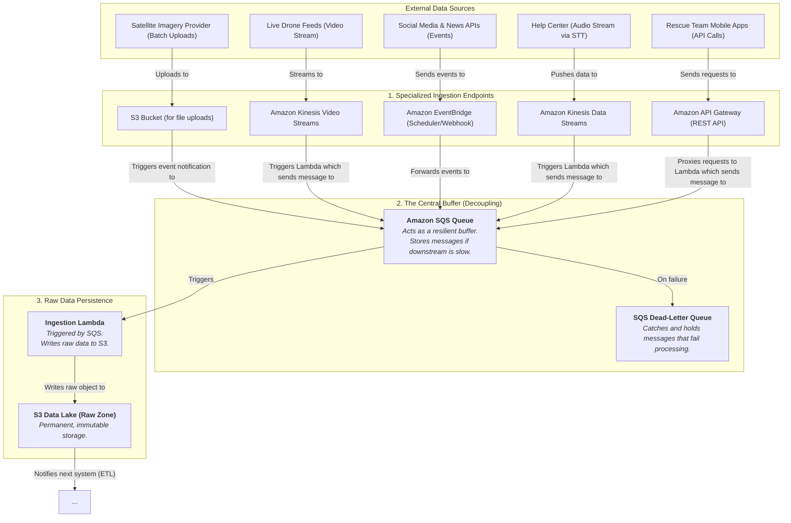

### Internal Architecture: Resilient Data Ingestion Layer

-----

### How It Works & Communicates

#### 1\. Specialized Ingestion Endpoints

Each data source interacts with an AWS service designed specifically for its data type.

  * **Satellite Imagery:** A new satellite image is a large file uploaded periodically. The best entry point is directly to an **S3 bucket**. This is simple and cost-effective.
  * **Live Drone Feeds:** This is a continuous video stream. **Amazon Kinesis Video Streams** is built to handle this, allowing for real-time processing and storage.
  * **Social Media & News:** This data often comes as discrete events. **Amazon EventBridge** is perfect as it can be configured to poll an API on a schedule (e.g., every minute) or act as a direct webhook target.
  * **Help Center Data:** After your STT (Speech-to-Text) model transcribes audio, you have a high-throughput stream of text data. **Amazon Kinesis Data Streams** is designed to ingest massive volumes of streaming data records like this.
  * **Rescue Team Apps:** A rescuer in the field sends a specific update, like a form submission. This is a classic transactional request, perfectly handled by an **Amazon API Gateway** endpoint.

#### 2\. The Central Buffer (Decoupling) 🌪️

This is the most critical part for resilience. After each specialized endpoint receives data, it doesn't immediately try to process it. Instead, it sends a small message to a central **Amazon SQS (Simple Queue Service) queue**.

  * **The Message:** This message contains either the data itself (if small) or a pointer to where the data is stored (e.g., the S3 path for a satellite image).
  * **Why is this so important?** The SQS queue acts as a shock absorber. If the next part of your system (the ETL pipeline) is slow, overloaded, or even temporarily offline, the data doesn't get lost. It simply waits safely in the queue. This **decouples** your ingestion from your processing, ensuring you never miss an update.
  * **Error Handling:** We configure a **Dead-Letter Queue (DLQ)**. If a message fails to be processed multiple times, SQS automatically moves it to the DLQ. This isolates the problematic data so it doesn't block the rest of the pipeline and allows engineers to inspect and fix it later.

#### 3\. Raw Data Persistence 💾

The final step of this layer is to create a permanent record.

  * An **AWS Lambda function** is subscribed to the SQS queue. Whenever new messages are available, the Lambda is automatically triggered.
  * Its only job is to read the message, retrieve the full data payload, and write it as a raw, timestamped file into the **Raw Zone of your S3 Data Lake**.
  * **Communication with Next System:** Once the file is written to S3, it automatically sends out an event notification (e.g., "new object created"). This event will trigger the next subsystem in our design: the **Data Lake & ETL Pipeline**.