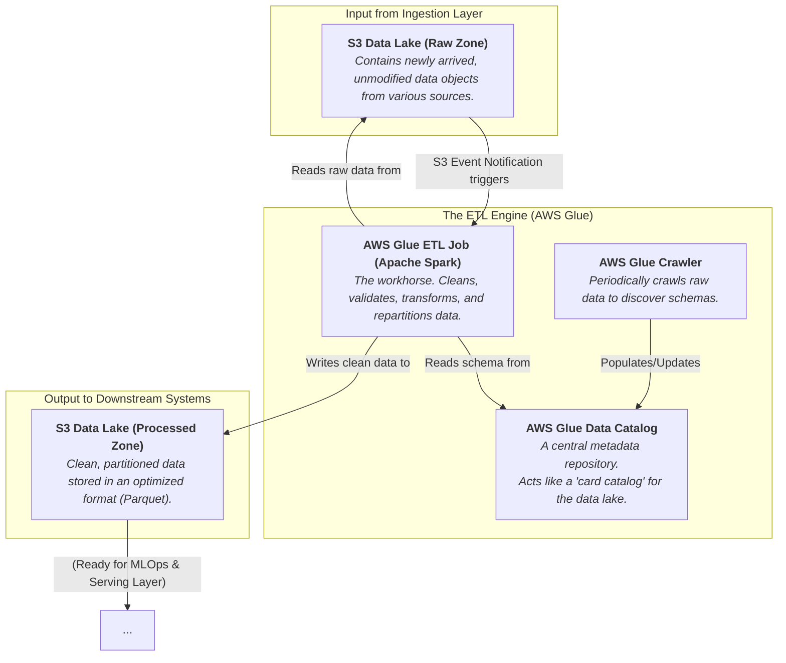

### Internal Architecture: Data Lake & ETL Pipeline

This system is triggered whenever new data lands in the "Raw Zone" from the Ingestion Layer. Its output is clean, optimized data in the "Processed Zone."

-----

### How It Works & Communicates

#### 1\. The Trigger: New Raw Data

The process begins the moment the **Ingestion Layer** drops a new file (e.g., `social-media-feed-1665034800.json`) into the **S3 Raw Zone**. An S3 Event Notification is automatically sent out, which triggers our AWS Glue ETL job.

#### 2\. The Brains: AWS Glue

This is a serverless data integration service that does all the heavy lifting.

  * **Glue Data Catalog (The Map):** Before we can process data, we need to understand its structure. An **AWS Glue Crawler** runs periodically on our raw data, automatically inferring the schema (e.g., "this JSON file has fields: `id`, `timestamp`, `text`, `user`") and storing this information in the **Glue Data Catalog**. This catalog provides a unified schema reference for all our data services.

  * **Glue ETL Job (The Worker):** This is a serverless Apache Spark script that executes the transformation logic. When triggered, it:

    1.  **Reads** the new raw file from the S3 Raw Zone.
    2.  **Consults** the Glue Data Catalog to understand the data's structure.
    3.  **Transforms the Data:** This is where the magic happens. The script performs crucial tasks like:
          * **Cleaning:** Removing duplicates, handling null values.
          * **Enriching:** Joining data with other datasets (e.g., adding district names to a set of coordinates).
          * **Standardizing:** Converting all timestamps to a single format (UTC), standardizing location names.
          * **Restructuring:** Converting from a nested JSON to a flat structure.
    4.  **Converts to Parquet:** The script converts the data into **Apache Parquet**, a columnar storage format. This is vital because it's highly compressed (saving S3 costs) and allows analytics queries to run up to 10x faster (or more) by only reading the specific columns needed, not the entire file.
    5.  **Partitions and Writes:** Finally, it writes the clean Parquet file to the **S3 Processed Zone**. It doesn't just dump the file; it writes it into a logical, partitioned folder structure, like `.../data_source=social_media/year=2025/month=10/day=06/`. This partitioning is critical for efficient querying later.

#### 3\. The Output: A Clean, "Golden" Dataset

The output of this system is organized, clean data in the **S3 Processed Zone**. This becomes the single source of truth for all other systems.

  * **Communication with Next Systems:** The processed data in S3 is now ready to be consumed. The **MLOps Platform** will use it to train models, and the **Serving Layer** will load it into the specialized databases (DynamoDB, OpenSearch) that power your dashboard and agent.