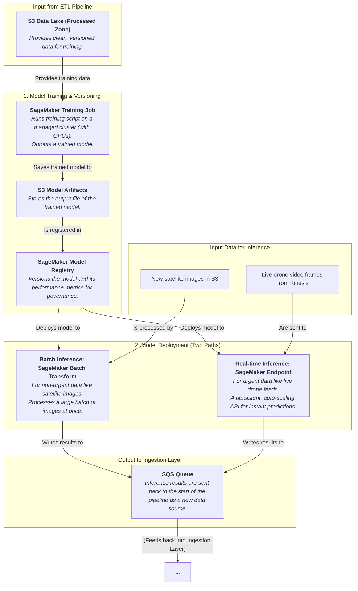

### Internal Architecture: MLOps Platform

This system is built around **Amazon SageMaker** and is designed to handle the complete machine learning lifecycle.

-----

### How It Works & Communicates

#### 1\. Model Training and Versioning

This is the core development loop, which can be fully automated.

  * **Trigger:** The process can be triggered on a schedule (e.g., retrain the model every week with new data) or manually by a data scientist.
  * **SageMaker Training Job:** When triggered, a **SageMaker Training Job** starts. You provide three things:
    1.  Your training code (e.g., a PyTorch script for your CNN).
    2.  A pointer to the clean training data in the **S3 Processed Zone**.
    3.  The type of compute resources you need (e.g., a powerful GPU instance).
        SageMaker automatically provisions the infrastructure, runs the code, and then tears everything down, so you only pay for the training time.
  * **Model Registry:** The output of the training job is a **model artifact** (the trained model file) which is saved to S3. This artifact, along with its performance metrics (e.g., "accuracy: 92%"), is then versioned in the **SageMaker Model Registry**. This provides a crucial audit trail and allows you to easily deploy or roll back to any version of your model.

#### 2\. Model Deployment (Using the Model)

Once a model is approved in the registry, it's deployed for inference. Your system needs two different deployment patterns:

  * **Batch Inference (for Satellite Imagery):** New satellite images don't require an instant response. For this, we use a **SageMaker Batch Transform** job. You can trigger this once a day, point it to all the new images, and it will efficiently process them all in a large batch, saving costs.
  * **Real-time Inference (for Drone Feeds):** For a live drone feed, you need answers in milliseconds. The model is deployed to a **SageMaker Endpoint**. This creates a persistent, auto-scaling API. Your video processing application can continuously send video frames to this endpoint and get immediate damage assessments back.

#### 3\. Communication: Closing the Loop

The output of the model—the inference results (e.g., `{ "image_id": "...", "damage_level": "severe", "confidence": 0.95 }`)—is itself a valuable piece of data.

  * These results are **sent back to the SQS queue in our Resilient Ingestion Layer**.
  * **Why?** This treats the AI's analysis just like any other data source. The results are written to the Raw Zone, processed by the ETL pipeline, and ultimately loaded into the serving databases. This "closes the loop" and ensures the AI's insights are available to the dashboard and the Bedrock Agent just like any other piece of information.