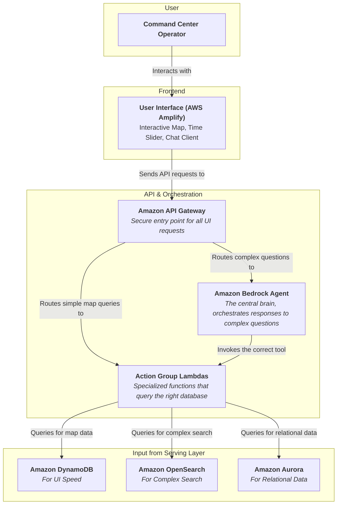

### Internal Architecture: Application & AI Agent Layer

This layer brings everything together, connecting the user to the powerful data stores we've built.

-----

### How It Works & Communicates

This layer is where the intelligence of the system truly shines. Let's walk through how an operator uses it.

#### 1\. The User Interface

The operator logs into the web dashboard hosted on **AWS Amplify**. They see the map and the chat window. When they move the time slider, the map instantly updates. This is a "simple" interaction:

  * The UI sends a request to **API Gateway**.
  * API Gateway routes it to a specific, lightweight **Lambda function**.
  * This function performs a fast key-value lookup on **DynamoDB** to get the aggregated map stats for that timestamp and returns them.

#### 2\. The AI Agent: The Intelligent Orchestrator 🧠

Now, the operator asks a complex question in the chat window: *"Show me all hospitals with more than 10 open beds in areas where social media chatter about 'needing medicine' has spiked in the last 3 hours."*

This is not a simple query. This is where the **Amazon Bedrock Agent** becomes the star of the show.

  * **Request & Plan:** The request is sent to the Bedrock Agent. The agent uses its underlying Large Language Model to understand the user's intent and break the question down into a logical plan:

    1.  Find areas where social media chatter about "needing medicine" has spiked recently. This requires a time-series aggregation and text search. **This sounds like a job for Amazon OpenSearch.**
    2.  Get a list of all hospitals. This is structured data. **This sounds like a job for Amazon Aurora.**
    3.  Check the bed capacity for those hospitals. This is also in **Aurora**.
    4.  Cross-reference the locations of the high-chatter areas with the hospital locations.
    5.  Filter the hospital list to only include those in the relevant areas with \>10 open beds.

  * **Execution:** The agent doesn't execute the queries itself. It acts as an orchestrator, invoking the correct **Action Group Lambdas** (its "tools"):

      * It calls a Lambda designed to query **OpenSearch** to get the list of "hotspot" neighborhoods.
      * It then calls another Lambda designed to query **Amazon Aurora** to get the list of hospitals and their bed capacities.
      * The agent's own logic can perform the final filtering and cross-referencing.

  * **Response:** Once it has the final list of hospitals, the agent synthesizes this structured data into a clear, natural language answer and presents it to the operator, perhaps even highlighting those hospitals on the map.