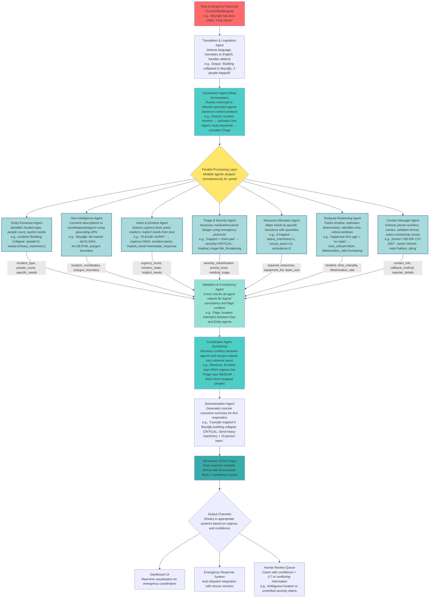

```mermaid
graph TD
    A["Raw Emergency Transcript<br/>(Turkish/Multilingual)<br/><i>e.g., 'Beyoğlu'nda bina çöktü, 3 kişi sıkıştı!'</i>"] --> B["Translation & Linguistics Agent<br/><i>Detects language, translates to English, handles dialects</i><br/>e.g., Output: 'Building collapsed in Beyoğlu, 3 people trapped!'"]
    
    B --> C["Coordinator Agent (Meta-Orchestrator)<br/><i>Routes transcript to relevant specialist agents based on content analysis</i><br/>e.g., Detects: location mention → activates Geo Agent; injury keywords → activates Triage"]
    
    C --> D{Parallel Processing Layer<br/><i>Multiple agents analyze simultaneously for speed</i>}
    
    D --> E1["Entity Extraction Agent<br/><i>Identifies incident type, people count, explicit needs</i><br/>e.g., incident='Building Collapse', people=3, needs=['heavy_machinery']"]
    D --> E2["Geo-Intelligence Agent<br/><i>Converts descriptions to coordinates/polygons using geocoding APIs</i><br/>e.g., 'Beyoğlu old market' → lat:41.0344, lon:28.9784, polygon boundary"]
    D --> E3["Intent & Emotion Agent<br/><i>Detects urgency level, panic markers, implicit needs from tone</i><br/>e.g., 'PLEASE HURRY' → urgency=HIGH, emotion=panic, implicit_need='immediate_response'"]
    D --> E4["Triage & Severity Agent<br/><i>Assesses medical/structural danger using emergency protocols</i><br/>e.g., 'trapped + chest pain' → severity=CRITICAL, medical_triage=life_threatening"]
    D --> E5["Resource Allocation Agent<br/><i>Maps needs to specific resources with quantities</i><br/>e.g., 3 trapped → heavy_machinery=1, rescue_team=10, ambulance=2"]
    D --> E6["Temporal Reasoning Agent<br/><i>Tracks timeline, estimates deterioration, identifies time-critical windows</i><br/>e.g., 'happened 2hrs ago' + 'no water' → time_critical=HIGH, deterioration_rate=increasing"]
    D --> E7["Contact Manager Agent<br/><i>Extracts phone numbers, names, validates format, notes connectivity issues</i><br/>e.g., phone='+90-555-123-4567', name='Ahmet', note='battery_dying'"]
    
    E1 --> |"incident_type, people_count, specific_needs"| F["Validation & Consistency Agent<br/><i>Cross-checks all agent outputs for logical consistency and flags conflicts</i><br/>e.g., Flags: location mismatch between Geo and Entity agents"]
    E2 --> |"location, coordinates, polygon_boundary"| F
    E3 --> |"urgency_score, emotion_state, implicit_needs"| F
    E4 --> |"severity_classification, priority_level, medical_triage"| F
    E5 --> |"required_resources, equipment_list, team_size"| F
    E6 --> |"timeline, time_criticality, deterioration_rate"| F
    E7 --> |"contact_info, callback_method, reporter_details"| F
    
    F --> G["Coordinator Agent (Synthesis)<br/><i>Resolves conflicts between agents and merges outputs into coherent report</i><br/>e.g., Resolves: Emotion says HIGH urgency but Triage says MEDIUM → final=HIGH (trapped people)"]
    
    G --> H["Summarization Agent<br/><i>Generates concise executive summary for first responders</i><br/>e.g., '3 people trapped in Beyoğlu building collapse. CRITICAL. Send heavy machinery + 10-person team.'"]
    
    H --> I["Structured JSON Output<br/><i>Final machine-readable format with all extracted fields + confidence scores</i>"]
    
    I --> J{Output Channels<br/><i>Routes to appropriate systems based on urgency and confidence</i>}
    J --> K["Dashboard UI<br/><i>Real-time visualization for emergency coordinators</i>"]
    J --> L["Emergency Response System<br/><i>Auto-dispatch integration with rescue services</i>"]
    J --> M["Human Review Queue<br/><i>Cases with confidence < 0.7 or conflicting information</i><br/>e.g., Ambiguous location or unverified severity claims"]
    
    style A fill:#ff6b6b
    style C fill:#4ecdc4
    style D fill:#ffe66d
    style F fill:#95e1d3
    style G fill:#4ecdc4
    style I fill:#38ada9
    
    classDef agentClass fill:#a8dadc,stroke:#457b9d,stroke-width:2px
    class E1,E2,E3,E4,E5,E6,E7 agentClass
```