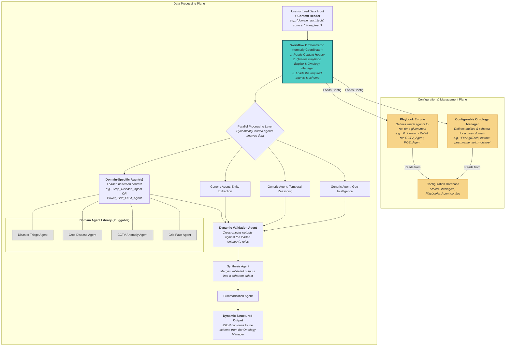

```mermaid
graph TD
    subgraph "Configuration & Management Plane"
        direction LR
        CFG_DB["Configuration Database<br/><i>Stores Ontologies, Playbooks, Agent configs</i>"]
        OM["<b>Configurable Ontology Manager</b><br/><i>Defines entities & schema for a given domain<br/>e.g., 'For AgriTech, extract: pest_name, soil_moisture'</i>"]
        PE["<b>Playbook Engine</b><br/><i>Defines which agents to run for a given input<br/>e.g., 'If domain is Retail, run CCTV_Agent, POS_Agent'</i>"]
    end

    subgraph "Data Processing Plane"
        A["Unstructured Data Input<br/><b>+ Context Header</b><br/><i>e.g., {domain: 'agri_tech', source: 'drone_feed'}</i>"] --> C_PRIME

        C_PRIME["<b>Workflow Orchestrator</b> (formerly Coordinator)<br/><i>1. Reads Context Header<br/>2. Queries Playbook Engine & Ontology Manager<br/>3. Loads the required agents & schema</i>"]

        C_PRIME --> D_PRIME{Parallel Processing Layer<br/><i>Dynamically loaded agents analyze data</i>}

        D_PRIME --> DA1["Generic Agent: Geo-Intelligence"]
        D_PRIME --> DA2["Generic Agent: Temporal Reasoning"]
        D_PRIME --> DA3["Generic Agent: Entity Extraction"]
        D_PRIME --> DA4["<b>Domain-Specific Agent(s)</b><br/><i>Loaded based on context<br/>e.g., Crop_Disease_Agent OR<br/>Power_Grid_Fault_Agent</i>"]

        subgraph "<b>Domain Agent Library (Pluggable)</b>"
            direction LR
            AGENT_DISASTER["Disaster Triage Agent"]
            AGENT_AGRI["Crop Disease Agent"]
            AGENT_RETAIL["CCTV Anomaly Agent"]
            AGENT_ENERGY["Grid Fault Agent"]
        end
        
        DA4 --- AGENT_AGRI & AGENT_ENERGY & AGENT_RETAIL & AGENT_DISASTER

        DA1 --> F_PRIME["<b>Dynamic Validation Agent</b><br/><i>Cross-checks outputs against the loaded ontology's rules</i>"]
        DA2 --> F_PRIME
        DA3 --> F_PRIME
        DA4 --> F_PRIME

        F_PRIME --> G_PRIME["Synthesis Agent<br/><i>Merges validated outputs into a coherent object</i>"]
        G_PRIME --> H["Summarization Agent"]
        H --> I_PRIME["<b>Dynamic Structured Output</b><br/><i>JSON conforms to the schema from the Ontology Manager</i>"]
    end

    %% Connections between planes
    C_PRIME -- "Loads Config" --> OM & PE
    OM & PE -- "Reads from" --> CFG_DB
    
    style C_PRIME fill:#4ecdc4,stroke:#1a535c,stroke-width:3px
    classDef config fill:#f7d488,stroke:#d9a44e
    class CFG_DB,OM,PE config
    classDef agentLib fill:#e0e0e0,stroke:#666
    class AGENT_DISASTER,AGENT_AGRI,AGENT_RETAIL,AGENT_ENERGY agentLib
```