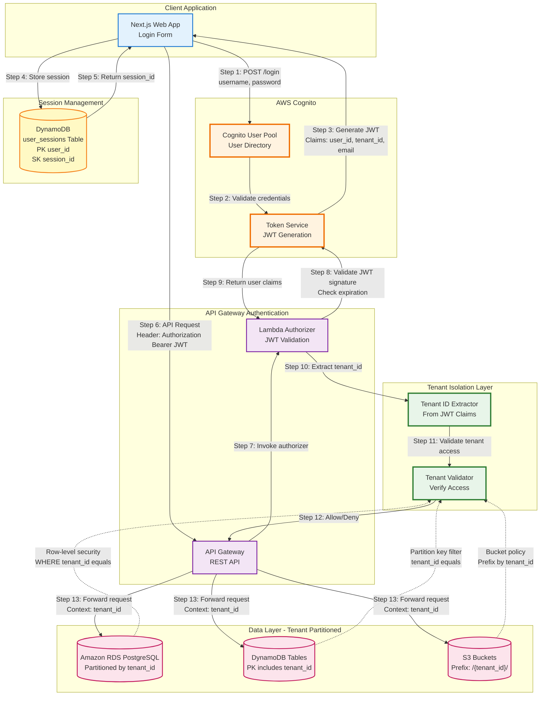

# Diagram 01: Authentication & Multi-Tenancy Flow

## Purpose
This diagram shows the authentication flow using AWS Cognito and how tenant isolation is enforced across all system components.

## AWS Services Used
- AWS Cognito (User Pools)
- AWS API Gateway (Lambda Authorizer)
- Amazon DynamoDB (Session Store)

## Diagram

## Component Descriptions

### AWS Cognito User Pool
- **Purpose**: Manages user authentication and stores user credentials
- **Configuration**:
  - Password policy: Min 8 chars, uppercase, lowercase, numbers, symbols
  - MFA: Optional (SMS or TOTP)
  - Token expiration: Access token 1 hour, Refresh token 30 days
- **JWT Claims**: `sub` (user_id), `tenant_id` (custom), `email`, `cognito:groups`

### Lambda Authorizer
- **Purpose**: Validates JWT tokens on every API request
- **Runtime**: Python 3.11
- **Execution**: Synchronous, <100ms
- **Caching**: 5 minutes per token
- **Response**: IAM policy document (Allow/Deny)

### DynamoDB Session Store
- **Table**: `user_sessions`
- **Partition Key**: `user_id` (String)
- **Sort Key**: `session_id` (String)
- **TTL**: `expires_at` attribute (30 days)
- **Attributes**: `tenant_id`, `chat_id`, `connection_id`, `created_at`, `last_activity`

### Tenant Isolation Enforcement
- **PostgreSQL**: Row-level security policies on all tables
- **DynamoDB**: Partition key includes `tenant_id`
- **S3**: Bucket policies restrict access to `/{tenant_id}/` prefix
- **Lambda**: Execution role scoped to tenant resources

## Data Flow

1. User submits credentials to Cognito
2. Cognito validates and returns JWT with `tenant_id` claim
3. Client stores JWT and session_id
4. All API requests include JWT in Authorization header
5. Lambda Authorizer validates JWT and extracts `tenant_id`
6. API Gateway forwards request with `tenant_id` in context
7. All data access filtered by `tenant_id`

## Security Notes

- JWT tokens signed with RS256 (asymmetric)
- Cognito public keys rotated automatically
- Lambda Authorizer caches validation results
- Session store uses DynamoDB encryption at rest
- All data partitioned by `tenant_id` for isolation
