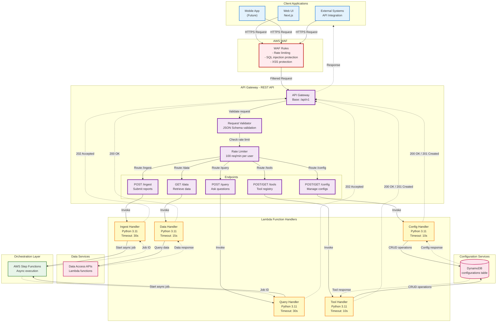

# Diagram 02: API Gateway & Endpoint Architecture

## Purpose
This diagram shows the API Gateway configuration with all 5 versioned endpoints and request routing logic.

## AWS Services Used
- AWS API Gateway (REST API)
- AWS Lambda (Backend handlers)
- AWS WAF (Web Application Firewall)

## Diagram



## Endpoint Specifications

### POST /api/v1/ingest

**Purpose**: Submit unstructured reports for processing

**Request:**
```json
{
  "domain_id": "civic-complaints",
  "text": "Pothole on Main Street near the library",
  "images": ["base64_string_1", "base64_string_2"]
}
```

**Response (202 Accepted):**
```json
{
  "job_id": "uuid-v4-string",
  "status": "processing",
  "message": "Report submitted successfully"
}
```

**Validation:**
- `domain_id`: Required, must exist in configuration
- `text`: Required, min 10 chars, max 10,000 chars
- `images`: Optional, max 5 images, max 5MB each

### POST /api/v1/query

**Purpose**: Ask natural language questions about data

**Request:**
```json
{
  "domain_id": "civic-complaints",
  "question": "What are the trends in pothole complaints?"
}
```

**Response (202 Accepted):**
```json
{
  "job_id": "uuid-v4-string",
  "status": "processing",
  "message": "Query submitted successfully"
}
```

**Validation:**
- `domain_id`: Required, must exist in configuration
- `question`: Required, min 5 chars, max 500 chars

### GET /api/v1/data

**Purpose**: Retrieve structured data

**Query Parameters:**
- `type`: Required, one of `retrieval|aggregation|spatial|analytics`
- `filters`: Optional, JSON string with filters
- `page`: Optional, default 1
- `limit`: Optional, default 20, max 100

**Example:**
```
GET /api/v1/data?type=retrieval&filters=json-encoded-string&page=1&limit=20
```

**Response (200 OK):**
```json
{
  "data": [
    {
      "id": "uuid",
      "domain_id": "civic-complaints",
      "structured_data": {...},
      "created_at": "2024-01-15T10:30:00Z",
      "images": ["https://s3.../image1.jpg"]
    }
  ],
  "pagination": {
    "page": 1,
    "limit": 20,
    "total": 150,
    "pages": 8
  }
}
```

### POST /api/v1/config

**Purpose**: Create or update configurations

**Request:**
```json
{
  "type": "agent",
  "config": {
    "agent_name": "Severity Classifier",
    "agent_type": "ingestion",
    "system_prompt": "Classify complaint severity as low, medium, or high",
    "tools": ["comprehend", "web_search"],
    "output_schema": {
      "severity": "string",
      "confidence": "number"
    },
    "dependency_parent": null
  }
}
```

**Response (201 Created):**
```json
{
  "config_id": "uuid-v4-string",
  "status": "created",
  "message": "Agent configuration created successfully"
}
```

**Config Types:**
- `agent`: Agent configurations
- `playbook`: Playbook configurations
- `dependency`: Dependency graph configurations
- `tool`: Tool registry entries

### GET /api/v1/config/{type}/{id}

**Purpose**: Retrieve configuration by type and ID

**Response (200 OK):**
```json
{
  "config_id": "uuid-v4-string",
  "type": "agent",
  "config": {},
  "created_at": "2024-01-15T10:30:00Z",
  "updated_at": "2024-01-15T10:30:00Z"
}
```

## AWS WAF Rules

**Rate Limiting:**
- 100 requests per minute per IP
- 1000 requests per hour per IP

**SQL Injection Protection:**
- Block requests with SQL keywords in query params
- Block requests with SQL patterns in body

**XSS Protection:**
- Block requests with script tags
- Block requests with event handlers

**Geographic Restrictions:**
- Allow all regions (configurable)

## API Gateway Configuration

**Throttling:**
- Burst limit: 500 requests
- Rate limit: 1000 requests per second

**CORS:**
- Allowed origins: Configured domains
- Allowed methods: GET, POST, PUT, DELETE, OPTIONS
- Allowed headers: Authorization, Content-Type

**Request/Response Transformation:**
- Add `X-Request-ID` header
- Add `X-Tenant-ID` header from JWT
- Remove sensitive headers from response

**Logging:**
- CloudWatch Logs for all requests
- Log level: INFO
- Include request/response bodies (sanitized)

## Lambda Handler Configuration

**Environment Variables:**
- `STEP_FUNCTIONS_ARN`: Step Functions state machine ARN
- `CONFIG_TABLE_NAME`: DynamoDB configuration table
- `TENANT_ID`: Extracted from JWT (runtime)

**IAM Permissions:**
- `states:StartExecution` (for ingest/query handlers)
- `dynamodb:GetItem`, `dynamodb:PutItem`, `dynamodb:Query` (for config/tool handlers)
- `logs:CreateLogGroup`, `logs:CreateLogStream`, `logs:PutLogEvents`

**Memory:**
- Ingest/Query handlers: 512 MB
- Data handler: 256 MB
- Config/Tool handlers: 256 MB

**Timeout:**
- Ingest/Query handlers: 30 seconds
- Data handler: 15 seconds
- Config/Tool handlers: 10 seconds

## Error Responses

**400 Bad Request:**
```json
{
  "error": "validation_error",
  "message": "Invalid request format",
  "fields": [
    {"field": "domain_id", "error": "Required field missing"}
  ]
}
```

**401 Unauthorized:**
```json
{
  "error": "unauthorized",
  "message": "Invalid or expired JWT token"
}
```

**403 Forbidden:**
```json
{
  "error": "forbidden",
  "message": "Access denied to this resource"
}
```

**429 Too Many Requests:**
```json
{
  "error": "rate_limit_exceeded",
  "message": "Too many requests, please try again later",
  "retry_after": 60
}
```

**500 Internal Server Error:**
```json
{
  "error": "internal_error",
  "message": "An unexpected error occurred",
  "request_id": "uuid-v4-string"
}
```
