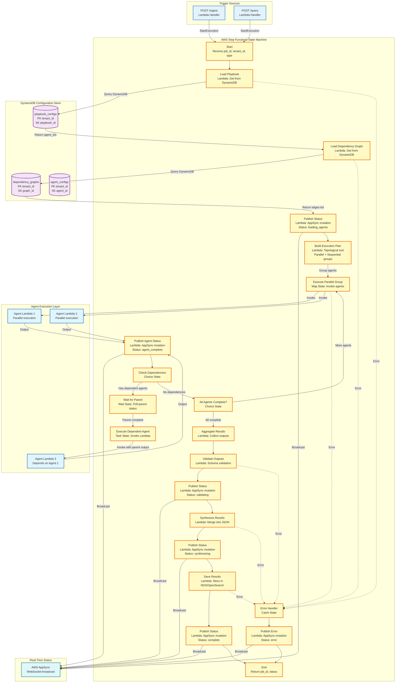

# Diagram 03: Unified Orchestrator Deep Dive

## Purpose
This diagram shows the AWS Step Functions orchestrator that handles both ingestion and query pipelines with dependency graph execution.

## AWS Services Used
- AWS Step Functions (State Machine)
- AWS Lambda (Agent functions)
- Amazon DynamoDB (Configuration Store)
- AWS AppSync (Status broadcasting)

## Diagram



## Component Descriptions

### AWS Step Functions State Machine

**State Machine Type**: Standard (for long-running workflows)

**Execution Role**: Permissions to invoke Lambda, read DynamoDB, publish to AppSync

**Timeout**: 15 minutes (max agent execution time)

**Retry Strategy**:
- Agent invocation: 3 retries with exponential backoff
- DynamoDB queries: 2 retries with exponential backoff
- AppSync mutations: 2 retries

### State Definitions

**Start State (Pass)**
- Receives input: `{ "job_id", "tenant_id", "type": "ingestion|query", "data": {...} }`
- Adds timestamp and execution ARN to context

**Load Playbook (Task - Lambda)**
- Function: `LoadPlaybookFunction`
- Input: `{ "tenant_id", "domain_id", "type": "ingestion|query" }`
- Output: `{ "agent_ids": ["agent1", "agent2", ...] }`
- Timeout: 5 seconds

**Load Dependency Graph (Task - Lambda)**
- Function: `LoadDependencyGraphFunction`
- Input: `{ "tenant_id", "playbook_id" }`
- Output: `{ "edges": [{"from": "agent1", "to": "agent2"}] }`
- Timeout: 5 seconds

**Build Execution Plan (Task - Lambda)**
- Function: `BuildExecutionPlanFunction`
- Algorithm: Topological sort with level grouping
- Input: `{ "agent_ids", "edges" }`
- Output: `{ "levels": [[agent1, agent2], [agent3]] }`
- Timeout: 10 seconds

**Execute Parallel Group (Map State)**
- Iterator: Agent invocation
- Max Concurrency: 10 agents
- Input: `{ "agent_id", "raw_data", "parent_output": null }`
- Output: Array of agent outputs

**Check Dependencies (Choice State)**
- Condition: Check if agent has `dependency_parent` in config
- Branch 1: Has dependency → Wait for Parent
- Branch 2: No dependency → Continue

**Wait for Parent (Wait State)**
- Wait type: Dynamic (based on parent execution time)
- Max wait: 5 minutes
- Poll interval: 5 seconds

**Execute Dependent Agent (Task - Lambda)**
- Function: Agent Lambda (dynamic)
- Input: `{ "agent_id", "raw_data", "parent_output": {...} }`
- Output: Agent output
- Timeout: 5 minutes

**Aggregate Results (Task - Lambda)**
- Function: `AggregateResultsFunction`
- Input: Array of agent outputs
- Output: `{ "aggregated": {...} }`
- Timeout: 10 seconds

**Validate Outputs (Task - Lambda)**
- Function: `ValidateOutputsFunction`
- Validation: Check against output schemas (max 5 keys)
- Input: `{ "aggregated", "schemas": [...] }`
- Output: `{ "valid": true/false, "errors": [...] }`
- Timeout: 10 seconds

**Synthesize Results (Task - Lambda)**
- Function: `SynthesizeResultsFunction`
- Purpose: Merge agent outputs into coherent JSON
- Input: `{ "aggregated" }`
- Output: `{ "synthesized": {...} }`
- Timeout: 10 seconds

**Save Results (Task - Lambda)**
- Function: `SaveResultsFunction`
- Actions: Store in RDS, create embeddings, save to OpenSearch
- Input: `{ "synthesized", "job_id", "tenant_id" }`
- Output: `{ "incident_id", "status": "saved" }`
- Timeout: 30 seconds

**Error Handler (Catch State)**
- Catches: All errors (States.ALL)
- ResultPath: `$.error`
- Next: PublishError

### Execution Plan Algorithm

**Topological Sort with Level Grouping:**

```python
def build_execution_plan(agent_ids, edges):
    # Build adjacency list
    graph = defaultdict(list)
    in_degree = defaultdict(int)
    
    for edge in edges:
        graph[edge['from']].append(edge['to'])
        in_degree[edge['to']] += 1
    
    # Find agents with no dependencies (level 0)
    levels = []
    current_level = [agent for agent in agent_ids if in_degree[agent] == 0]
    
    while current_level:
        levels.append(current_level)
        next_level = []
        
        for agent in current_level:
            for neighbor in graph[agent]:
                in_degree[neighbor] -= 1
                if in_degree[neighbor] == 0:
                    next_level.append(neighbor)
        
        current_level = next_level
    
    return levels  # [[agent1, agent2], [agent3], [agent4, agent5]]
```

**Example:**
- Agents: A, B, C, D, E
- Dependencies: C depends on A, D depends on B, E depends on C
- Execution Plan:
  - Level 0: [A, B] (parallel)
  - Level 1: [C, D] (parallel, wait for level 0)
  - Level 2: [E] (wait for C)

### Status Broadcasting

**AppSync Mutations:**

```graphql
mutation PublishStatus($input: StatusInput!) {
  publishStatus(input: $input) {
    jobId
    status
    message
    timestamp
  }
}
```

**Status Types:**
- `loading_agents`: Orchestrator loading configuration
- `invoking_{agent_name}`: Starting agent execution
- `agent_complete_{agent_name}`: Agent finished
- `validating`: Validation in progress
- `synthesizing`: Synthesis in progress
- `complete`: Job finished successfully
- `error`: Job failed

### Error Handling Strategy

**Retry Logic:**
- Agent timeout: Retry 3 times with 2x backoff (2s, 4s, 8s)
- DynamoDB throttling: Retry 2 times with 1.5x backoff
- AppSync errors: Retry 2 times, continue on failure (non-blocking)

**Partial Success:**
- If some agents fail, continue with successful outputs
- Mark failed agents in final result
- Include error messages in synthesis

**Dead Letter Queue:**
- Failed executions sent to SQS DLQ
- CloudWatch alarm on DLQ depth > 10
- Manual review and retry

### Performance Optimization

**Parallel Execution:**
- Agents in same level execute concurrently
- Max 10 concurrent Lambda invocations
- Reduces total execution time by ~60%

**Caching:**
- Playbook configurations cached in Lambda memory (5 min TTL)
- Dependency graphs cached in Lambda memory (5 min TTL)
- Agent configurations loaded once per execution

**Async Status Updates:**
- AppSync mutations non-blocking
- Failures don't stop execution
- Logged for debugging

## State Machine Definition (JSON)

```json
{
  "Comment": "Unified Orchestrator for Ingestion and Query Pipelines",
  "StartAt": "LoadPlaybook",
  "States": {
    "LoadPlaybook": {
      "Type": "Task",
      "Resource": "arn:aws:lambda:REGION:ACCOUNT:function:LoadPlaybookFunction",
      "TimeoutSeconds": 5,
      "Retry": [
        {
          "ErrorEquals": ["States.ALL"],
          "IntervalSeconds": 2,
          "MaxAttempts": 2,
          "BackoffRate": 1.5
        }
      ],
      "Catch": [
        {
          "ErrorEquals": ["States.ALL"],
          "ResultPath": "$.error",
          "Next": "ErrorHandler"
        }
      ],
      "Next": "LoadDependencyGraph"
    },
    "LoadDependencyGraph": {
      "Type": "Task",
      "Resource": "arn:aws:lambda:REGION:ACCOUNT:function:LoadDependencyGraphFunction",
      "TimeoutSeconds": 5,
      "Next": "PublishLoadingStatus"
    },
    "PublishLoadingStatus": {
      "Type": "Task",
      "Resource": "arn:aws:lambda:REGION:ACCOUNT:function:PublishStatusFunction",
      "Parameters": {
        "status": "loading_agents"
      },
      "Next": "BuildExecutionPlan"
    },
    "BuildExecutionPlan": {
      "Type": "Task",
      "Resource": "arn:aws:lambda:REGION:ACCOUNT:function:BuildExecutionPlanFunction",
      "TimeoutSeconds": 10,
      "Next": "ExecuteAgentLevels"
    },
    "ExecuteAgentLevels": {
      "Type": "Map",
      "ItemsPath": "$.levels",
      "MaxConcurrency": 10,
      "Iterator": {
        "StartAt": "InvokeAgent",
        "States": {
          "InvokeAgent": {
            "Type": "Task",
            "Resource": "arn:aws:lambda:REGION:ACCOUNT:function:AgentInvokerFunction",
            "TimeoutSeconds": 300,
            "Retry": [
              {
                "ErrorEquals": ["States.Timeout"],
                "IntervalSeconds": 2,
                "MaxAttempts": 3,
                "BackoffRate": 2.0
              }
            ],
            "End": true
          }
        }
      },
      "Next": "AggregateResults"
    },
    "AggregateResults": {
      "Type": "Task",
      "Resource": "arn:aws:lambda:REGION:ACCOUNT:function:AggregateResultsFunction",
      "Next": "ValidateOutputs"
    },
    "ValidateOutputs": {
      "Type": "Task",
      "Resource": "arn:aws:lambda:REGION:ACCOUNT:function:ValidateOutputsFunction",
      "Next": "SynthesizeResults"
    },
    "SynthesizeResults": {
      "Type": "Task",
      "Resource": "arn:aws:lambda:REGION:ACCOUNT:function:SynthesizeResultsFunction",
      "Next": "SaveResults"
    },
    "SaveResults": {
      "Type": "Task",
      "Resource": "arn:aws:lambda:REGION:ACCOUNT:function:SaveResultsFunction",
      "TimeoutSeconds": 30,
      "Next": "PublishCompleteStatus"
    },
    "PublishCompleteStatus": {
      "Type": "Task",
      "Resource": "arn:aws:lambda:REGION:ACCOUNT:function:PublishStatusFunction",
      "Parameters": {
        "status": "complete"
      },
      "End": true
    },
    "ErrorHandler": {
      "Type": "Task",
      "Resource": "arn:aws:lambda:REGION:ACCOUNT:function:PublishStatusFunction",
      "Parameters": {
        "status": "error"
      },
      "End": true
    }
  }
}
```
