# Diagram 04: Agent Library Architecture

## Purpose
This diagram shows the Lambda-based agent architecture with built-in ingestion agents, query agents (interrogative-based), and custom agents.

## AWS Services Used
- AWS Lambda (Agent functions)
- AWS Bedrock (Claude 3 for LLM)
- AWS Comprehend (Entity extraction)
- Amazon Location Service (Geocoding)

## Diagram

```mermaid
flowchart TB
    subgraph AgentInvoker["Agent Invoker - Step Functions Task"]
        Invoker["Agent Invoker Lambda<br/>Routes to specific agent"]
    end
    
    subgraph IngestionAgents["Built-in Ingestion Agents - AWS Lambda"]
        GeoAgent["Geo Agent<br/>Python 3.11<br/>Memory 512MB<br/>Timeout 5min"]
        TempAgent["Temporal Agent<br/>Python 3.11<br/>Memory 512MB<br/>Timeout 5min"]
        EntityAgent["Entity Agent<br/>Python 3.11<br/>Memory 512MB<br/>Timeout 5min"]
    end
    
    subgraph QueryAgents["Built-in Query Agents - AWS Lambda"]
        WhenAgent["When Agent<br/>Interrogative temporal<br/>Memory 512MB"]
        WhereAgent["Where Agent<br/>Interrogative spatial<br/>Memory 512MB"]
        WhyAgent["Why Agent<br/>Interrogative causal<br/>Memory 512MB"]
        HowAgent["How Agent<br/>Interrogative method<br/>Memory 512MB"]
        WhatAgent["What Agent<br/>Interrogative entity<br/>Memory 512MB"]
        WhoAgent["Who Agent<br/>Interrogative person<br/>Memory 512MB"]
        WhichAgent["Which Agent<br/>Interrogative selection<br/>Memory 512MB"]
        HowManyAgent["How Many Agent<br/>Interrogative count<br/>Memory 512MB"]
        HowMuchAgent["How Much Agent<br/>Interrogative quantity<br/>Memory 512MB"]
        FromWhereAgent["From Where Agent<br/>Interrogative origin<br/>Memory 512MB"]
        WhatKindAgent["What Kind Agent<br/>Interrogative type<br/>Memory 512MB"]
    end
    
    subgraph CustomAgents["Custom User Agents - AWS Lambda"]
        CustomAgent1["Custom Agent 1<br/>User-defined logic<br/>Memory 512MB"]
        CustomAgentN["Custom Agent N<br/>User-defined logic<br/>Memory 512MB"]
    end
    
    subgraph AgentTools["Agent Tool Access"]
        ToolACL["Tool Access Control<br/>Lambda Layer"]
    end
    
    subgraph AWSServices["AWS AI Services"]
        Bedrock["AWS Bedrock<br/>Claude 3 Sonnet<br/>LLM inference"]
        Comprehend["AWS Comprehend<br/>Entity extraction<br/>Sentiment analysis"]
        Location["Amazon Location<br/>Geocoding service"]
    end
    
    subgraph ExternalTools["External Tools"]
        WebSearch["Web Search API<br/>External information"]
        CustomAPIs["Custom Domain APIs<br/>User integrations"]
    end
    
    subgraph DataAccess["Data Access APIs"]
        RetrievalAPI["Retrieval API<br/>Query stored data"]
        VectorSearch["Vector Search<br/>OpenSearch semantic"]
    end
    
    subgraph AgentConfig["Agent Configuration - DynamoDB"]
        ConfigTable[("agent_configs table<br/>System prompts<br/>Tool permissions<br/>Output schemas<br/>Dependencies")]
    end
    
    %% Invocation Flow
    Invoker -->|Load config| ConfigTable
    ConfigTable -->|Return agent config| Invoker
    
    Invoker -->|Invoke ingestion| GeoAgent
    Invoker -->|Invoke ingestion| TempAgent
    Invoker -->|Invoke ingestion| EntityAgent
    
    Invoker -->|Invoke query| WhenAgent
    Invoker -->|Invoke query| WhereAgent
    Invoker -->|Invoke query| WhyAgent
    Invoker -->|Invoke query| HowAgent
    Invoker -->|Invoke query| WhatAgent
    Invoker -->|Invoke query| WhoAgent
    Invoker -->|Invoke query| WhichAgent
    Invoker -->|Invoke query| HowManyAgent
    Invoker -->|Invoke query| HowMuchAgent
    Invoker -->|Invoke query| FromWhereAgent
    Invoker -->|Invoke query| WhatKindAgent
    
    Invoker -->|Invoke custom| CustomAgent1
    Invoker -->|Invoke custom| CustomAgentN
    
    %% Tool Access
    GeoAgent -->|Request tool| ToolACL
    TempAgent -->|Request tool| ToolACL
    EntityAgent -->|Request tool| ToolACL
    WhenAgent -->|Request tool| ToolACL
    WhereAgent -->|Request tool| ToolACL
    WhyAgent -->|Request tool| ToolACL
    CustomAgent1 -->|Request tool| ToolACL
    
    %% Tool Routing
    ToolACL -->|Verify permissions| ConfigTable
    ToolACL -->|Grant access| Bedrock
    ToolACL -->|Grant access| Comprehend
    ToolACL -->|Grant access| Location
    ToolACL -->|Grant access| WebSearch
    ToolACL -->|Grant access| CustomAPIs
    ToolACL -->|Grant access| RetrievalAPI
    ToolACL -->|Grant access| VectorSearch
    
    %% Tool Responses
    Bedrock -.->|LLM response| GeoAgent
    Comprehend -.->|Entities| EntityAgent
    Location -.->|Coordinates| GeoAgent
    WebSearch -.->|Search results| TempAgent
    RetrievalAPI -.->|Data results| WhenAgent
    VectorSearch -.->|Similar docs| WhyAgent

    classDef invokerBox fill:#fff9c4,stroke:#f57f17,stroke-width:3px
    classDef ingestionBox fill:#e1f5ff,stroke:#0066cc,stroke-width:2px
    classDef queryBox fill:#e8f5e9,stroke:#2e7d32,stroke-width:2px
    classDef customBox fill:#f3e5f5,stroke:#7b1fa2,stroke-width:2px
    classDef toolBox fill:#ffe0b2,stroke:#e65100,stroke-width:2px
    classDef awsBox fill:#fff3e0,stroke:#ef6c00,stroke-width:3px
    classDef externalBox fill:#fce4ec,stroke:#c2185b,stroke-width:2px
    classDef configBox fill:#e0f7fa,stroke:#00838f,stroke-width:2px
    
    class AgentInvoker invokerBox
    class IngestionAgents ingestionBox
    class QueryAgents queryBox
    class CustomAgents customBox
    class AgentTools toolBox
    class AWSServices awsBox
    class ExternalTools,DataAccess externalBox
    class AgentConfig configBox
```



## Agent Specifications

### Ingestion Agents

**Geo Agent**
- **Purpose**: Extract location information from text
- **Tools**: Amazon Location Service, Web Search API
- **Input**: Raw text + optional parent output
- **Output Schema**: `location_name`, `coordinates`, `address`, `confidence`, `source`
- **Max Keys**: 5
- **Example**: "Pothole on Main Street" → `{"location_name": "Main Street", "coordinates": [lat, lng], ...}`

**Temporal Agent**
- **Purpose**: Extract time and date information
- **Tools**: Web Search API, Custom APIs
- **Input**: Raw text + optional parent output
- **Output Schema**: `timestamp`, `date`, `time`, `relative_time`, `confidence`
- **Max Keys**: 5
- **Example**: "Reported today at 3pm" → `{"timestamp": "2024-01-15T15:00:00Z", ...}`

**Entity Agent**
- **Purpose**: Extract named entities and sentiment
- **Tools**: AWS Comprehend, Web Search API
- **Input**: Raw text + optional parent output
- **Output Schema**: `entities`, `sentiment`, `key_phrases`, `language`, `confidence`
- **Max Keys**: 5
- **Example**: "Broken streetlight" → `{"entities": ["streetlight"], "sentiment": "negative", ...}`

### Query Agents (Interrogative-Based)

All query agents follow the same pattern:
- **Runtime**: Python 3.11
- **Memory**: 512 MB
- **Timeout**: 5 minutes
- **Input**: Raw question + optional parent output + ingestion schema context
- **Output**: Max 5 keys with analysis from interrogative perspective
- **Tools**: Data APIs, Vector Search

**When Agent**
- **Interrogative**: Temporal analysis
- **Focus**: Time patterns, trends over time, temporal correlations
- **Output Schema**: `time_pattern`, `trend`, `peak_period`, `frequency`, `summary`
- **Example**: "When do complaints spike?" → `{"peak_period": "weekdays 8-10am", ...}`

**Where Agent**
- **Interrogative**: Spatial analysis
- **Focus**: Location patterns, geographic clusters, spatial distribution
- **Output Schema**: `location_pattern`, `hotspots`, `geographic_spread`, `density`, `summary`
- **Example**: "Where are complaints concentrated?" → `{"hotspots": ["downtown", "district 5"], ...}`

**Why Agent**
- **Interrogative**: Causal analysis
- **Focus**: Root causes, correlations, contributing factors
- **Output Schema**: `primary_cause`, `contributing_factors`, `correlation`, `evidence`, `summary`
- **Example**: "Why are complaints increasing?" → `{"primary_cause": "recent rainfall", ...}`

**How Agent**
- **Interrogative**: Method analysis
- **Focus**: Process, mechanism, methodology
- **Output Schema**: `method`, `process`, `mechanism`, `steps`, `summary`

**What Agent**
- **Interrogative**: Entity analysis
- **Focus**: Types, categories, classifications
- **Output Schema**: `entity_types`, `categories`, `classification`, `distribution`, `summary`

**Who Agent**
- **Interrogative**: Person/actor analysis
- **Focus**: Stakeholders, reporters, responsible parties
- **Output Schema**: `actors`, `stakeholders`, `reporters`, `roles`, `summary`

**Which Agent**
- **Interrogative**: Selection analysis
- **Focus**: Comparisons, choices, alternatives
- **Output Schema**: `options`, `comparison`, `recommendation`, `criteria`, `summary`

**How Many Agent**
- **Interrogative**: Count analysis
- **Focus**: Quantities, counts, numbers
- **Output Schema**: `count`, `total`, `breakdown`, `percentage`, `summary`

**How Much Agent**
- **Interrogative**: Quantity analysis
- **Focus**: Amounts, volumes, magnitudes
- **Output Schema**: `amount`, `volume`, `magnitude`, `scale`, `summary`

**From Where Agent**
- **Interrogative**: Origin analysis
- **Focus**: Sources, origins, starting points
- **Output Schema**: `origin`, `source`, `starting_point`, `path`, `summary`

**What Kind Agent**
- **Interrogative**: Type analysis
- **Focus**: Qualities, characteristics, types
- **Output Schema**: `type`, `characteristics`, `qualities`, `attributes`, `summary`

### Custom Agents

**Configuration**:
- User-defined system prompts
- User-selected tools from registry
- User-defined output schema (max 5 keys)
- Optional single-level dependency on parent agent
- Can be ingestion or query type

**Example Custom Agent**:
```json
{
  "agent_name": "Severity Classifier",
  "agent_type": "ingestion",
  "system_prompt": "Classify complaint severity as low, medium, or high based on urgency and impact",
  "tools": ["comprehend", "bedrock"],
  "output_schema": {
    "severity": "string",
    "urgency": "string",
    "impact": "string",
    "priority_score": "number",
    "reasoning": "string"
  },
  "dependency_parent": "entity_agent"
}
```

## Agent Execution Model

**Input Event Structure**:
```python
{
  "job_id": "uuid",
  "tenant_id": "uuid",
  "agent_id": "geo_agent",
  "raw_text": "Pothole on Main Street",
  "parent_output": None,  # or parent agent's output if dependency exists
  "agent_config": {
    "system_prompt": "...",
    "tools": ["location", "web_search"],
    "output_schema": {...}
  }
}
```

**Output Structure**:
```python
{
  "agent_id": "geo_agent",
  "agent_name": "Geo Agent",
  "output": {
    "location_name": "Main Street",
    "coordinates": [40.7128, -74.0060],
    "address": "Main Street, City, State",
    "confidence": 0.95,
    "source": "amazon_location"
  },
  "status": "success",
  "execution_time_ms": 1234,
  "tools_used": ["location"],
  "error": None
}
```

## Tool Access Control

**Permission Matrix** (stored in DynamoDB):
```json
{
  "geo_agent": ["bedrock", "location", "web_search"],
  "temporal_agent": ["bedrock", "web_search", "custom_apis"],
  "entity_agent": ["bedrock", "comprehend", "web_search"],
  "when_agent": ["bedrock", "retrieval_api", "vector_search"],
  "where_agent": ["bedrock", "spatial_api", "vector_search"],
  "custom_severity": ["bedrock", "comprehend"]
}
```

**Access Control Flow**:
1. Agent requests tool by name
2. Tool ACL checks permissions in DynamoDB
3. If allowed, returns tool endpoint/credentials
4. If denied, returns error
5. Agent invokes tool with parameters
6. Tool returns result to agent

## AWS Bedrock Integration

**Model**: Claude 3 Sonnet
**Endpoint**: `bedrock-runtime.us-east-1.amazonaws.com`

**Request Format**:
```python
{
  "modelId": "anthropic.claude-3-sonnet-20240229-v1:0",
  "contentType": "application/json",
  "accept": "application/json",
  "body": {
    "anthropic_version": "bedrock-2023-05-31",
    "max_tokens": 1000,
    "messages": [
      {
        "role": "user",
        "content": "System: {system_prompt}\n\nUser: {raw_text}\n\nExtract: {output_schema}"
      }
    ]
  }
}
```

## Performance Optimization

**Lambda Configuration**:
- Provisioned concurrency: 5 instances per agent (for built-in agents)
- Reserved concurrency: 100 total across all agents
- Memory: 512 MB (optimal for Bedrock API calls)
- Timeout: 5 minutes (allows for retries)

**Caching**:
- Agent configurations cached in Lambda memory (5 min TTL)
- Tool endpoints cached in Lambda memory (10 min TTL)
- Bedrock responses not cached (always fresh)

**Parallel Execution**:
- Agents in same dependency level run concurrently
- Max 10 concurrent agent invocations per job
- Step Functions Map state handles parallelization
