# Diagram 05: Tool Registry & Access Control

## Purpose
This diagram shows the centralized tool registry with access control enforcement for agent-to-tool permissions.

## AWS Services Used
- Amazon DynamoDB (Tool catalog and permissions)
- AWS Lambda (Tool proxy functions)
- AWS Secrets Manager (API keys)

## Diagram

```mermaid
flowchart TB
    subgraph Agents["Agent Layer"]
        Agent1["Geo Agent"]
        Agent2["Entity Agent"]
        Agent3["Custom Agent"]
    end
    
    subgraph ToolACL["Tool Access Control Layer"]
        ACLChecker["ACL Checker Lambda<br/>Verify permissions"]
        PermissionCache["Permission Cache<br/>In-memory 5min TTL"]
    end
    
    subgraph ToolRegistry["Tool Registry - DynamoDB"]
        ToolCatalog[("tool_catalog table<br/>Tool metadata<br/>Endpoints<br/>Auth methods")]
        ToolPermissions[("tool_permissions table<br/>Agent-to-tool matrix<br/>PK tenant_id agent_id<br/>SK tool_name")]
    end
    
    subgraph BuiltInTools["Built-in AWS Tools"]
        BedrockTool["AWS Bedrock Tool<br/>Claude 3 API<br/>IAM auth"]
        ComprehendTool["AWS Comprehend Tool<br/>Entity extraction<br/>IAM auth"]
        LocationTool["Amazon Location Tool<br/>Geocoding API<br/>IAM auth"]
    end
    
    subgraph ExternalTools["External Tools"]
        WebSearchTool["Web Search Tool<br/>External API<br/>API key auth"]
        CustomAPITool["Custom API Tool<br/>User endpoint<br/>User auth"]
    end
    
    subgraph DataTools["Data Access Tools"]
        RetrievalTool["Retrieval API Tool<br/>Internal Lambda<br/>JWT auth"]
        SpatialTool["Spatial API Tool<br/>Internal Lambda<br/>JWT auth"]
        VectorTool["Vector Search Tool<br/>OpenSearch<br/>IAM auth"]
    end
    
    subgraph SecretsMgmt["AWS Secrets Manager"]
        APIKeys["API Keys<br/>External tool credentials"]
    end
    
    subgraph ToolProxies["Tool Proxy Layer"]
        BedrockProxy["Bedrock Proxy Lambda"]
        ComprehendProxy["Comprehend Proxy Lambda"]
        LocationProxy["Location Proxy Lambda"]
        WebSearchProxy["Web Search Proxy Lambda"]
        CustomAPIProxy["Custom API Proxy Lambda"]
    end
    
    %% Agent to ACL
    Agent1 -->|Request tool location| ACLChecker
    Agent2 -->|Request tool comprehend| ACLChecker
    Agent3 -->|Request tool custom_api| ACLChecker
    
    %% ACL Check
    ACLChecker -->|Check cache| PermissionCache
    PermissionCache -->|Cache miss| ToolPermissions
    ToolPermissions -->|Return allowed tools| ACLChecker
    ACLChecker -->|Update cache| PermissionCache
    
    %% Tool Metadata Lookup
    ACLChecker -->|Get tool metadata| ToolCatalog
    ToolCatalog -->|Return endpoint auth| ACLChecker
    
    %% Permission Granted - Route to Proxy
    ACLChecker -->|Grant bedrock| BedrockProxy
    ACLChecker -->|Grant comprehend| ComprehendProxy
    ACLChecker -->|Grant location| LocationProxy
    ACLChecker -->|Grant web_search| WebSearchProxy
    ACLChecker -->|Grant custom_api| CustomAPIProxy
    
    %% Proxy to Tool
    BedrockProxy -->|Invoke with IAM| BedrockTool
    ComprehendProxy -->|Invoke with IAM| ComprehendTool
    LocationProxy -->|Invoke with IAM| LocationTool
    
    WebSearchProxy -->|Get API key| APIKeys
    APIKeys -->|Return key| WebSearchProxy
    WebSearchProxy -->|Invoke with key| WebSearchTool
    
    CustomAPIProxy -->|Get credentials| APIKeys
    APIKeys -->|Return credentials| CustomAPIProxy
    CustomAPIProxy -->|Invoke with auth| CustomAPITool
    
    %% Direct access for data tools
    ACLChecker -->|Grant retrieval| RetrievalTool
    ACLChecker -->|Grant spatial| SpatialTool
    ACLChecker -->|Grant vector| VectorTool
    
    %% Tool Responses
    BedrockTool -.->|Response| BedrockProxy
    BedrockProxy -.->|Response| Agent1
    
    ComprehendTool -.->|Response| ComprehendProxy
    ComprehendProxy -.->|Response| Agent2
    
    WebSearchTool -.->|Response| WebSearchProxy
    WebSearchProxy -.->|Response| Agent3

    classDef agentBox fill:#e1f5ff,stroke:#0066cc,stroke-width:2px
    classDef aclBox fill:#fff9c4,stroke:#f57f17,stroke-width:3px
    classDef registryBox fill:#f3e5f5,stroke:#7b1fa2,stroke-width:3px
    classDef awsToolBox fill:#fff3e0,stroke:#ef6c00,stroke-width:2px
    classDef externalToolBox fill:#fce4ec,stroke:#c2185b,stroke-width:2px
    classDef dataToolBox fill:#e8f5e9,stroke:#2e7d32,stroke-width:2px
    classDef secretsBox fill:#ffebee,stroke:#c62828,stroke-width:2px
    classDef proxyBox fill:#e0f7fa,stroke:#00838f,stroke-width:2px
    
    class Agents agentBox
    class ToolACL aclBox
    class ToolRegistry registryBox
    class BuiltInTools awsToolBox
    class ExternalTools externalToolBox
    class DataTools dataToolBox
    class SecretsMgmt secretsBox
    class ToolProxies proxyBox
```



## Tool Catalog Schema

**DynamoDB Table**: `tool_catalog`

**Partition Key**: `tool_name` (String)

**Attributes**:
```json
{
  "tool_name": "bedrock",
  "display_name": "AWS Bedrock",
  "description": "Claude 3 LLM for text generation and analysis",
  "category": "ai_service",
  "endpoint": "bedrock-runtime.us-east-1.amazonaws.com",
  "auth_method": "iam",
  "is_builtin": true,
  "parameters_schema": {
    "prompt": "string",
    "max_tokens": "number",
    "temperature": "number"
  },
  "response_schema": {
    "text": "string",
    "usage": "object"
  },
  "rate_limit": "1000/minute",
  "timeout_seconds": 30,
  "created_at": "2024-01-01T00:00:00Z"
}
```

## Tool Permissions Schema

**DynamoDB Table**: `tool_permissions`

**Partition Key**: `tenant_id#agent_id` (String)
**Sort Key**: `tool_name` (String)

**Attributes**:
```json
{
  "tenant_id": "uuid",
  "agent_id": "geo_agent",
  "tool_name": "location",
  "allowed": true,
  "max_calls_per_execution": 10,
  "created_at": "2024-01-01T00:00:00Z",
  "updated_at": "2024-01-01T00:00:00Z"
}
```

**Default Permissions** (Built-in Agents):
```json
{
  "geo_agent": ["bedrock", "location", "web_search"],
  "temporal_agent": ["bedrock", "web_search"],
  "entity_agent": ["bedrock", "comprehend", "web_search"],
  "when_agent": ["bedrock", "retrieval_api", "analytics_api", "vector_search"],
  "where_agent": ["bedrock", "spatial_api", "vector_search"],
  "why_agent": ["bedrock", "retrieval_api", "analytics_api", "vector_search"],
  "how_agent": ["bedrock", "retrieval_api", "vector_search"],
  "what_agent": ["bedrock", "aggregation_api", "vector_search"],
  "who_agent": ["bedrock", "retrieval_api", "comprehend"],
  "which_agent": ["bedrock", "aggregation_api", "analytics_api"],
  "how_many_agent": ["bedrock", "aggregation_api"],
  "how_much_agent": ["bedrock", "aggregation_api"],
  "from_where_agent": ["bedrock", "spatial_api", "retrieval_api"],
  "what_kind_agent": ["bedrock", "aggregation_api", "comprehend"]
}
```

## Tool Specifications

### AWS Bedrock Tool

**Purpose**: LLM inference for text generation and analysis

**Endpoint**: `bedrock-runtime.us-east-1.amazonaws.com`

**Authentication**: IAM (Lambda execution role)

**Request**:
```python
{
  "modelId": "anthropic.claude-3-sonnet-20240229-v1:0",
  "body": {
    "anthropic_version": "bedrock-2023-05-31",
    "max_tokens": 1000,
    "messages": [{"role": "user", "content": "..."}]
  }
}
```

**Response**:
```python
{
  "content": [{"type": "text", "text": "..."}],
  "usage": {"input_tokens": 100, "output_tokens": 200}
}
```

**Rate Limit**: 1000 requests/minute per account

### AWS Comprehend Tool

**Purpose**: Entity extraction, sentiment analysis, key phrase detection

**Endpoint**: `comprehend.us-east-1.amazonaws.com`

**Authentication**: IAM (Lambda execution role)

**Request**:
```python
{
  "Text": "Pothole on Main Street",
  "LanguageCode": "en"
}
```

**Response**:
```python
{
  "Entities": [
    {"Text": "Main Street", "Type": "LOCATION", "Score": 0.95}
  ],
  "Sentiment": "NEGATIVE",
  "SentimentScore": {"Negative": 0.8, "Positive": 0.1}
}
```

**Rate Limit**: 100 requests/second per account

### Amazon Location Tool

**Purpose**: Geocoding, reverse geocoding, place search

**Endpoint**: `geo.us-east-1.amazonaws.com`

**Authentication**: IAM (Lambda execution role)

**Request**:
```python
{
  "IndexName": "default-place-index",
  "Text": "Main Street, City, State"
}
```

**Response**:
```python
{
  "Results": [
    {
      "Place": {
        "Label": "Main Street, City, State, Country",
        "Geometry": {"Point": [-74.0060, 40.7128]}
      },
      "Relevance": 0.95
    }
  ]
}
```

**Rate Limit**: 50 requests/second per account

### Web Search Tool

**Purpose**: External information retrieval

**Endpoint**: `https://api.search-provider.com/v1/search`

**Authentication**: API Key (from Secrets Manager)

**Request**:
```python
{
  "query": "pothole repair methods",
  "max_results": 5,
  "language": "en"
}
```

**Response**:
```python
{
  "results": [
    {
      "title": "...",
      "url": "...",
      "snippet": "...",
      "relevance": 0.9
    }
  ]
}
```

**Rate Limit**: 100 requests/minute (API provider limit)

### Custom API Tool

**Purpose**: User-defined integrations

**Endpoint**: User-configured

**Authentication**: User-configured (API key, OAuth, etc.)

**Request/Response**: User-defined schemas

**Example**:
```python
# Request
{
  "endpoint": "https://city-api.example.com/departments",
  "method": "GET",
  "headers": {"Authorization": "Bearer {token}"}
}

# Response
{
  "departments": [
    {"id": "1", "name": "Public Works", "contact": "..."}
  ]
}
```

## Access Control Flow

**Step 1: Agent Requests Tool**
```python
# Agent code
tool_response = request_tool(
    tool_name="location",
    parameters={"address": "Main Street"}
)
```

**Step 2: ACL Checker Validates**
```python
# ACL Checker Lambda
def check_permission(tenant_id, agent_id, tool_name):
    # Check cache
    cache_key = f"{tenant_id}#{agent_id}#{tool_name}"
    if cache_key in permission_cache:
        return permission_cache[cache_key]
    
    # Query DynamoDB
    response = dynamodb.get_item(
        TableName='tool_permissions',
        Key={
            'tenant_id#agent_id': f"{tenant_id}#{agent_id}",
            'tool_name': tool_name
        }
    )
    
    allowed = response.get('Item', {}).get('allowed', False)
    
    # Cache result
    permission_cache[cache_key] = allowed
    
    return allowed
```

**Step 3: Get Tool Metadata**
```python
# ACL Checker Lambda
def get_tool_metadata(tool_name):
    response = dynamodb.get_item(
        TableName='tool_catalog',
        Key={'tool_name': tool_name}
    )
    
    return response['Item']
```

**Step 4: Route to Proxy**
```python
# ACL Checker Lambda
def route_to_proxy(tool_metadata, parameters):
    proxy_function = tool_metadata['proxy_function_arn']
    
    lambda_client.invoke(
        FunctionName=proxy_function,
        InvocationType='RequestResponse',
        Payload=json.dumps({
            'tool_name': tool_metadata['tool_name'],
            'endpoint': tool_metadata['endpoint'],
            'auth_method': tool_metadata['auth_method'],
            'parameters': parameters
        })
    )
```

**Step 5: Proxy Invokes Tool**
```python
# Tool Proxy Lambda
def invoke_tool(tool_name, endpoint, auth_method, parameters):
    if auth_method == 'iam':
        # Use AWS SigV4 signing
        response = requests.post(
            endpoint,
            json=parameters,
            auth=AWSRequestsAuth(...)
        )
    elif auth_method == 'api_key':
        # Get API key from Secrets Manager
        api_key = get_secret(f"tool/{tool_name}/api_key")
        response = requests.post(
            endpoint,
            json=parameters,
            headers={'Authorization': f'Bearer {api_key}'}
        )
    
    return response.json()
```

## Tool Registration

**Register New Tool** (via `/api/v1/tools` endpoint):

```python
# Request
POST /api/v1/tools
{
  "tool_name": "weather_api",
  "display_name": "Weather API",
  "description": "Get weather data for locations",
  "category": "external_api",
  "endpoint": "https://api.weather.com/v1",
  "auth_method": "api_key",
  "parameters_schema": {
    "location": "string",
    "units": "string"
  },
  "response_schema": {
    "temperature": "number",
    "conditions": "string"
  }
}

# Response
{
  "tool_name": "weather_api",
  "status": "registered",
  "message": "Tool registered successfully"
}
```

**Grant Tool Permission to Agent**:

```python
# Request
POST /api/v1/config
{
  "type": "tool_permission",
  "config": {
    "agent_id": "custom_agent_1",
    "tool_name": "weather_api",
    "allowed": true,
    "max_calls_per_execution": 5
  }
}

# Response
{
  "status": "granted",
  "message": "Permission granted successfully"
}
```

## Error Handling

**Permission Denied**:
```python
{
  "error": "permission_denied",
  "message": "Agent 'custom_agent_1' is not authorized to use tool 'weather_api'",
  "agent_id": "custom_agent_1",
  "tool_name": "weather_api"
}
```

**Tool Not Found**:
```python
{
  "error": "tool_not_found",
  "message": "Tool 'invalid_tool' does not exist in registry",
  "tool_name": "invalid_tool"
}
```

**Rate Limit Exceeded**:
```python
{
  "error": "rate_limit_exceeded",
  "message": "Tool 'bedrock' rate limit exceeded: 1000 requests/minute",
  "tool_name": "bedrock",
  "retry_after": 60
}
```

**Tool Invocation Failed**:
```python
{
  "error": "tool_invocation_failed",
  "message": "Tool 'location' returned error: Invalid address",
  "tool_name": "location",
  "tool_error": "..."
}
```

## Monitoring

**CloudWatch Metrics**:
- Tool invocation count (per tool)
- Tool invocation latency (per tool)
- Permission check latency
- Permission denied count (per agent, per tool)
- Tool error rate (per tool)

**CloudWatch Logs**:
- All tool invocations logged with agent_id, tool_name, parameters (sanitized)
- Permission checks logged
- Tool errors logged with full context
