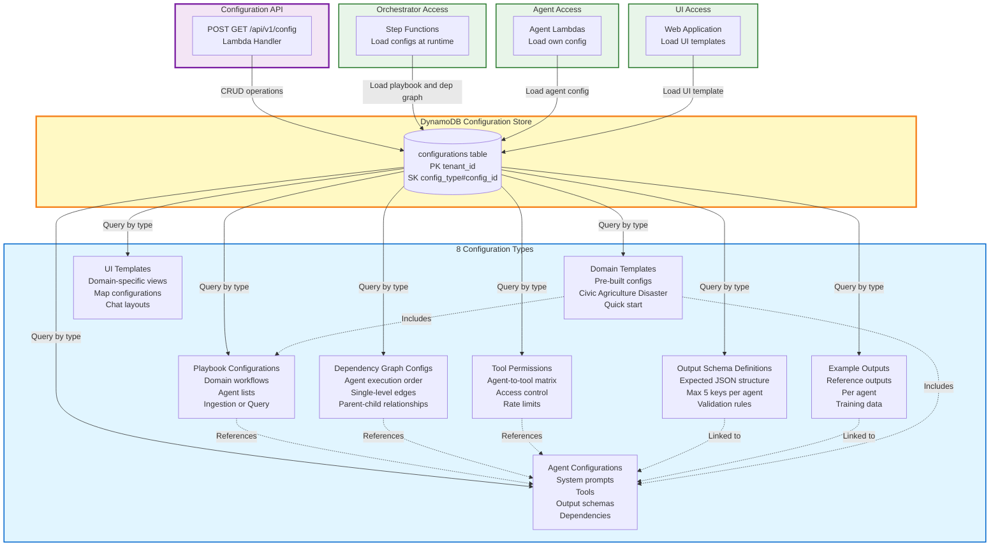

# Diagram 06: Configuration Management Plane

## Purpose
This diagram shows the DynamoDB-based configuration store with 8 configuration types for managing agents, playbooks, dependencies, and domain templates.

## AWS Services Used
- Amazon DynamoDB (Configuration storage)
- AWS Lambda (Configuration handlers)

## Diagram



## Configuration Schemas

### 1. Agent Configuration

```json
{
  "config_type": "agent",
  "config_id": "geo_agent",
  "tenant_id": "uuid",
  "agent_name": "Geo Agent",
  "agent_type": "ingestion",
  "system_prompt": "Extract location information from text. Identify place names, addresses, and geographic references.",
  "tools": ["bedrock", "location", "web_search"],
  "output_schema": {
    "location_name": "string",
    "coordinates": "array",
    "address": "string",
    "confidence": "number",
    "source": "string"
  },
  "dependency_parent": null,
  "interrogative": null,
  "is_builtin": true,
  "created_at": "2024-01-01T00:00:00Z",
  "updated_at": "2024-01-01T00:00:00Z"
}
```

### 2. Playbook Configuration

```json
{
  "config_type": "playbook",
  "config_id": "civic_complaints_ingestion",
  "tenant_id": "uuid",
  "domain_id": "civic-complaints",
  "playbook_type": "ingestion",
  "agent_ids": ["geo_agent", "temporal_agent", "entity_agent", "severity_classifier"],
  "description": "Process civic complaint reports",
  "created_at": "2024-01-01T00:00:00Z"
}
```

### 3. Dependency Graph Configuration

```json
{
  "config_type": "dependency_graph",
  "config_id": "civic_complaints_dep_graph",
  "tenant_id": "uuid",
  "playbook_id": "civic_complaints_ingestion",
  "edges": [
    {"from": "entity_agent", "to": "severity_classifier"}
  ],
  "created_at": "2024-01-01T00:00:00Z"
}
```

### 4. Tool Permission Configuration

```json
{
  "config_type": "tool_permission",
  "config_id": "geo_agent_permissions",
  "tenant_id": "uuid",
  "agent_id": "geo_agent",
  "allowed_tools": {
    "bedrock": {"max_calls": 10},
    "location": {"max_calls": 5},
    "web_search": {"max_calls": 3}
  },
  "created_at": "2024-01-01T00:00:00Z"
}
```

### 5. Output Schema Definition

```json
{
  "config_type": "output_schema",
  "config_id": "geo_agent_schema",
  "tenant_id": "uuid",
  "agent_id": "geo_agent",
  "schema": {
    "type": "object",
    "properties": {
      "location_name": {"type": "string", "required": true},
      "coordinates": {"type": "array", "items": {"type": "number"}, "minItems": 2, "maxItems": 2},
      "address": {"type": "string"},
      "confidence": {"type": "number", "minimum": 0, "maximum": 1},
      "source": {"type": "string", "enum": ["amazon_location", "web_search", "inferred"]}
    },
    "maxProperties": 5
  },
  "created_at": "2024-01-01T00:00:00Z"
}
```

### 6. Example Output Configuration

```json
{
  "config_type": "example_output",
  "config_id": "geo_agent_example_1",
  "tenant_id": "uuid",
  "agent_id": "geo_agent",
  "input_text": "Pothole on Main Street near the library",
  "expected_output": {
    "location_name": "Main Street",
    "coordinates": [40.7128, -74.0060],
    "address": "Main Street, City, State 12345",
    "confidence": 0.95,
    "source": "amazon_location"
  },
  "created_at": "2024-01-01T00:00:00Z"
}
```

### 7. Domain Template Configuration

```json
{
  "config_type": "domain_template",
  "config_id": "civic_complaints_template",
  "tenant_id": "system",
  "domain_name": "Civic Complaints",
  "description": "Template for civic complaint reporting systems",
  "included_agents": ["geo_agent", "temporal_agent", "entity_agent"],
  "included_playbooks": ["civic_complaints_ingestion", "civic_complaints_query"],
  "ui_template_id": "civic_complaints_ui",
  "is_public": true,
  "created_at": "2024-01-01T00:00:00Z"
}
```

### 8. UI Template Configuration

```json
{
  "config_type": "ui_template",
  "config_id": "civic_complaints_ui",
  "tenant_id": "system",
  "domain_id": "civic-complaints",
  "map_config": {
    "default_center": [40.7128, -74.0060],
    "default_zoom": 12,
    "marker_icon": "complaint-pin",
    "cluster_enabled": true
  },
  "chat_config": {
    "welcome_message": "Report a civic issue",
    "placeholder": "Describe the issue and location",
    "suggested_prompts": ["Pothole", "Broken streetlight", "Graffiti"]
  },
  "created_at": "2024-01-01T00:00:00Z"
}
```

## DynamoDB Table Design

**Table Name**: `configurations`

**Partition Key**: `tenant_id` (String)
**Sort Key**: `config_type#config_id` (String)

**GSI 1**: `config_type-index`
- Partition Key: `config_type`
- Sort Key: `created_at`
- Purpose: Query all configs of a type across tenants (admin use)

**GSI 2**: `domain_id-index`
- Partition Key: `domain_id`
- Sort Key: `config_type`
- Purpose: Query all configs for a domain

**Attributes**:
- `tenant_id`: UUID
- `config_type`: agent | playbook | dependency_graph | tool_permission | output_schema | example_output | domain_template | ui_template
- `config_id`: Unique identifier within type
- `config_data`: JSON blob with type-specific data
- `version`: Number (for versioning)
- `created_at`: ISO timestamp
- `updated_at`: ISO timestamp
- `created_by`: User ID

## CRUD Operations

**Create Configuration**:
```python
POST /api/v1/config
{
  "type": "agent",
  "config": {...}
}

# Response
{
  "config_id": "uuid",
  "status": "created"
}
```

**Read Configuration**:
```python
GET /api/v1/config/agent/geo_agent

# Response
{
  "config_type": "agent",
  "config_id": "geo_agent",
  "config": {...}
}
```

**Update Configuration**:
```python
PUT /api/v1/config/agent/geo_agent
{
  "config": {...}
}

# Response
{
  "config_id": "geo_agent",
  "version": 2,
  "status": "updated"
}
```

**Delete Configuration**:
```python
DELETE /api/v1/config/agent/custom_agent_1

# Response
{
  "config_id": "custom_agent_1",
  "status": "deleted"
}
```

**List Configurations**:
```python
GET /api/v1/config?type=agent&limit=20

# Response
{
  "configs": [...],
  "pagination": {...}
}
```

## Configuration Validation

**Agent Config Validation**:
- `agent_name`: Required, 3-50 chars
- `agent_type`: Required, one of ingestion | query | custom
- `system_prompt`: Required, 10-2000 chars
- `tools`: Required, array of valid tool names
- `output_schema`: Required, max 5 properties
- `dependency_parent`: Optional, must be valid agent_id
- `interrogative`: Required for query agents

**Playbook Config Validation**:
- `domain_id`: Required, valid domain
- `playbook_type`: Required, ingestion | query
- `agent_ids`: Required, array of valid agent IDs
- All referenced agents must exist

**Dependency Graph Validation**:
- `playbook_id`: Required, valid playbook
- `edges`: Array of from-to pairs
- No circular dependencies
- No multi-level dependencies (single parent only)
- All referenced agents must be in playbook

## Version Control

**Versioning Strategy**:
- Each update increments version number
- Previous versions stored in S3 backup bucket
- Rollback supported via version number

**Backup Location**:
```
s3://tenant-id-config-backups/
  /agent/
    /geo_agent_v1.json
    /geo_agent_v2.json
  /playbook/
    /civic_complaints_ingestion_v1.json
```

## Performance Optimization

**Caching**:
- Lambda functions cache configs in memory (5 min TTL)
- Step Functions cache playbooks and dep graphs
- Reduces DynamoDB read load by ~80%

**Batch Operations**:
- Load multiple configs in single DynamoDB BatchGetItem
- Reduces latency for orchestrator startup

**Provisioned Capacity**:
- 10 RCU, 5 WCU for base load
- Auto-scaling enabled for bursts
