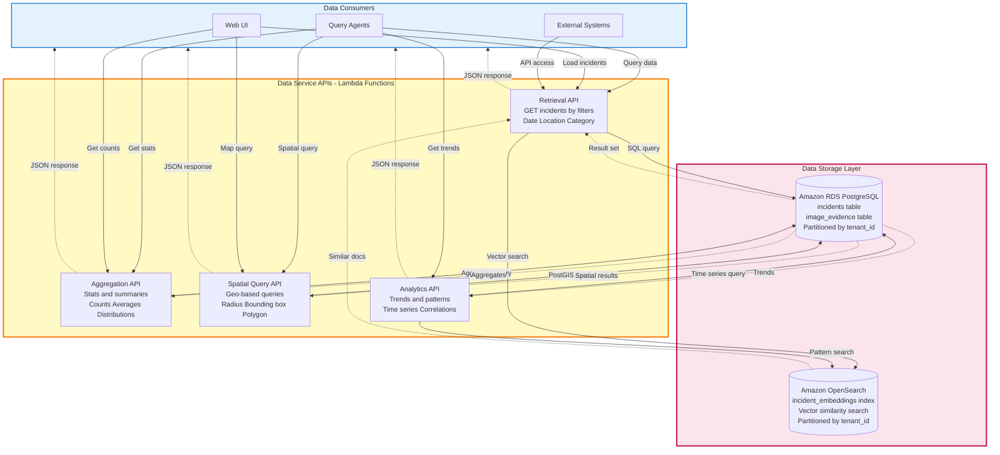

# Diagram 07: Data Access Layer with API-Based Access

## Purpose
This diagram shows the four data service APIs that provide structured access to stored data without direct database access from agents.

## AWS Services Used
- AWS Lambda (Data API handlers)
- Amazon RDS PostgreSQL (Structured data)
- Amazon OpenSearch (Vector search)

## Diagram



## API Specifications

### 1. Retrieval API

**Endpoint**: `GET /api/v1/data?type=retrieval`

**Query Parameters**:
- `domain_id`: Filter by domain
- `date_from`: ISO timestamp
- `date_to`: ISO timestamp
- `location`: Location name or coordinates
- `category`: Incident category
- `page`: Page number (default 1)
- `limit`: Results per page (default 20, max 100)

**Example Request**:
```
GET /api/v1/data?type=retrieval&domain_id=civic-complaints&date_from=2024-01-01&location=downtown&page=1&limit=20
```

**Response**:
```json
{
  "data": [
    {
      "id": "uuid",
      "tenant_id": "uuid",
      "domain_id": "civic-complaints",
      "raw_text": "Pothole on Main Street",
      "structured_data": {
        "location_name": "Main Street",
        "coordinates": [40.7128, -74.0060],
        "severity": "medium",
        "category": "road_maintenance"
      },
      "images": [
        "https://s3.../image1.jpg"
      ],
      "created_at": "2024-01-15T10:30:00Z",
      "created_by": "user_uuid"
    }
  ],
  "pagination": {
    "page": 1,
    "limit": 20,
    "total": 150,
    "pages": 8
  }
}
```

### 2. Aggregation API

**Endpoint**: `GET /api/v1/data?type=aggregation`

**Query Parameters**:
- `domain_id`: Required
- `group_by`: Field to group by (category, location, date)
- `metric`: count | avg | sum | min | max
- `field`: Field to aggregate (if metric not count)
- `date_from`: Optional filter
- `date_to`: Optional filter

**Example Request**:
```
GET /api/v1/data?type=aggregation&domain_id=civic-complaints&group_by=category&metric=count
```

**Response**:
```json
{
  "data": {
    "aggregation": "count",
    "group_by": "category",
    "results": [
      {"category": "road_maintenance", "count": 45},
      {"category": "streetlight", "count": 32},
      {"category": "graffiti", "count": 18}
    ],
    "total": 95
  }
}
```

### 3. Spatial Query API

**Endpoint**: `GET /api/v1/data?type=spatial`

**Query Parameters**:
- `domain_id`: Required
- `query_type`: radius | bounding_box | polygon
- `center`: Lat,lng (for radius)
- `radius_km`: Radius in km (for radius)
- `bbox`: minLat,minLng,maxLat,maxLng (for bounding_box)
- `polygon`: Array of lat,lng points (for polygon)
- `limit`: Max results (default 100)

**Example Request**:
```
GET /api/v1/data?type=spatial&domain_id=civic-complaints&query_type=radius&center=40.7128,-74.0060&radius_km=5&limit=50
```

**Response**:
```json
{
  "data": [
    {
      "id": "uuid",
      "location_name": "Main Street",
      "coordinates": [40.7128, -74.0060],
      "distance_km": 0.5,
      "structured_data": {...}
    }
  ],
  "query": {
    "type": "radius",
    "center": [40.7128, -74.0060],
    "radius_km": 5
  },
  "count": 23
}
```

### 4. Analytics API

**Endpoint**: `GET /api/v1/data?type=analytics`

**Query Parameters**:
- `domain_id`: Required
- `analysis_type`: trend | pattern | correlation
- `field`: Field to analyze
- `time_bucket`: hour | day | week | month (for trend)
- `date_from`: Required
- `date_to`: Required

**Example Request**:
```
GET /api/v1/data?type=analytics&domain_id=civic-complaints&analysis_type=trend&field=category&time_bucket=day&date_from=2024-01-01&date_to=2024-01-31
```

**Response**:
```json
{
  "data": {
    "analysis_type": "trend",
    "field": "category",
    "time_bucket": "day",
    "results": [
      {"date": "2024-01-01", "count": 5, "trend": "stable"},
      {"date": "2024-01-02", "count": 8, "trend": "increasing"},
      {"date": "2024-01-03", "count": 12, "trend": "increasing"}
    ],
    "summary": {
      "total_incidents": 234,
      "avg_per_day": 7.5,
      "peak_day": "2024-01-15",
      "trend_direction": "increasing"
    }
  }
}
```

## Database Queries

### Retrieval API - SQL Query

```sql
SELECT 
  i.id,
  i.tenant_id,
  i.domain_id,
  i.raw_text,
  i.structured_data,
  i.created_at,
  i.created_by,
  ARRAY_AGG(ie.s3_key) as images
FROM incidents i
LEFT JOIN image_evidence ie ON i.id = ie.incident_id
WHERE i.tenant_id = $1
  AND i.domain_id = $2
  AND i.created_at >= $3
  AND i.created_at <= $4
  AND i.structured_data->>'location_name' ILIKE $5
GROUP BY i.id
ORDER BY i.created_at DESC
LIMIT $6 OFFSET $7;
```

### Aggregation API - SQL Query

```sql
SELECT 
  structured_data->>'category' as category,
  COUNT(*) as count
FROM incidents
WHERE tenant_id = $1
  AND domain_id = $2
GROUP BY structured_data->>'category'
ORDER BY count DESC;
```

### Spatial API - PostGIS Query

```sql
SELECT 
  i.id,
  i.structured_data->>'location_name' as location_name,
  ST_AsGeoJSON(ST_Point(
    (i.structured_data->'coordinates'->>0)::float,
    (i.structured_data->'coordinates'->>1)::float
  )) as coordinates,
  ST_Distance(
    ST_Point(
      (i.structured_data->'coordinates'->>0)::float,
      (i.structured_data->'coordinates'->>1)::float
    )::geography,
    ST_Point($3, $4)::geography
  ) / 1000 as distance_km,
  i.structured_data
FROM incidents i
WHERE i.tenant_id = $1
  AND i.domain_id = $2
  AND ST_DWithin(
    ST_Point(
      (i.structured_data->'coordinates'->>0)::float,
      (i.structured_data->'coordinates'->>1)::float
    )::geography,
    ST_Point($3, $4)::geography,
    $5 * 1000
  )
ORDER BY distance_km
LIMIT $6;
```

### Analytics API - Time Series Query

```sql
SELECT 
  DATE_TRUNC('day', created_at) as date,
  COUNT(*) as count,
  CASE 
    WHEN COUNT(*) > LAG(COUNT(*)) OVER (ORDER BY DATE_TRUNC('day', created_at)) 
    THEN 'increasing'
    WHEN COUNT(*) < LAG(COUNT(*)) OVER (ORDER BY DATE_TRUNC('day', created_at))
    THEN 'decreasing'
    ELSE 'stable'
  END as trend
FROM incidents
WHERE tenant_id = $1
  AND domain_id = $2
  AND created_at >= $3
  AND created_at <= $4
GROUP BY DATE_TRUNC('day', created_at)
ORDER BY date;
```

## OpenSearch Vector Search

**Query**:
```json
{
  "query": {
    "bool": {
      "must": [
        {"term": {"tenant_id": "uuid"}},
        {"term": {"domain_id": "civic-complaints"}}
      ],
      "should": [
        {
          "knn": {
            "text_embedding": {
              "vector": [0.1, 0.2, ...],
              "k": 10
            }
          }
        }
      ]
    }
  }
}
```

**Response**:
```json
{
  "hits": {
    "hits": [
      {
        "_source": {
          "incident_id": "uuid",
          "text_content": "Pothole on Main Street",
          "structured_data": {...},
          "created_at": "2024-01-15T10:30:00Z"
        },
        "_score": 0.95
      }
    ]
  }
}
```

## Performance Optimization

**Connection Pooling**:
- RDS Proxy for PostgreSQL connections
- Max 100 connections per Lambda
- Connection reuse across invocations

**Query Optimization**:
- Indexes on tenant_id, domain_id, created_at
- GIN index on structured_data JSONB
- PostGIS spatial indexes on coordinates

**Caching**:
- Aggregation results cached in ElastiCache (5 min TTL)
- Frequently accessed incidents cached
- Cache invalidation on new data

**Rate Limiting**:
- 100 requests/minute per user
- 1000 requests/minute per tenant
- Throttling via API Gateway
