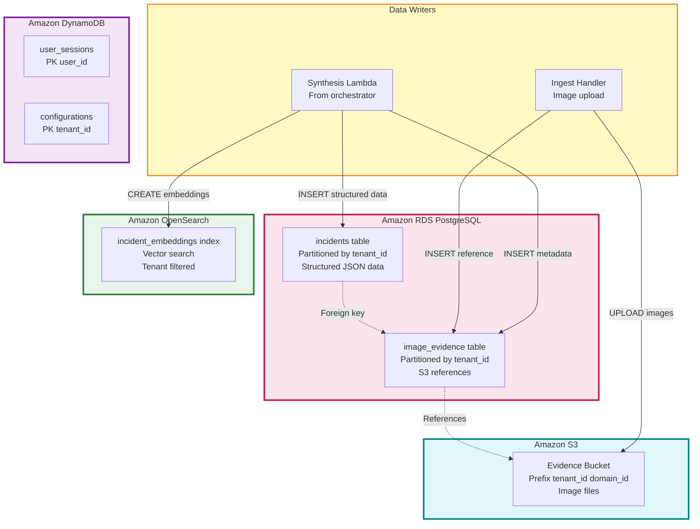

# Diagram 08: Data Persistence Layer

## Purpose
Shows RDS PostgreSQL, OpenSearch, DynamoDB, and S3 architecture with tenant partitioning.

## AWS Services
- Amazon RDS PostgreSQL, Amazon OpenSearch, Amazon DynamoDB, Amazon S3

## Diagram



## PostgreSQL Schema

```sql
CREATE TABLE incidents (
  id UUID PRIMARY KEY,
  tenant_id UUID NOT NULL,
  domain_id VARCHAR(100) NOT NULL,
  raw_text TEXT NOT NULL,
  structured_data JSONB NOT NULL,
  created_at TIMESTAMP DEFAULT NOW(),
  created_by UUID NOT NULL,
  INDEX idx_tenant_domain (tenant_id, domain_id),
  INDEX idx_created (created_at),
  INDEX idx_structured_gin (structured_data) USING GIN
) PARTITION BY LIST (tenant_id);

CREATE TABLE image_evidence (
  id UUID PRIMARY KEY,
  incident_id UUID REFERENCES incidents(id),
  tenant_id UUID NOT NULL,
  s3_bucket VARCHAR(200),
  s3_key VARCHAR(500),
  uploaded_at TIMESTAMP DEFAULT NOW()
) PARTITION BY LIST (tenant_id);
```

## OpenSearch Index

```json
{
  "mappings": {
    "properties": {
      "incident_id": {"type": "keyword"},
      "tenant_id": {"type": "keyword"},
      "text_embedding": {
        "type": "knn_vector",
        "dimension": 1536
      },
      "text_content": {"type": "text"},
      "created_at": {"type": "date"}
    }
  }
}
```

## S3 Structure

```
s3://tenant-uuid-evidence/
  /civic-complaints/
    /incident-uuid-1/
      /image_001.jpg
      /image_002.png
```
