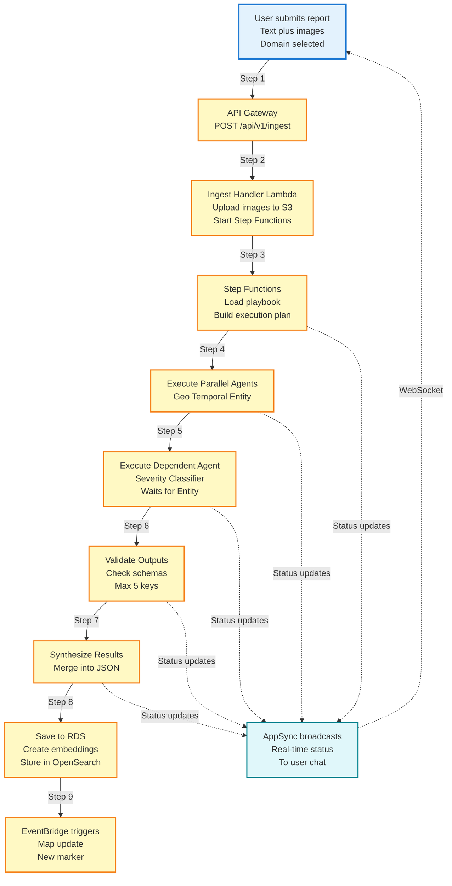

# Diagram 09: Ingestion Pipeline End-to-End Flow

## Purpose
Complete flow from user submission to data storage with real-time status updates.

## Diagram



## Flow Steps

1. User selects domain and submits text with images
2. API Gateway validates JWT and routes to ingest handler
3. Handler uploads images to S3, starts Step Functions
4. Step Functions loads playbook and dependency graph
5. Parallel agents execute (Geo, Temporal, Entity)
6. Dependent agent waits for parent (Severity waits for Entity)
7. Validator checks all outputs against schemas
8. Synthesizer merges into single JSON document
9. Data saved to RDS, embeddings to OpenSearch
10. EventBridge triggers map update
11. Real-time status via AppSync throughout

## Example Status Messages

```
- "Loading agents for civic-complaints domain"
- "Invoking Geo Agent"
- "Geo Agent calling Amazon Location"
- "Geo Agent complete"
- "Invoking Entity Agent"
- "Entity Agent calling AWS Comprehend"
- "Entity Agent complete"
- "Waiting for Entity Agent before Severity Classifier"
- "Invoking Severity Classifier"
- "Severity Classifier complete"
- "Validating outputs"
- "Synthesizing results"
- "Saving to database"
- "Complete - Incident ID: uuid"
```
