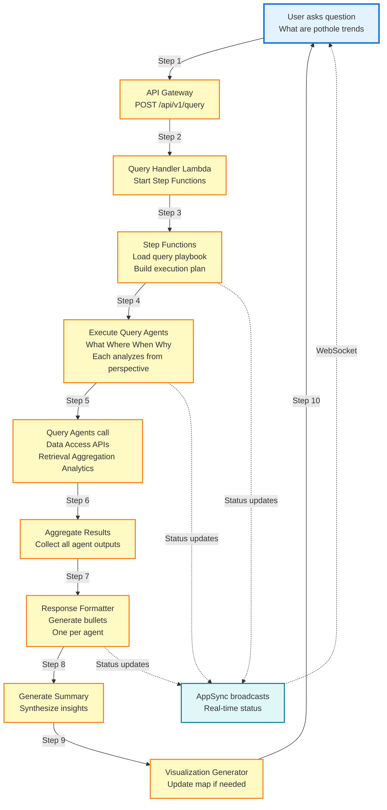

# Diagram 10: Query Pipeline End-to-End Flow

## Purpose
Complete flow from user question to multi-perspective response with bullet points and summary.

## Diagram



## Flow Steps

1. User asks "What are the trends in pothole complaints?"
2. API Gateway validates JWT and routes to query handler
3. Handler starts Step Functions with query playbook
4. Step Functions loads query agents (What, Where, When, Why)
5. Query agents execute in parallel, each calling Data APIs
6. What Agent: Analyzes complaint types and categories
7. Where Agent: Analyzes geographic distribution
8. When Agent: Analyzes temporal patterns
9. Why Agent: Analyzes root causes
10. Results aggregated from all agents
11. Response Formatter generates bullet points (one per agent)
12. Summary generated synthesizing all insights
13. Visualization updated if spatial data present

## Example Response

```
Question: "What are the trends in pothole complaints?"

Response:
• What: 45 pothole complaints received, primarily road surface damage
• Where: Concentrated in downtown area and District 5
• When: 80% reported in last 2 weeks, peak on weekdays 8-10am
• Why: Recent heavy rainfall caused road deterioration

Summary: Pothole complaints have surged in downtown due to recent rainfall, with 45 reports concentrated in high-traffic areas during morning commute hours.
```

## Query Agent Execution

Each query agent:
- Receives raw question text
- Loads ingestion agent schemas for context
- Calls appropriate Data APIs
- Analyzes from interrogative perspective
- Returns max 5 keys with 1-2 line insight
