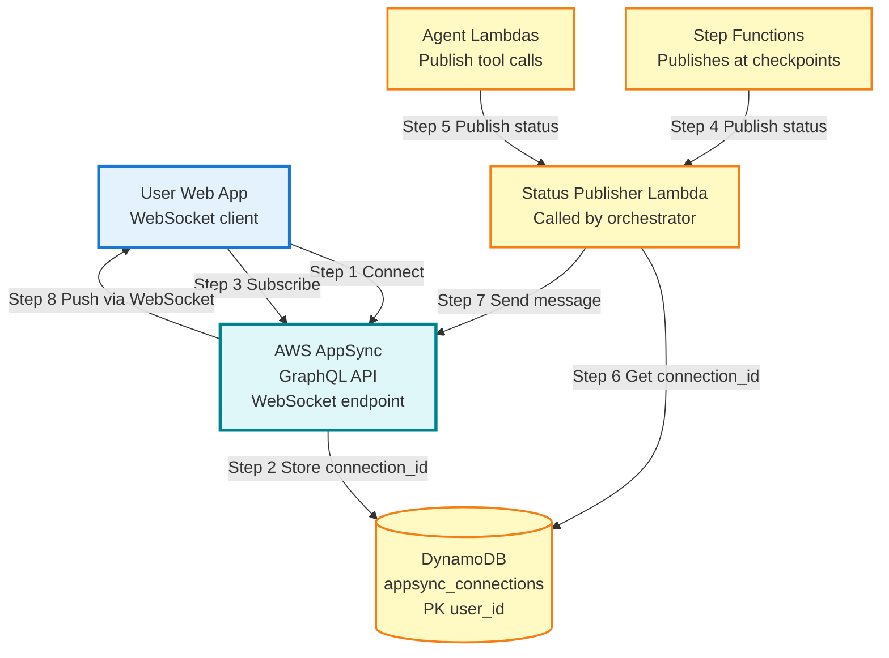

# Diagram 11: Real-Time Status Streaming Architecture

## Purpose
AWS AppSync WebSocket broadcasting for real-time agent execution updates.

## Diagram



## GraphQL Schema

```graphql
type Mutation {
  publishStatus(input: StatusInput!): Status
}

type Subscription {
  onStatusUpdate(userId: ID!): Status
    @aws_subscribe(mutations: ["publishStatus"])
}

type Status {
  jobId: ID!
  userId: ID!
  agentName: String
  status: String!
  message: String
  timestamp: AWSDateTime!
}

input StatusInput {
  jobId: ID!
  userId: ID!
  agentName: String
  status: String!
  message: String
}
```

## Status Types

- `loading_agents`: Orchestrator loading playbook
- `invoking_geo_agent`: Starting Geo Agent
- `calling_amazon_location`: Geo Agent using tool
- `agent_complete_geo_agent`: Geo Agent finished
- `validating`: Validation in progress
- `synthesizing`: Synthesis in progress
- `complete`: Job finished
- `error`: Job failed
