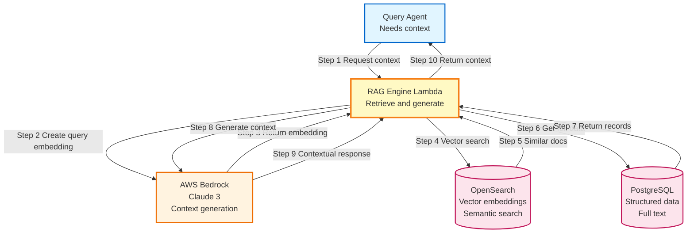

# Diagram 12: RAG Integration Layer

## Purpose
RAG engine for semantic search and context retrieval using OpenSearch.

## Diagram

## RAG Flow

1. Query agent needs context for question
2. RAG engine creates embedding of question
3. Vector search in OpenSearch finds similar incidents
4. Full incident data retrieved from PostgreSQL
5. Context generated using Bedrock with retrieved data
6. Contextual response returned to query agent
