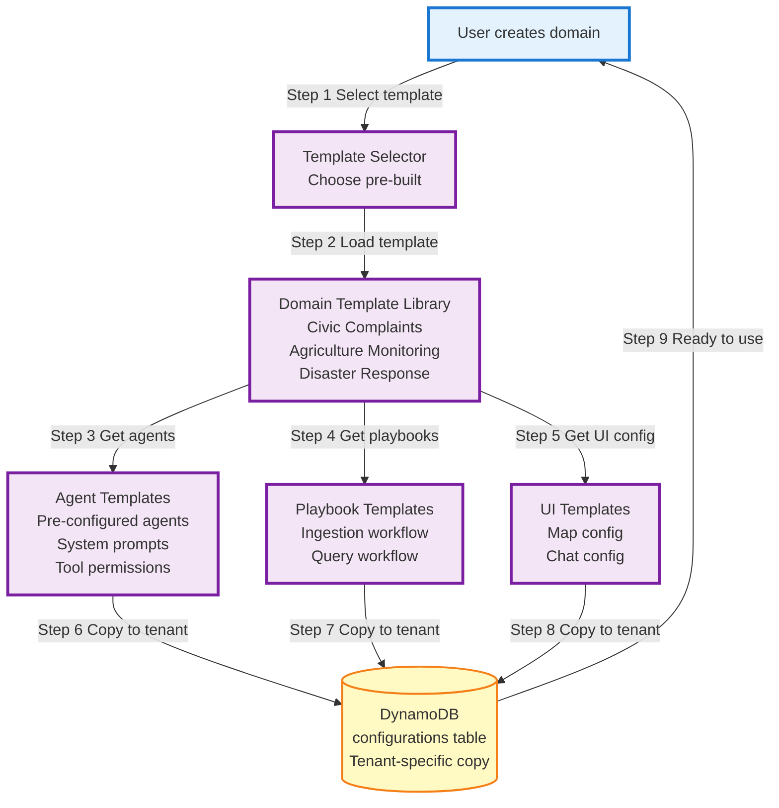

# Diagram 13: Domain Configuration & Templates

## Purpose
Pre-built domain templates for quick deployment (Civic, Agriculture, Disaster).

## Diagram

## Pre-Built Templates

### Civic Complaints Template
- Agents: Geo, Temporal, Entity, Severity Classifier
- Ingestion: Extract location, time, issue type, severity
- Query: When, Where, What, Why agents
- UI: Map with complaint markers, category filters

### Agriculture Monitoring Template
- Agents: Geo, Temporal, Crop Identifier, Weather Analyzer
- Ingestion: Extract farm location, crop type, conditions
- Query: When, Where, What Kind, How Much agents
- UI: Map with farm plots, crop health indicators

### Disaster Response Template
- Agents: Geo, Temporal, Emergency Classifier, Resource Tracker
- Ingestion: Extract incident location, type, urgency, resources needed
- Query: Where, When, What, How Many agents
- UI: Map with emergency markers, resource allocation view
