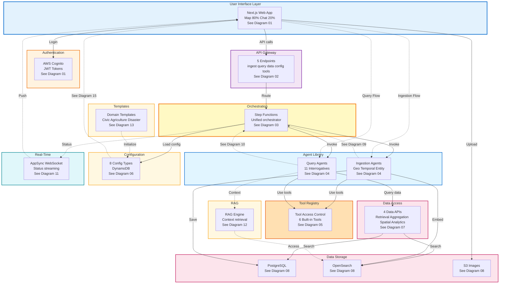

# Diagram 14: System Overview - All Components

## Purpose
High-level view showing how all 13 component diagrams connect together.

## Diagram

## Component Diagram Index

1. **Authentication & Multi-Tenancy** - Cognito JWT flow, tenant isolation
2. **API Gateway & Endpoints** - 5 REST endpoints with WAF
3. **Unified Orchestrator** - Step Functions dependency graph execution
4. **Agent Library** - Ingestion, Query (11 interrogatives), Custom agents
5. **Tool Registry** - 6 built-in tools with ACL
6. **Configuration Management** - 8 config types in DynamoDB
7. **Data Access Layer** - 4 data service APIs
8. **Data Persistence** - RDS, OpenSearch, DynamoDB, S3
9. **Ingestion Pipeline** - End-to-end data processing flow
10. **Query Pipeline** - End-to-end query analysis flow
11. **Real-Time Status** - AppSync WebSocket broadcasting
12. **RAG Integration** - Semantic search and context retrieval
13. **Domain Configuration** - Pre-built templates
14. **System Overview** - This diagram
15. **Dependency Graph Visualization** - n8n-style editor
16. **Response Formation** - Bullet points and summary generation

## Data Flow Summary

**Ingestion**: User → API Gateway → Step Functions → Agents (parallel + dependent) → Validation → Synthesis → RDS/OpenSearch → Map Update

**Query**: User → API Gateway → Step Functions → Query Agents (parallel) → Data APIs → RDS/OpenSearch → Response Formatter → Bullets + Summary → User

**Real-Time**: All steps publish status → AppSync → WebSocket → User UI

## AWS Services Used

- **Compute**: Lambda, Step Functions
- **API**: API Gateway, AppSync
- **Auth**: Cognito
- **Storage**: RDS PostgreSQL, OpenSearch, DynamoDB, S3
- **AI/ML**: Bedrock (Claude 3), Comprehend, Location Service
- **Integration**: EventBridge
- **Security**: WAF, Secrets Manager, IAM
- **Monitoring**: CloudWatch, X-Ray
