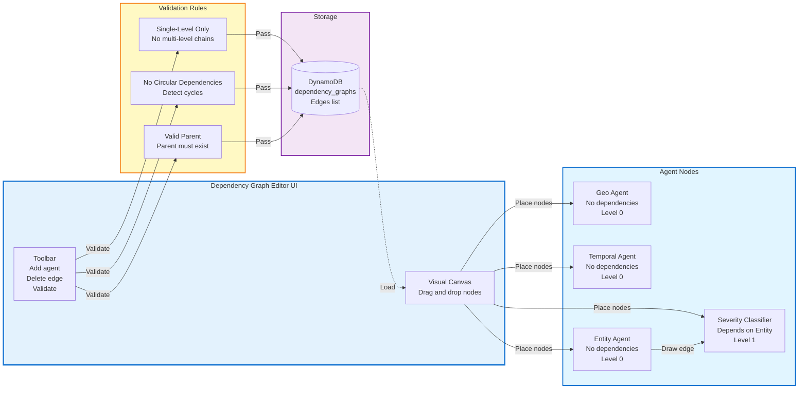

# Diagram 15: Dependency Graph Visualization (n8n-style)

## Purpose
Visual editor for creating and managing agent dependency graphs with single-level hierarchy.

## Diagram



## Visual Editor Features

### Node Representation
```
┌─────────────────────┐
│   Geo Agent         │
│   Type: Ingestion   │
│   Tools: 3          │
│   Dependencies: 0   │
└─────────────────────┘

┌─────────────────────┐
│ Severity Classifier │
│   Type: Ingestion   │
│   Tools: 2          │
│   Depends on: ↑     │
│   Entity Agent      │
└─────────────────────┘
```

### Edge Rules
- **Solid arrow**: Dependency (child waits for parent)
- **Dashed line**: Data flow (parent output to child input)
- **Red X**: Invalid (multi-level or circular)

### Validation Messages
- ✅ "Valid dependency graph - 2 levels"
- ❌ "Error: Circular dependency detected (Agent A → Agent B → Agent A)"
- ❌ "Error: Multi-level dependency not allowed (Agent C depends on Agent B which depends on Agent A)"
- ⚠️ "Warning: Agent D has no dependencies and will execute in parallel"

## Example Configurations

### Valid: Single-Level Dependencies
```
Level 0 (Parallel):
- Geo Agent
- Temporal Agent
- Entity Agent

Level 1 (Sequential):
- Severity Classifier (depends on Entity Agent)
- Priority Scorer (depends on Temporal Agent)
```

### Invalid: Multi-Level Chain
```
❌ NOT ALLOWED:
Agent A → Agent B → Agent C
(Agent C depends on B, B depends on A)

✅ CORRECT:
Agent A → Agent C
Agent B → Agent C
(Both A and B are parents of C)
```

### Execution Order
```
1. Execute Level 0 agents in parallel
2. Wait for all Level 0 to complete
3. Execute Level 1 agents in parallel
4. Continue until all levels complete
```

## Storage Format

```json
{
  "config_type": "dependency_graph",
  "config_id": "civic_complaints_dep_graph",
  "tenant_id": "uuid",
  "playbook_id": "civic_complaints_ingestion",
  "edges": [
    {
      "from": "entity_agent",
      "to": "severity_classifier",
      "data_flow": true
    },
    {
      "from": "temporal_agent",
      "to": "priority_scorer",
      "data_flow": true
    }
  ],
  "levels": [
    ["geo_agent", "temporal_agent", "entity_agent"],
    ["severity_classifier", "priority_scorer"]
  ],
  "created_at": "2024-01-01T00:00:00Z"
}
```

## UI Implementation

**Frontend**: React Flow library for node-based editor
**Backend**: Validation Lambda checks graph validity
**Real-Time**: Auto-save on every change
**Collaboration**: Lock mechanism for concurrent edits
