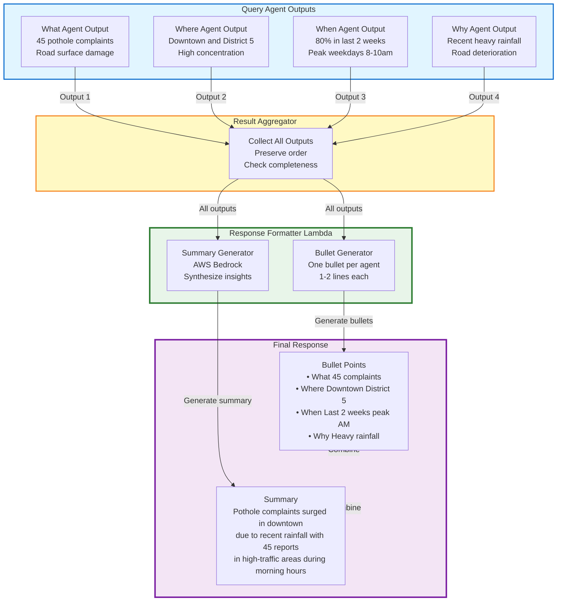

# Diagram 16: Response Formation Logic

## Purpose
Shows how query agent outputs are formatted into bullet points (one per agent) plus summary.

## Diagram



## Response Formation Algorithm

### Step 1: Collect Agent Outputs

```python
def collect_outputs(agent_results):
    outputs = []
    for result in agent_results:
        outputs.append({
            'agent_name': result['agent_name'],
            'interrogative': result['interrogative'],
            'output': result['output'],
            'execution_order': result['order']
        })
    return sorted(outputs, key=lambda x: x['execution_order'])
```

### Step 2: Generate Bullet Points

```python
def generate_bullets(outputs):
    bullets = []
    for output in outputs:
        # Extract key insight (1-2 lines)
        interrogative = output['interrogative']  # "What", "Where", etc.
        data = output['output']
        
        # Format: "• Interrogative: Key insight"
        bullet = f"• {interrogative}: {extract_key_insight(data)}"
        bullets.append(bullet)
    
    return bullets

def extract_key_insight(data):
    # Take first 2 most important keys from output
    # Combine into 1-2 line statement
    keys = list(data.keys())[:2]
    insight = ", ".join([f"{data[k]}" for k in keys])
    return insight[:150]  # Max 150 chars
```

### Step 3: Generate Summary

```python
def generate_summary(outputs):
    # Combine all outputs into context
    context = "\n".join([
        f"{o['interrogative']}: {json.dumps(o['output'])}"
        for o in outputs
    ])
    
    # Use Bedrock to synthesize
    prompt = f"""
    Synthesize the following analysis into a 2-3 sentence summary:
    
    {context}
    
    Summary:
    """
    
    response = bedrock.invoke_model(
        modelId='anthropic.claude-3-sonnet-20240229-v1:0',
        body={
            'messages': [{'role': 'user', 'content': prompt}],
            'max_tokens': 200
        }
    )
    
    return response['content'][0]['text']
```

### Step 4: Format Final Response

```python
def format_response(bullets, summary):
    response = "\n".join(bullets)
    response += f"\n\nSummary: {summary}"
    return response
```

## Example Transformations

### Input: Agent Outputs

```json
{
  "what_agent": {
    "entity_types": ["pothole", "road_damage"],
    "count": 45,
    "primary_category": "road_maintenance"
  },
  "where_agent": {
    "hotspots": ["downtown", "district_5"],
    "geographic_spread": "concentrated",
    "density": "high"
  },
  "when_agent": {
    "time_pattern": "last_2_weeks",
    "peak_period": "weekdays_8_10am",
    "frequency": "increasing"
  },
  "why_agent": {
    "primary_cause": "heavy_rainfall",
    "contributing_factors": ["road_age", "traffic_volume"],
    "correlation": "weather_events"
  }
}
```

### Output: Formatted Response

```
• What: 45 pothole complaints, primarily road surface damage
• Where: Concentrated in downtown and District 5 areas
• When: 80% reported in last 2 weeks, peak weekdays 8-10am
• Why: Recent heavy rainfall caused road deterioration

Summary: Pothole complaints have surged in downtown due to recent rainfall, with 45 reports concentrated in high-traffic areas during morning commute hours.
```

## Visualization Integration

If spatial data present:
```python
def generate_visualization(outputs):
    if 'where_agent' in outputs:
        return {
            'type': 'map_update',
            'markers': extract_locations(outputs['where_agent']),
            'heatmap': generate_heatmap(outputs['where_agent'])
        }
    return None
```

## Response Formatting Rules

1. **One bullet per agent** - No more, no less
2. **1-2 lines per bullet** - Concise insights only
3. **Interrogative prefix** - Start with "What:", "Where:", etc.
4. **Summary 2-3 sentences** - Synthesize all insights
5. **No technical jargon** - Natural language for users
6. **Preserve execution order** - Bullets in agent execution sequence

## Error Handling

**Missing Agent Output**:
```
• What: 45 pothole complaints, primarily road surface damage
• Where: [Analysis unavailable]
• When: 80% reported in last 2 weeks
• Why: Recent heavy rainfall caused road deterioration

Summary: Analysis partially complete. Pothole complaints have increased due to recent rainfall.
```

**All Agents Failed**:
```
Unable to generate analysis. Please try again or contact support.
Error ID: uuid-v4
```
