# V1

```mermaid
---
config:
  layout: dagre
---
flowchart TB
    subgraph AuthLayer["Authentication & Tenancy Layer"]
        Cognito["AWS Cognito<br/>User Login & JWT Token<br/>Multi-tenant isolation"]
    end
    
    subgraph UserLayer["User Interface Layer"]
        UI["Web Application"]
        Map["Map View 80%<br/>Real-time marker updates"]
        Chat["Chat Interface 20%<br/>Status stream subscriber"]
    end
    
    subgraph APILayer["API Gateway Layer - Requires Auth Token"]
        APIGW["API Gateway<br/>Token validation on every request"]
        ProcessEP["/processText"]
        QueryEP["/queryData"]
        ConfigEP["/config/agents"]
        ToolEP["/config/tools"]
    end
    
    subgraph Orchestrator["Workflow Orchestrator - Async Execution"]
        WF["Workflow Engine<br/>Executes pre-configured dependency graph"]
        DepGraph["Dependency Graph Executor<br/>Respects agent data dependencies"]
        StatusPublisher["Status Publisher<br/>Broadcasts agent execution state"]
        AgentSelector["Agent Selector & Router"]
        ResultAgg["Result Aggregator"]
    end
    
    subgraph ToolRegistry["Centralized Tool Registry"]
        ToolCatalog["Tool Catalog<br/>All available tools"]
        ToolAuth["Tool Access Control<br/>Per-agent permissions"]
        T1["Tool: Amazon Location"]
        T2["Tool: Web Search"]
        T3["Tool: AWS Comprehend"]
        T4["Tool: Custom APIs"]
        T5["Tool: Database Query"]
        
        ToolCatalog --> T1 & T2 & T3 & T4 & T5
    end
    
    subgraph AgentLibrary["Specialist Agent Library - Lambdas"]
        direction TB
        
        subgraph BuiltIn["Built-in Agents"]
            GeoAgent["GeoAI Agent<br/>Tools: T1, T2"]
            TempAgent["Temporal Agent<br/>Tools: T2, T4"]
            EntityAgent["Entity Agent<br/>Tools: T3, T2"]
        end
        
        subgraph Custom["User Custom Agents"]
            CustomAgent1["Custom Agent 1<br/>Tools: User-selected"]
            CustomAgentN["Custom Agent N<br/>Tools: User-selected"]
        end
        
        subgraph ConvAgent["Conversation Response Agent"]
            ResponseFormatter["Response Formation Agent<br/>Synthesizes conversational replies"]
        end
    end
    
    subgraph ConfigManagement["User Configuration & Management Plane"]
        UserConfigDB[("User Configuration DB<br/>PostgreSQL/DynamoDB<br/>Partitioned by user_id")]
        
        subgraph UserConfigs["Per-User Configurations"]
            AgentConfigs["Agent Configurations<br/>System prompts, tools, schemas"]
            PlaybookConfigs["Playbook Configurations<br/>Agent combinations per domain"]
            DepGraphConfigs["Dependency Graph Configs<br/>Agent execution order & data flow"]
            ToolPermissions["Tool Permissions<br/>Which agent can use which tools"]
            OutputSchemas["Output Schema Definitions<br/>Expected JSON keys per agent"]
            ExampleOutputs["Example Outputs<br/>Reference outputs per agent"]
        end
        
        UserConfigDB --> AgentConfigs & PlaybookConfigs & DepGraphConfigs & ToolPermissions & OutputSchemas & ExampleOutputs
    end
    
    subgraph ValidationLayer["Validation & Synthesis Layer"]
        Validator["Dynamic Validation Agent<br/>Cross-validates agent outputs"]
        Synthesizer["Synthesis Agent<br/>Merges into coherent JSON<br/>Publishes synthesis status"]
    end
    
    subgraph DataLayer["Data Persistence Layer - Tenant Partitioned"]
        OutputFormatter["JSON Output Formatter"]
        Database[("Tenant Database<br/>PostgreSQL partitioned by user_id<br/>Stores structured outputs")]
        VectorDB[("Vector Database<br/>Partitioned by user_id<br/>For RAG queries")]
        SessionStore[("Session Store<br/>DynamoDB<br/>session_id, chat_id per user")]
    end
    
    subgraph ChatRAG["Conversational AI Layer"]
        RAGEngine["RAG Engine<br/>Retrieves user-specific data"]
        BedrockChat["Bedrock Chat Model<br/>Conversational interface"]
    end
    
    subgraph StatusStream["Real-time Status Broadcasting"]
        AppSync["AWS AppSync<br/>WebSocket connection per user"]
        StatusQueue["Status Message Queue"]
    end
    
    %% Auth Flow
    UI -->|Step 1 Login| Cognito
    Cognito -->|Step 2 JWT Token| UI
    
    %% Main Processing Flow - Async
    UI -->|Step 3 POST with Token| APIGW
    APIGW -->|Step 4 Validate Token| Cognito
    APIGW -->|Step 5 Route to Orchestrator| ProcessEP
    ProcessEP -->|Step 6 Start Async Job| WF
    
    WF -->|Step 7 Load user configs| UserConfigDB
    UserConfigDB -->|Step 8 Return playbook & dep graph| DepGraph
    
    DepGraph -->|Step 9 Publish: Loading agents| StatusPublisher
    StatusPublisher -->|Step 10 Broadcast| StatusQueue
    StatusQueue -->|Step 11 Push to UI| AppSync
    AppSync -->|Step 12 Real-time update| Chat
    
    DepGraph -->|Step 13 Execute in order| AgentSelector
    
    %% Agent Execution with Status
    AgentSelector -->|Step 14a Invoke GeoAgent| GeoAgent
    GeoAgent -->|Step 14b Request tools| ToolAuth
    ToolAuth -->|Step 14c Verify permissions| ToolPermissions
    ToolAuth -->|Step 14d Grant access| T1
    
    GeoAgent -->|Step 15a Status: Calling Amazon Location| StatusPublisher
    StatusPublisher -->|Step 15b Reason: Finding coordinates| StatusQueue
    
    T1 -->|Step 16 Return tool result| GeoAgent
    GeoAgent -->|Step 17 Return geo data| ResultAgg
    
    ResultAgg -->|Step 18 Status: GeoAgent complete| StatusPublisher
    
    %% Dependent Agent Execution
    AgentSelector -->|Step 19 Invoke TempAgent with GeoAgent data| TempAgent
    TempAgent -->|Step 20 Status: Parsing temporal info| StatusPublisher
    TempAgent -->|Step 21 Return temporal data| ResultAgg
    
    AgentSelector -->|Step 22 Invoke CustomAgent| CustomAgent1
    CustomAgent1 -->|Step 23 Access user-configured tools| ToolAuth
    CustomAgent1 -->|Step 24 Return custom data| ResultAgg
    
    %% Validation & Synthesis with Status
    ResultAgg -->|Step 25 All agents complete| Validator
    Validator -->|Step 26 Status: Validating outputs| StatusPublisher
    Validator -->|Step 27 Cross-check consistency| Synthesizer
    
    Synthesizer -->|Step 28 Status: Synthesizing results| StatusPublisher
    Synthesizer -->|Step 29 Load output schema| OutputSchemas
    Synthesizer -->|Step 30 Format final JSON| OutputFormatter
    
    %% Data Storage
    OutputFormatter -->|Step 31 Save structured data| Database
    OutputFormatter -->|Step 32 Create embeddings| VectorDB
    OutputFormatter -->|Step 33 Store session info| SessionStore
    
    Database -->|Step 34 Confirm saved| APIGW
    APIGW -->|Step 35 Response to UI| UI
    
    %% Visualization
    Database -.->|Step 36 Query for map data| Map
    
    %% Chat Query Flow
    Chat -->|Step 37 User query with Token| QueryEP
    QueryEP -->|Step 38 Validate & route| RAGEngine
    RAGEngine <-->|Step 39 Retrieve context| Database
    RAGEngine <-->|Step 40 Semantic search| VectorDB
    RAGEngine -->|Step 41 Generate context| BedrockChat
    BedrockChat -->|Step 42 Format response| ResponseFormatter
    ResponseFormatter -->|Step 43 Return answer| Chat
    
    %% Configuration Management
    UI -->|Manage agents & tools| ConfigEP
    ConfigEP <-->|CRUD operations| UserConfigDB
    
    UI -->|Register/update tools| ToolEP
    ToolEP <-->|Update catalog| ToolCatalog

    classDef authBox fill:#fff3e0,stroke:#ef6c00,stroke-width:3px
    classDef uiBox fill:#e3f2fd,stroke:#1976d2,stroke-width:2px
    classDef apiBox fill:#f3e5f5,stroke:#7b1fa2,stroke-width:2px
    classDef orchestratorBox fill:#fff9c4,stroke:#f57f17,stroke-width:3px
    classDef agentBox fill:#e1f5ff,stroke:#0066cc,stroke-width:2px
    classDef toolBox fill:#ffe0b2,stroke:#e65100,stroke-width:2px
    classDef configBox fill:#fff8e1,stroke:#f9a825,stroke-width:2px
    classDef validationBox fill:#f1f8e9,stroke:#558b2f,stroke-width:2px
    classDef dataBox fill:#fce4ec,stroke:#c2185b,stroke-width:2px
    classDef chatBox fill:#e8eaf6,stroke:#3f51b5,stroke-width:2px
    classDef statusBox fill:#e0f7fa,stroke:#00838f,stroke-width:3px
    
    class AuthLayer authBox
    class UserLayer uiBox
    class APILayer apiBox
    class Orchestrator orchestratorBox
    class AgentLibrary,BuiltIn,Custom,ConvAgent agentBox
    class ToolRegistry toolBox
    class ConfigManagement,UserConfigs configBox
    class ValidationLayer validationBox
    class DataLayer dataBox
    class ChatRAG chatBox
    class StatusStream statusBox
```

# V2

```mermaid
---
config:
  layout: dagre
---
flowchart TB
    subgraph UserInterface["User Interface Layer - Domain Agnostic"]
        UI["Web Application<br/>Configurable per domain"]
        MapView["Map Visualization 80%<br/>Geospatial data display"]
        ChatView["Chat Interface 20%<br/>Input & Query mode"]
    end
    
    subgraph AuthLayer["Authentication & Multi-tenancy"]
        Cognito["AWS Cognito<br/>JWT Token Auth"]
        RoleManager["Role Manager<br/>Public, Citizen, Admin, NGO, Analyst"]
    end
    
    subgraph APIGateway["Unified API Gateway - All Operations"]
        APIGW["API Gateway<br/>Token validation on all requests"]
        
        subgraph Endpoints["API Endpoints"]
            IngestEP["/api/v1/ingest<br/>Submit reports"]
            QueryEP["/api/v1/query<br/>Ask questions"]
            DataEP["/api/v1/data<br/>Structured data access"]
            ConfigEP["/api/v1/config<br/>Manage agents & playbooks"]
            ToolEP["/api/v1/tools<br/>Tool registry"]
        end
    end
    
    subgraph Pipeline1["PIPELINE 1: Data Ingestion & Processing"]
        direction TB
        
        subgraph Orchestrator["Workflow Orchestrator"]
            WF["Workflow Engine<br/>Async execution"]
            DepGraph["Dependency Graph<br/>User-configured"]
            StatusPub["Status Publisher"]
        end
        
        subgraph AgentLayer["Specialist Agent Library"]
            BuiltInAgents["Built-in Agents<br/>Geo, Temporal, Entity"]
            CustomAgents["Custom Domain Agents<br/>User-created"]
        end
        
        subgraph ToolRegistry["Centralized Tool Registry"]
            ToolCatalog["Available Tools"]
            ToolACL["Access Control"]
        end
        
        subgraph Validation["Validation & Synthesis"]
            Validator["Validation Agent"]
            Synthesizer["Synthesis Agent"]
        end
    end
    
    subgraph Pipeline2["PIPELINE 2: Conversational Query & Analysis"]
        direction TB
        
        subgraph QueryRouter["Query Processing"]
            IntentClass["Intent Classifier"]
            QueryType["Query Type Detection"]
        end
        
        subgraph QueryAgent["Query Generation Agent"]
            APIQueryBuilder["API Query Builder<br/>Not direct DB access"]
            FilterBuilder["Filter & Parameter Builder"]
            SchemaContext["Data Schema Context"]
        end
        
        subgraph AnalysisLayer["Analysis & Processing"]
            DataAnalyzer["Data Analysis Agent"]
            TrendDetector["Trend Detection"]
            PatternFinder["Pattern Recognition"]
        end
        
        subgraph ResponseLayer["Response Generation"]
            ResponseFormatter["Response Formation Agent<br/>Natural language output"]
            VizGenerator["Visualization Generator"]
        end
    end
    
    subgraph DataAPI["Data Access Layer - API Based"]
        direction TB
        
        subgraph DataAPIs["Data Service APIs"]
            RetrievalAPI["Retrieval API<br/>GET incidents by filters"]
            AggregationAPI["Aggregation API<br/>Stats & summaries"]
            SpatialAPI["Spatial Query API<br/>Geo-based queries"]
            AnalyticsAPI["Analytics API<br/>Trends & patterns"]
        end
        
        subgraph RBAC["Role-Based Data Filtering"]
            PublicFilter["Public Data Filter<br/>Anonymized public view"]
            UserFilter["User Data Filter<br/>Own data + public"]
            AdminFilter["Admin Data Filter<br/>Full access"]
            RoleRouter["Route based on role"]
        end
    end
    
    subgraph DataLayer["Data Persistence Layer"]
        Database[("Structured Database<br/>PostgreSQL<br/>Partitioned by tenant")]
        VectorDB[("Vector Database<br/>Semantic search<br/>Partitioned by tenant")]
        SessionStore[("Session Store<br/>DynamoDB<br/>chat_id, session_id")]
        ConfigStore[("Configuration Store<br/>Agents, Playbooks, Schemas")]
    end
    
    subgraph StatusStreaming["Real-time Status & Updates"]
        AppSync["AWS AppSync<br/>WebSocket per user"]
        EventBridge["Event Bridge<br/>Async event routing"]
    end
    
    subgraph DomainConfig["Domain Configuration Plane"]
        DomainDef["Domain Definition<br/>Civic, Agriculture, Disaster, etc."]
        PlaybookLib["Playbook Library<br/>Pre-built workflows"]
        OntologyLib["Ontology Library<br/>Domain schemas"]
        UITemplates["UI Templates<br/>Domain-specific views"]
    end
    
    %% Auth Flow
    UI -->|Step 1 Login| Cognito
    Cognito -->|Step 2 JWT + Role| UI
    
    %% ===== PIPELINE 1: INGESTION =====
    ChatView -->|Step 3 Submit report| APIGW
    APIGW -->|Step 4 Validate token| Cognito
    APIGW -->|Step 5 Route| IngestEP
    
    IngestEP -->|Step 6 Start async job| WF
    WF -->|Step 7 Load playbook| ConfigStore
    WF -->|Step 8 Execute dependency graph| DepGraph
    
    DepGraph -->|Step 9 Invoke agents| BuiltInAgents
    DepGraph -->|Step 10 Invoke custom agents| CustomAgents
    
    BuiltInAgents & CustomAgents -->|Step 11 Request tools| ToolACL
    ToolACL -->|Step 12 Grant access| ToolCatalog
    
    BuiltInAgents & CustomAgents -->|Step 13 Publish status| StatusPub
    StatusPub -->|Step 14 Broadcast| AppSync
    AppSync -->|Step 15 Real-time update| ChatView
    
    BuiltInAgents & CustomAgents -->|Step 16 Return results| Validator
    Validator -->|Step 17 Validate| Synthesizer
    Synthesizer -->|Step 18 Load schema| ConfigStore
    Synthesizer -->|Step 19 Save data via API| DataAPIs
    
    DataAPIs -->|Step 20 Store| Database
    DataAPIs -->|Step 21 Create embeddings| VectorDB
    DataAPIs -->|Step 22 Confirm| APIGW
    APIGW -->|Step 23 Response| UI
    
    Database -.->|Step 24 Trigger update| EventBridge
    EventBridge -.->|Step 25 Notify| MapView
    
    %% ===== PIPELINE 2: QUERY =====
    ChatView -->|Step 26 Ask question| APIGW
    APIGW -->|Step 27 Validate & extract role| Cognito
    APIGW -->|Step 28 Route| QueryEP
    
    QueryEP -->|Step 29 Classify intent| IntentClass
    IntentClass -->|Step 30 Determine type| QueryType
    
    QueryType -->|Step 31 Build API query| APIQueryBuilder
    APIQueryBuilder -->|Step 32 Load schema| SchemaContext
    APIQueryBuilder -->|Step 33 Build filters| FilterBuilder
    
    FilterBuilder -->|Step 34 Apply RBAC| RoleRouter
    RoleRouter -->|Step 35a Public role| PublicFilter
    RoleRouter -->|Step 35b User role| UserFilter
    RoleRouter -->|Step 35c Admin role| AdminFilter
    
    PublicFilter & UserFilter & AdminFilter -->|Step 36 Call appropriate API| DataAPIs
    
    DataAPIs -->|Step 37 Query data| Database
    DataAPIs -->|Step 38 Semantic search if needed| VectorDB
    DataAPIs -->|Step 39 Return filtered results| DataAnalyzer
    
    DataAnalyzer -->|Step 40 Detect patterns| TrendDetector
    TrendDetector -->|Step 41 Find insights| PatternFinder
    
    PatternFinder -->|Step 42 Format response| ResponseFormatter
    ResponseFormatter -->|Step 43 Generate viz| VizGenerator
    
    VizGenerator -->|Step 44 Return answer| ChatView
    VizGenerator -.->|Step 45 Update map| MapView
    
    %% Configuration Management
    UI -->|Configure domain| ConfigEP
    ConfigEP <-->|Load/save configs| ConfigStore
    
    DomainDef -.->|Provides templates| ConfigStore
    PlaybookLib -.->|Pre-built workflows| ConfigStore
    OntologyLib -.->|Domain schemas| ConfigStore
    UITemplates -.->|UI components| UI

    classDef uiBox fill:#e3f2fd,stroke:#1976d2,stroke-width:3px
    classDef authBox fill:#fff3e0,stroke:#ef6c00,stroke-width:2px
    classDef apiBox fill:#f3e5f5,stroke:#7b1fa2,stroke-width:3px
    classDef pipeline1Box fill:#e8f5e9,stroke:#2e7d32,stroke-width:3px
    classDef pipeline2Box fill:#e1f5fe,stroke:#0277bd,stroke-width:3px
    classDef dataAPIBox fill:#fff9c4,stroke:#f57f17,stroke-width:3px
    classDef dataBox fill:#fce4ec,stroke:#c2185b,stroke-width:2px
    classDef statusBox fill:#e0f7fa,stroke:#00838f,stroke-width:2px
    classDef configBox fill:#f3e5f5,stroke:#8e24aa,stroke-width:2px
    
    class UserInterface uiBox
    class AuthLayer authBox
    class APIGateway,Endpoints apiBox
    class Pipeline1 pipeline1Box
    class Pipeline2 pipeline2Box
    class DataAPI,DataAPIs,RBAC dataAPIBox
    class DataLayer dataBox
    class StatusStreaming statusBox
    class DomainConfig configBox
```

# V3

```mermaid
flowchart TB
    subgraph UserInterface["User Interface Layer"]
        UI["Web Application"]
        MapView["Map Visualization 80%"]
        ChatView["Chat Interface 20%"]
    end
    
    subgraph AuthLayer["Authentication & Multi-tenancy"]
        Cognito["AWS Cognito<br/>JWT Token Auth"]
        RoleManager["Role Manager<br/>Public, Citizen, Admin"]
    end
    
    subgraph APIGateway["Unified API Gateway"]
        APIGW["API Gateway"]
        IngestEP["/api/v1/ingest"]
        QueryEP["/api/v1/query"]
        ConfigEP["/api/v1/config"]
    end
    
    subgraph UnifiedOrchestrator["UNIFIED ORCHESTRATOR - Handles Both Pipelines"]
        PlaybookLoader["Playbook Loader<br/>Load ingestion or query playbook"]
        DepGraphExecutor["Dependency Graph Executor<br/>Same logic for both pipelines"]
        AgentInvoker["Agent Invoker<br/>Executes any agent type"]
        StatusPublisher["Status Publisher<br/>Real-time updates"]
        Validator["Output Validator<br/>Validates against schema"]
        Synthesizer["Result Synthesizer<br/>Formats final output"]
    end
    
    subgraph AgentLibrary["UNIFIED AGENT LIBRARY"]
        direction TB
        
        subgraph IngestionAgents["Ingestion Agents"]
            GeoAgent["Geo Agent<br/>Max 5 keys"]
            TempAgent["Temporal Agent<br/>Max 5 keys"]
            EntityAgent["Entity Agent<br/>Max 5 keys"]
        end
        
        subgraph QueryAgents["Query Agents"]
            IntentAgent["Intent Classifier<br/>Max 5 keys"]
            AnalysisAgent["Analysis Agent<br/>Max 5 keys"]
            TrendAgent["Trend Detector<br/>Max 5 keys"]
        end
        
        subgraph CustomAgents["Custom Domain Agents"]
            CustomAgent1["Custom Agent 1<br/>Max 5 keys"]
            CustomAgentN["Custom Agent N<br/>Max 5 keys"]
        end
    end
    
    subgraph ToolRegistry["Centralized Tool Registry"]
        ToolCatalog["Available Tools"]
        ToolACL["Access Control"]
    end
    
    subgraph DataAPI["Data Access Layer - API Based"]
        RetrievalAPI["Retrieval API"]
        AggregationAPI["Aggregation API"]
        SpatialAPI["Spatial Query API"]
        AnalyticsAPI["Analytics API"]
        
        RoleFilter["RBAC Filter<br/>Public/User/Admin"]
    end
    
    subgraph DataLayer["Data Persistence Layer"]
        Database[("Structured Database<br/>PostgreSQL")]
        VectorDB[("Vector Database")]
        ConfigStore[("Configuration Store<br/>Ingestion + Query Playbooks")]
    end
    
    subgraph DomainConfig["Domain Configuration Plane"]
        IngestionPlaybooks["Ingestion Playbook Library<br/>Pre-built data processing workflows"]
        QueryPlaybooks["Query Playbook Library<br/>Pre-built reasoning chains"]
        DomainTemplates["Domain Templates<br/>Civic, Agriculture, Disaster, etc."]
    end
    
    %% Auth Flow
    UI -->|Login| Cognito
    Cognito -->|JWT + Role| UI
    
    %% INGESTION FLOW
    ChatView -->|Submit report| APIGW
    APIGW -->|Route| IngestEP
    IngestEP -->|Load ingestion playbook| PlaybookLoader
    PlaybookLoader -->|Get config| ConfigStore
    ConfigStore -->|Return playbook| DepGraphExecutor
    
    DepGraphExecutor -->|Execute agents| AgentInvoker
    AgentInvoker -->|Invoke| IngestionAgents
    AgentInvoker -->|Invoke| CustomAgents
    
    IngestionAgents & CustomAgents -->|Request tools| ToolACL
    ToolACL -->|Grant access| ToolCatalog
    
    IngestionAgents & CustomAgents -->|Publish status| StatusPublisher
    StatusPublisher -->|Broadcast| ChatView
    
    IngestionAgents & CustomAgents -->|Return results| Validator
    Validator -->|Validate| Synthesizer
    Synthesizer -->|Save via API| RetrievalAPI
    RetrievalAPI -->|Store| Database
    
    %% QUERY FLOW
    ChatView -->|Ask question| APIGW
    APIGW -->|Route| QueryEP
    QueryEP -->|Load query playbook| PlaybookLoader
    PlaybookLoader -->|Get config| ConfigStore
    ConfigStore -->|Return playbook| DepGraphExecutor
    
    DepGraphExecutor -->|Execute agents| AgentInvoker
    AgentInvoker -->|Invoke| QueryAgents
    AgentInvoker -->|Invoke| CustomAgents
    
    QueryAgents & CustomAgents -->|Request tools| ToolACL
    ToolACL -->|Grant access| ToolCatalog
    
    QueryAgents & CustomAgents -->|Call APIs| RoleFilter
    RoleFilter -->|Apply RBAC| RetrievalAPI
    RoleFilter -->|Apply RBAC| AggregationAPI
    RoleFilter -->|Apply RBAC| SpatialAPI
    RoleFilter -->|Apply RBAC| AnalyticsAPI
    
    RetrievalAPI & AggregationAPI & SpatialAPI & AnalyticsAPI -->|Query| Database
    RetrievalAPI & AggregationAPI & SpatialAPI & AnalyticsAPI -->|Search| VectorDB
    
    QueryAgents & CustomAgents -->|Publish status| StatusPublisher
    QueryAgents & CustomAgents -->|Return results| Validator
    Validator -->|Validate| Synthesizer
    Synthesizer -->|Format response| ChatView
    Synthesizer -.->|Update map| MapView
    
    %% Configuration
    UI -->|Configure| ConfigEP
    ConfigEP <-->|CRUD| ConfigStore
    
    IngestionPlaybooks -.->|Templates| ConfigStore
    QueryPlaybooks -.->|Templates| ConfigStore
    DomainTemplates -.->|Pre-built configs| ConfigStore

    classDef uiBox fill:#e3f2fd,stroke:#1976d2,stroke-width:3px
    classDef authBox fill:#fff3e0,stroke:#ef6c00,stroke-width:2px
    classDef orchestratorBox fill:#fff9c4,stroke:#f57f17,stroke-width:3px
    classDef agentBox fill:#e1f5ff,stroke:#0066cc,stroke-width:2px
    classDef dataAPIBox fill:#e8f5e9,stroke:#2e7d32,stroke-width:2px
    classDef dataBox fill:#fce4ec,stroke:#c2185b,stroke-width:2px
    classDef configBox fill:#f3e5f5,stroke:#8e24aa,stroke-width:2px
    
    class UserInterface uiBox
    class AuthLayer authBox
    class UnifiedOrchestrator orchestratorBox
    class AgentLibrary,IngestionAgents,QueryAgents,CustomAgents agentBox
    class DataAPI,RoleFilter dataAPIBox
    class DataLayer dataBox
    class DomainConfig configBox
```

---

## Unified Architecture Diagram

```mermaid
---
config:
  layout: dagre
---
flowchart TB
    subgraph UserInterface["User Interface Layer - Domain Configurable"]
        UI["Web Application<br/>Domain-specific templates"]
        MapView["Map Visualization 80%<br/>Real-time geospatial display"]
        ChatView["Chat Interface 20%<br/>Ingestion & Query modes"]
    end
    
    subgraph AuthLayer["Authentication & Multi-tenancy Layer"]
        Cognito["AWS Cognito<br/>JWT Token Auth<br/>Multi-tenant isolation"]
        RoleManager["Role Manager<br/>Public, Citizen, Admin, NGO, Analyst"]
    end
    
    subgraph APIGateway["Unified API Gateway - Versioned Endpoints"]
        APIGW["API Gateway<br/>Token validation on all requests"]
        
        subgraph Endpoints["API Endpoints v1"]
            IngestEP["/api/v1/ingest<br/>Submit reports & data"]
            QueryEP["/api/v1/query<br/>Ask questions & analyze"]
            DataEP["/api/v1/data<br/>Direct data access"]
            ConfigEP["/api/v1/config<br/>Manage agents & playbooks"]
            ToolEP["/api/v1/tools<br/>Tool registry management"]
        end
    end
    
    subgraph UnifiedOrchestrator["UNIFIED ORCHESTRATOR - Dual Pipeline Handler"]
        PlaybookLoader["Playbook Loader<br/>Loads ingestion or query playbook"]
        DepGraphExecutor["Dependency Graph Executor<br/>Respects agent dependencies & data flow"]
        AgentInvoker["Agent Invoker<br/>Executes any agent type"]
        ResultAggregator["Result Aggregator<br/>Collects agent outputs"]
        StatusPublisher["Status Publisher<br/>Real-time execution updates"]
        Validator["Output Validator<br/>Schema validation & cross-check"]
        Synthesizer["Result Synthesizer<br/>Merges into coherent JSON"]
    end
    
    subgraph AgentLibrary["UNIFIED AGENT LIBRARY - Max 5 Keys Output"]
        direction TB
        
        subgraph IngestionAgents["Ingestion Agents"]
            GeoAgent["Geo Agent<br/>Tools: Amazon Location, Web Search<br/>Max 5 keys"]
            TempAgent["Temporal Agent<br/>Tools: Web Search, Custom APIs<br/>Max 5 keys"]
            EntityAgent["Entity Agent<br/>Tools: AWS Comprehend, Web Search<br/>Max 5 keys"]
        end
        
        subgraph QueryAgents["Query & Analysis Agents"]
            IntentAgent["Intent Classifier<br/>Tools: Schema Context<br/>Max 5 keys"]
            AnalysisAgent["Data Analysis Agent<br/>Tools: Data APIs<br/>Max 5 keys"]
            TrendAgent["Trend Detector<br/>Tools: Analytics API<br/>Max 5 keys"]
            PatternAgent["Pattern Recognition<br/>Tools: Vector DB<br/>Max 5 keys"]
        end
        
        subgraph ResponseAgents["Response Formation Agents"]
            ResponseFormatter["Response Formation Agent<br/>Natural language synthesis"]
            VizGenerator["Visualization Generator<br/>Map & chart generation"]
        end
        
        subgraph CustomAgents["Custom Domain Agents"]
            CustomAgent1["Custom Agent 1<br/>Tools: User-configured<br/>Max 5 keys"]
            CustomAgentN["Custom Agent N<br/>Tools: User-configured<br/>Max 5 keys"]
        end
    end
    
    subgraph ToolRegistry["Centralized Tool Registry"]
        ToolCatalog["Tool Catalog<br/>All available tools"]
        ToolACL["Tool Access Control<br/>Per-agent permissions"]
        
        subgraph AvailableTools["Available Tools"]
            T1["Amazon Location Service"]
            T2["Web Search API"]
            T3["AWS Comprehend"]
            T4["Custom Domain APIs"]
            T5["Data Query APIs"]
            T6["Vector Search"]
        end
        
        ToolCatalog --> T1
        ToolCatalog --> T2
        ToolCatalog --> T3
        ToolCatalog --> T4
        ToolCatalog --> T5
        ToolCatalog --> T6
    end
    
    subgraph ConfigManagement["Configuration & Management Plane"]
        ConfigStore[("Configuration Store<br/>PostgreSQL/DynamoDB<br/>Partitioned by tenant_id")]
        
        subgraph ConfigTypes["Configuration Types"]
            AgentConfigs["Agent Configurations<br/>System prompts, tools, schemas"]
            PlaybookConfigs["Playbook Configurations<br/>Ingestion & Query workflows"]
            DepGraphConfigs["Dependency Graph Configs<br/>Agent execution order & data flow"]
            ToolPermissions["Tool Permissions<br/>Agent-to-tool access matrix"]
            OutputSchemas["Output Schema Definitions<br/>Expected JSON structure (max 5 keys)"]
            ExampleOutputs["Example Outputs<br/>Reference outputs per agent"]
            DomainTemplates["Domain Templates<br/>Civic, Agriculture, Disaster, etc."]
            UITemplates["UI Templates<br/>Domain-specific views"]
        end
        
        ConfigStore --> AgentConfigs
        ConfigStore --> PlaybookConfigs
        ConfigStore --> DepGraphConfigs
        ConfigStore --> ToolPermissions
        ConfigStore --> OutputSchemas
        ConfigStore --> ExampleOutputs
        ConfigStore --> DomainTemplates
        ConfigStore --> UITemplates
    end
    
    subgraph DataAccessLayer["Data Access Layer - API Based with RBAC"]
        direction TB
        
        subgraph DataAPIs["Data Service APIs"]
            RetrievalAPI["Retrieval API<br/>GET incidents by filters"]
            AggregationAPI["Aggregation API<br/>Stats & summaries"]
            SpatialAPI["Spatial Query API<br/>Geo-based queries"]
            AnalyticsAPI["Analytics API<br/>Trends & patterns"]
        end
        
        subgraph RBACLayer["Role-Based Access Control"]
            RoleRouter["Role Router<br/>Routes based on JWT role"]
            PublicFilter["Public Data Filter<br/>Anonymized public view"]
            UserFilter["User Data Filter<br/>Own data + public"]
            AdminFilter["Admin Data Filter<br/>Full access + PII"]
        end
        
        RoleRouter --> PublicFilter
        RoleRouter --> UserFilter
        RoleRouter --> AdminFilter
    end
    
    subgraph DataLayer["Data Persistence Layer - Tenant Partitioned"]
        Database[("Structured Database<br/>PostgreSQL<br/>Partitioned by tenant_id<br/>Stores structured outputs")]
        VectorDB[("Vector Database<br/>Semantic search<br/>Partitioned by tenant_id<br/>For RAG queries")]
        SessionStore[("Session Store<br/>DynamoDB<br/>session_id, chat_id per user")]
    end
    
    subgraph RAGLayer["Conversational AI & RAG Layer"]
        RAGEngine["RAG Engine<br/>Retrieves tenant-specific context"]
        BedrockChat["Bedrock Chat Model<br/>Conversational interface"]
    end
    
    subgraph StatusStreaming["Real-time Status & Event Broadcasting"]
        AppSync["AWS AppSync<br/>WebSocket per user<br/>Real-time status updates"]
        EventBridge["EventBridge<br/>Async event routing<br/>Triggers map updates"]
    end
    
    %% ========== AUTH FLOW ==========
    UI -->|Step 1: Login| Cognito
    Cognito -->|Step 2: JWT Token + Role| UI
    
    %% ========== INGESTION PIPELINE ==========
    ChatView -->|Step 3: Submit report with Token| APIGW
    APIGW -->|Step 4: Validate token & extract role| Cognito
    APIGW -->|Step 5: Route to ingestion| IngestEP
    
    IngestEP -->|Step 6: Load ingestion playbook| PlaybookLoader
    PlaybookLoader -->|Step 7: Get playbook config| ConfigStore
    ConfigStore -->|Step 8: Return playbook & dep graph| DepGraphExecutor
    
    DepGraphExecutor -->|Step 9: Publish Loading agents| StatusPublisher
    StatusPublisher -->|Step 10: Broadcast status| AppSync
    AppSync -->|Step 11: Real-time update| ChatView
    
    DepGraphExecutor -->|Step 12: Execute agents in order| AgentInvoker
    
    AgentInvoker -->|Step 13a: Invoke| GeoAgent
    AgentInvoker -->|Step 13b: Invoke| TempAgent
    AgentInvoker -->|Step 13c: Invoke| EntityAgent
    AgentInvoker -->|Step 13d: Invoke| CustomAgents
    
    GeoAgent -->|Step 14: Request tools| ToolACL
    TempAgent -->|Step 14: Request tools| ToolACL
    EntityAgent -->|Step 14: Request tools| ToolACL
    CustomAgents -->|Step 14: Request tools| ToolACL
    
    ToolACL -->|Step 15: Verify permissions| ToolPermissions
    ToolACL -->|Step 16: Grant access| AvailableTools
    
    GeoAgent -->|Step 17: Publish agent status| StatusPublisher
    TempAgent -->|Step 17: Publish agent status| StatusPublisher
    EntityAgent -->|Step 17: Publish agent status| StatusPublisher
    CustomAgents -->|Step 17: Publish agent status| StatusPublisher
    
    AvailableTools -->|Step 18: Return tool results| GeoAgent
    AvailableTools -->|Step 18: Return tool results| TempAgent
    AvailableTools -->|Step 18: Return tool results| EntityAgent
    AvailableTools -->|Step 18: Return tool results| CustomAgents
    
    GeoAgent -->|Step 19: Return results| ResultAggregator
    TempAgent -->|Step 19: Return results| ResultAggregator
    EntityAgent -->|Step 19: Return results| ResultAggregator
    CustomAgents -->|Step 19: Return results| ResultAggregator
    
    ResultAggregator -->|Step 20: All agents complete| Validator
    Validator -->|Step 21: Publish Validating| StatusPublisher
    Validator -->|Step 22: Load output schema| OutputSchemas
    Validator -->|Step 23: Cross-validate| Synthesizer
    
    Synthesizer -->|Step 24: Publish Synthesizing| StatusPublisher
    Synthesizer -->|Step 25: Format final JSON| RetrievalAPI
    
    RetrievalAPI -->|Step 26: Store structured data| Database
    RetrievalAPI -->|Step 27: Create embeddings| VectorDB
    RetrievalAPI -->|Step 28: Store session info| SessionStore
    
    Database -->|Step 29: Trigger event| EventBridge
    EventBridge -->|Step 30: Notify map update| MapView
    
    RetrievalAPI -->|Step 31: Confirm saved| APIGW
    APIGW -->|Step 32: Response to UI| ChatView
    
    %% ========== QUERY PIPELINE ==========
    ChatView -->|Step 33: Ask question with Token| APIGW
    APIGW -->|Step 34: Validate & extract role| Cognito
    APIGW -->|Step 35: Route to query| QueryEP
    
    QueryEP -->|Step 36: Load query playbook| PlaybookLoader
    PlaybookLoader -->|Step 37: Get query playbook| ConfigStore
    ConfigStore -->|Step 38: Return query workflow| DepGraphExecutor
    
    DepGraphExecutor -->|Step 39: Execute query agents| AgentInvoker
    
    AgentInvoker -->|Step 40a: Invoke| IntentAgent
    AgentInvoker -->|Step 40b: Invoke| AnalysisAgent
    AgentInvoker -->|Step 40c: Invoke| TrendAgent
    AgentInvoker -->|Step 40d: Invoke| PatternAgent
    
    IntentAgent -->|Step 41: Request tools| ToolACL
    AnalysisAgent -->|Step 41: Request tools| ToolACL
    TrendAgent -->|Step 41: Request tools| ToolACL
    PatternAgent -->|Step 41: Request tools| ToolACL
    
    ToolACL -->|Step 42: Grant access| AvailableTools
    
    IntentAgent -->|Step 43: Publish status| StatusPublisher
    AnalysisAgent -->|Step 43: Publish status| StatusPublisher
    TrendAgent -->|Step 43: Publish status| StatusPublisher
    PatternAgent -->|Step 43: Publish status| StatusPublisher
    
    StatusPublisher -->|Step 44: Broadcast| AppSync
    
    IntentAgent -->|Step 45: Call data APIs| RoleRouter
    AnalysisAgent -->|Step 45: Call data APIs| RoleRouter
    TrendAgent -->|Step 45: Call data APIs| RoleRouter
    PatternAgent -->|Step 45: Call data APIs| RoleRouter
    
    RoleRouter -->|Step 46: Apply RBAC filter| PublicFilter
    RoleRouter -->|Step 46: Apply RBAC filter| UserFilter
    RoleRouter -->|Step 46: Apply RBAC filter| AdminFilter
    
    PublicFilter -->|Step 47: Query via APIs| RetrievalAPI
    PublicFilter -->|Step 47: Query via APIs| AggregationAPI
    PublicFilter -->|Step 47: Query via APIs| SpatialAPI
    PublicFilter -->|Step 47: Query via APIs| AnalyticsAPI
    
    UserFilter -->|Step 47: Query via APIs| RetrievalAPI
    UserFilter -->|Step 47: Query via APIs| AggregationAPI
    UserFilter -->|Step 47: Query via APIs| SpatialAPI
    UserFilter -->|Step 47: Query via APIs| AnalyticsAPI
    
    AdminFilter -->|Step 47: Query via APIs| RetrievalAPI
    AdminFilter -->|Step 47: Query via APIs| AggregationAPI
    AdminFilter -->|Step 47: Query via APIs| SpatialAPI
    AdminFilter -->|Step 47: Query via APIs| AnalyticsAPI
    
    RetrievalAPI -->|Step 48: Query data| Database
    AggregationAPI -->|Step 48: Query data| Database
    SpatialAPI -->|Step 48: Query data| Database
    AnalyticsAPI -->|Step 48: Query data| Database
    
    RetrievalAPI -->|Step 49: Semantic search| VectorDB
    AggregationAPI -->|Step 49: Semantic search| VectorDB
    SpatialAPI -->|Step 49: Semantic search| VectorDB
    AnalyticsAPI -->|Step 49: Semantic search| VectorDB
    
    RetrievalAPI -->|Step 50: Return filtered results| IntentAgent
    RetrievalAPI -->|Step 50: Return filtered results| AnalysisAgent
    RetrievalAPI -->|Step 50: Return filtered results| TrendAgent
    RetrievalAPI -->|Step 50: Return filtered results| PatternAgent
    
    AggregationAPI -->|Step 50: Return filtered results| IntentAgent
    AggregationAPI -->|Step 50: Return filtered results| AnalysisAgent
    AggregationAPI -->|Step 50: Return filtered results| TrendAgent
    AggregationAPI -->|Step 50: Return filtered results| PatternAgent
    
    SpatialAPI -->|Step 50: Return filtered results| IntentAgent
    SpatialAPI -->|Step 50: Return filtered results| AnalysisAgent
    SpatialAPI -->|Step 50: Return filtered results| TrendAgent
    SpatialAPI -->|Step 50: Return filtered results| PatternAgent
    
    AnalyticsAPI -->|Step 50: Return filtered results| IntentAgent
    AnalyticsAPI -->|Step 50: Return filtered results| AnalysisAgent
    AnalyticsAPI -->|Step 50: Return filtered results| TrendAgent
    AnalyticsAPI -->|Step 50: Return filtered results| PatternAgent
    
    IntentAgent -->|Step 51: Return analysis| ResultAggregator
    AnalysisAgent -->|Step 51: Return analysis| ResultAggregator
    TrendAgent -->|Step 51: Return analysis| ResultAggregator
    PatternAgent -->|Step 51: Return analysis| ResultAggregator
    
    ResultAggregator -->|Step 52: Aggregate results| Validator
    Validator -->|Step 53: Validate| Synthesizer
    Synthesizer -->|Step 54: Format for response| ResponseFormatter
    
    ResponseFormatter -->|Step 55: Generate natural language| VizGenerator
    VizGenerator -->|Step 56: Create visualizations| ChatView
    VizGenerator -.->|Step 57: Update map| MapView
    
    %% ========== RAG INTEGRATION ==========
    QueryEP -.->|Alternative: RAG query| RAGEngine
    RAGEngine <-.->|Retrieve context| Database
    RAGEngine <-.->|Semantic search| VectorDB
    RAGEngine -.->|Generate response| BedrockChat
    BedrockChat -.->|Format answer| ResponseFormatter
    
    %% ========== CONFIGURATION MANAGEMENT ==========
    UI -->|Manage agents & playbooks| ConfigEP
    ConfigEP <-->|CRUD operations| ConfigStore
    
    UI -->|Register/update tools| ToolEP
    ToolEP <-->|Update catalog| ToolCatalog
    
    UI -->|Access structured data| DataEP
    DataEP -->|Apply RBAC| RoleRouter
    
    %% ========== DOMAIN TEMPLATES ==========
    DomainTemplates -.->|Provides pre-built configs| PlaybookConfigs
    UITemplates -.->|Provides UI components| UI

    classDef uiBox fill:#e3f2fd,stroke:#1976d2,stroke-width:3px
    classDef authBox fill:#fff3e0,stroke:#ef6c00,stroke-width:3px
    classDef apiBox fill:#f3e5f5,stroke:#7b1fa2,stroke-width:3px
    classDef orchestratorBox fill:#fff9c4,stroke:#f57f17,stroke-width:4px
    classDef agentBox fill:#e1f5ff,stroke:#0066cc,stroke-width:2px
    classDef toolBox fill:#ffe0b2,stroke:#e65100,stroke-width:2px
    classDef configBox fill:#fff8e1,stroke:#f9a825,stroke-width:3px
    classDef dataAPIBox fill:#e8f5e9,stroke:#2e7d32,stroke-width:3px
    classDef dataBox fill:#fce4ec,stroke:#c2185b,stroke-width:2px
    classDef ragBox fill:#e8eaf6,stroke:#3f51b5,stroke-width:2px
    classDef statusBox fill:#e0f7fa,stroke:#00838f,stroke-width:3px
    
    class UserInterface uiBox
    class AuthLayer authBox
    class APIGateway,Endpoints apiBox
    class UnifiedOrchestrator orchestratorBox
    class AgentLibrary,IngestionAgents,QueryAgents,ResponseAgents,CustomAgents agentBox
    class ToolRegistry,AvailableTools toolBox
    class ConfigManagement,ConfigTypes configBox
    class DataAccessLayer,DataAPIs,RBACLayer dataAPIBox
    class DataLayer dataBox
    class RAGLayer ragBox
    class StatusStreaming statusBox
```

---

## Key Architectural Decisions

### 1. Unified Orchestrator (from V3)
- **Single orchestrator** handles both ingestion and query pipelines
- Reduces code duplication and maintenance overhead
- Playbook-driven execution allows flexibility

### 2. API-Based Data Access (from V2)
- **No direct database access** from agents
- All data access through RBAC-enforced APIs
- Enables fine-grained access control per role

### 3. Comprehensive Configuration (from V1)
- **Detailed configuration types** for all aspects
- Output schemas enforce max 5 keys per agent
- Example outputs guide agent behavior

### 4. Role-Based Access Control (from V2)
- **Three-tier access**: Public, User, Admin
- Applied at API layer before data access
- Ensures data privacy and security

### 5. Real-Time Status Streaming (from V1)
- **AppSync WebSocket** for live updates
- Status published at each orchestration step
- EventBridge for async map updates

### 6. Tool Registry with ACL (from V1)
- **Centralized tool catalog** with specific tools
- Per-agent permissions enforced
- Extensible for custom tools

### 7. Domain Templates (from V2)
- **Pre-built playbooks** for common domains
- UI templates for domain-specific views
- Accelerates deployment for new use cases

### 8. Agent Output Constraints (from V3)
- **Max 5 keys per agent** output
- Ensures consistency and simplicity
- Easier validation and synthesis

---

## Data Flow Summary

### Ingestion Pipeline:
1. User submits report via chat
2. API Gateway validates JWT and routes to ingestion endpoint
3. Orchestrator loads ingestion playbook from config store
4. Dependency graph executor invokes agents in order
5. Agents use tools (with ACL checks) to process data
6. Real-time status updates via AppSync
7. Validator checks outputs against schemas
8. Synthesizer merges results into structured JSON
9. Data saved via API layer to database and vector DB
10. EventBridge triggers map update

### Query Pipeline:
1. User asks question via chat
2. API Gateway validates JWT, extracts role, routes to query endpoint
3. Orchestrator loads query playbook from config store
4. Query agents (Intent, Analysis, Trend, Pattern) execute
5. Agents call data APIs with RBAC filtering
6. APIs query database and vector DB based on user role
7. Results aggregated and validated
8. Response formatter generates natural language answer
9. Visualization generator creates charts/maps
10. Response returned to chat and map updated

---

## Technology Stack

### Frontend:
- Next.js web application
- Mapbox for geospatial visualization
- AppSync client for WebSocket

### Backend:
- AWS Lambda for agents (serverless)
- API Gateway for REST endpoints
- AWS Cognito for authentication
- AppSync for real-time updates
- EventBridge for async events

### Data Layer:
- PostgreSQL for structured data (tenant-partitioned)
- Vector database for semantic search (tenant-partitioned)
- DynamoDB for session store

### AI/ML:
- AWS Bedrock for LLM (chat and agents)
- AWS Comprehend for entity extraction
- Amazon Location Service for geocoding

---

## Scalability & Multi-tenancy

- **Tenant isolation** at database partition level
- **JWT-based authentication** with tenant_id in token
- **Role-based access control** enforced at API layer
- **Serverless architecture** scales automatically
- **Configuration per tenant** in config store
- **Custom agents** per tenant supported

---

## Security Considerations

1. **Authentication**: JWT tokens from Cognito on all requests
2. **Authorization**: RBAC enforced at API layer
3. **Data isolation**: Tenant partitioning in all databases
4. **Tool access**: ACL enforced per agent
5. **PII protection**: Public filter anonymizes data
6. **Audit trail**: All API calls logged

---

## Extensibility

1. **Custom agents**: Users can create domain-specific agents
2. **Custom tools**: Tool registry supports custom integrations
3. **Domain templates**: Pre-built configs for common use cases
4. **Playbook library**: Reusable workflows
5. **UI templates**: Domain-specific views
6. **Output schemas**: Flexible JSON structure (max 5 keys)

---
