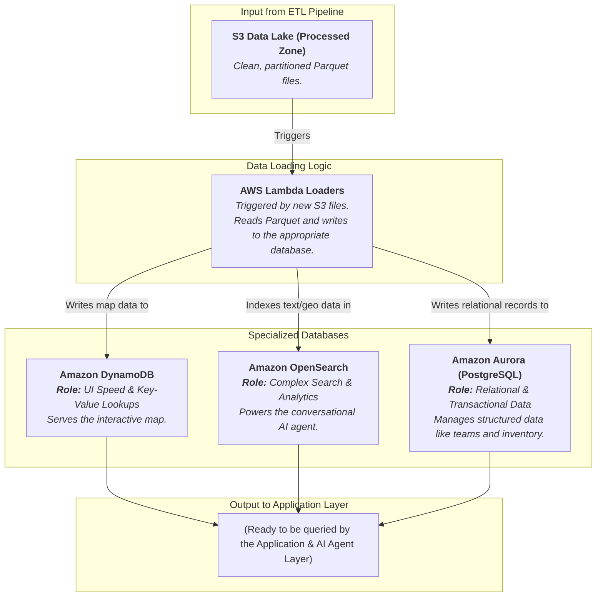

### Internal Architecture: Polyglot Persistence (Serving Layer)

This system is triggered when new, clean data is available in the processed zone of our data lake. Its sole purpose is to load this data into the right databases to be queried by the application layer.

-----

### How It Works & Communicates

This layer acts as the final, organized library for your application. It takes the neatly filed documents from the ETL pipeline and places them on the correct shelves for easy access.

#### 1\. The Trigger: New Processed Data

When the ETL pipeline writes new, clean Parquet files to the **S3 Processed Zone**, it triggers a set of **AWS Lambda Loaders**. There can be one loader per database, each responsible for reading the new data and formatting it for its target.

#### 2\. The Specialized Databases (The Shelves) 📚

Each database is chosen for its specific strengths:

  * **Amazon DynamoDB (The Index Card Shelf)**

      * **Purpose:** To provide lightning-fast, single-digit millisecond responses for the interactive map dashboard.
      * **How it's Used:** When the loader gets new data, it calculates and updates aggregated stats for each geographic region (e.g., `geohash: t8f5z, damaged_buildings: 52, call_volume: 15`). When a user hovers over that region on the map, the UI can query DynamoDB by that single key and get an instant response.
      * **Communication:** It communicates directly with the simple Lambda functions that power the UI map, serving up pre-calculated data instantly.

  * **Amazon OpenSearch (The Research Section)**

      * **Purpose:** To power complex queries for the **Amazon Bedrock Agent**. This is the most critical database for the AI's intelligence.
      * **How it's Used:** The loader indexes all textual and geospatial data here. OpenSearch allows the Bedrock Agent's Action Groups to ask complex questions that would be impossible for other databases, such as:
          * **Full-Text Search:** "Find all reports that mention 'gas leak' and 'school'."
          * **Geospatial Search:** "List all buildings with 'severe' damage within a 3km radius of this hospital."
          * **Complex Filtering (Faceting):** "Show me the top 5 neighborhoods by call volume where the rescue status is still 'pending'."
      * **Communication:** It's the primary data source queried by the advanced Action Group Lambdas that the Bedrock Agent uses to answer user questions.

  * **Amazon Aurora (The Master Ledger)**

      * **Purpose:** To manage highly structured, relational data that requires transactional integrity.
      * **How it's Used:** The loader writes and updates records for things like rescue team rosters, vehicle assignments, medical supply inventories, and official incident report logs. This data has clear relationships (a team has members, a vehicle has an inventory) that are best managed in a traditional SQL database.
      * **Communication:** It's queried by Action Group Lambdas when the Bedrock Agent needs to answer questions like, "Which medical teams are available and have more than 10 first-aid kits?" or "What is the official status of incident report \#582-A?"

By separating the data this way, you ensure that every part of your application is incredibly fast and efficient.