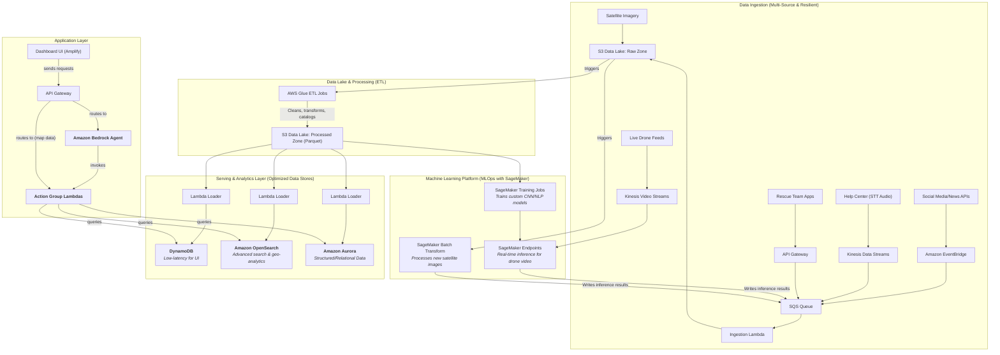

```mermaid
graph TD
    subgraph "Data Ingestion (Multi-Source & Resilient)"
        Satellite["Satellite Imagery"] --> S3_Raw["S3 Data Lake: Raw Zone"]
        Drone["Live Drone Feeds"] --> KVS["Kinesis Video Streams"]
        SocialMedia["Social Media/News APIs"] --> EventBridge["Amazon EventBridge"]
        Helpline["Help Center (STT Audio)"] --> KDS["Kinesis Data Streams"]
        RescueTeam["Rescue Team Apps"] --> APIGW["API Gateway"]

        EventBridge --> SQS["SQS Queue"]
        KDS --> SQS
        APIGW --> SQS
        SQS --> Lambda_Ingest["Ingestion Lambda"] --> S3_Raw
    end

    subgraph "Data Lake & Processing (ETL)"
        S3_Raw -- "triggers" --> Glue["AWS Glue ETL Jobs"]
        Glue -- "Cleans, transforms, catalogs" --> S3_Processed["S3 Data Lake: Processed Zone (Parquet)"]
    end

    subgraph "Machine Learning Platform (MLOps with SageMaker)"
        S3_Processed --> SM_Train["SageMaker Training Jobs<br><i>Trains custom CNN/NLP models</i>"]
        SM_Train --> SM_Endpoint["SageMaker Endpoints<br><i>Real-time inference for drone video</i>"]
        KVS --> SM_Endpoint
        SM_Endpoint -- "Writes inference results" --> SQS

        S3_Raw -- "triggers" --> SM_Batch["SageMaker Batch Transform<br><i>Processes new satellite images</i>"]
        SM_Batch -- "Writes inference results" --> SQS
    end

    subgraph "Serving & Analytics Layer (Optimized Data Stores)"
        S3_Processed --> Load_DDB["Lambda Loader"] --> DynamoDB["<b>DynamoDB</b><br><i>Low-latency for UI</i>"]
        S3_Processed --> Load_OS["Lambda Loader"] --> OpenSearch["<b>Amazon OpenSearch</b><br><i>Advanced search & geo-analytics</i>"]
        S3_Processed --> Load_AUR["Lambda Loader"] --> Aurora["<b>Amazon Aurora</b><br><i>Structured/Relational Data</i>"]
    end
    
    subgraph "Application Layer"
        Bedrock_Agent["<b>Amazon Bedrock Agent</b>"]
        Action_Lambdas["<b>Action Group Lambdas</b>"]
        App_API["API Gateway"]
        UI["Dashboard UI (Amplify)"]
    end

    %% Connections
    Bedrock_Agent -- "invokes" --> Action_Lambdas
    Action_Lambdas -- "queries" --> DynamoDB
    Action_Lambdas -- "queries" --> OpenSearch
    Action_Lambdas -- "queries" --> Aurora
    UI -- "sends requests" --> App_API
    App_API -- "routes to" --> Bedrock_Agent
    App_API -- "routes to (map data)" --> Action_Lambdas
```